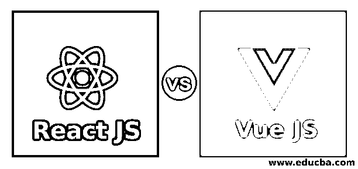
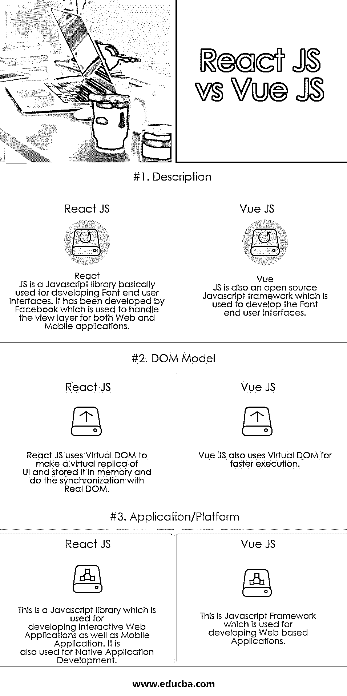

# 反应 js vs js 视图

> 原文：<https://www.educba.com/react-js-vs-vue-js/>

## React JS 和 Vue JS 的区别

React JS 是一个 Javascript 库，主要用于开发字体终端用户界面。React JS 由脸书开发，用于处理 Web 和移动应用程序的视图层。Javascript、HTML5 和 CSS 需要在同一个。这用于开发可重用的 UI 组件。React JS 在 MVC 模型中被用作视图部件。我们可以将 React JS 作为一个节点呈现在服务器上，也可以用于本地应用程序开发。React JS 实际上实现的是单向数据流；这也是 React JS 比其他常用 JS 框架简单很多的原因。

### React JS 是什么？

React.js 是一个 JavaScript 用户界面库，用于构建 UI 网页。它由脸书开发，由脸书和一群基于社区的开发者维护。它最初是由一个名叫乔丹·沃克的人开发的。它最初发布于 2013 年。它支持跨平台。它完全是用 JavaScript 语言编写的。它用于开发单页 Web 应用程序和移动应用程序。

<small>网页开发、编程语言、软件测试&其他</small>

**React JS 的特点**

*   **JSX** : Javascript 语法扩展，主要推荐在 React JS 中使用。
*   组件: React JS 是一种组件结构，用于使用不同的模块化结构处理大型项目。
*   **单向数据流:**它使用 Flux 模式实现单向数据流，以保持数据的单向。
*   许可证:由脸书公司授权。

### Vue JS 是什么？

Vue JS 也是一个开源的渐进式框架，用于开发字体最终用户界面。Vue JS 是由谷歌前雇员尤雨溪开发的。Vue JS 用于开发交互式 Web 应用的前端。它是由一个名叫尤雨溪的个人开发者开发的。由于其简化的库，它也可以与其他 UI 库集成。它是在麻省理工学院的许可下授权的。它最初于 2014 年发布。它支持跨平台。它完全是用 JavaScript 语言编写的。它被开发成可以与任何类型的 UI 库集成，并且具有适应性。

**Vue JS 的特点**

*   **模板:** Vue JS 提供基于 HTML 的模板，用于创建视图，即用户界面。它分别维护 HTML、CSS 和 JS。
*   指令: Vue JS 使用不同的内置指令来执行不同种类的动作。
*   **观察者:**观察者习惯于关注任何与数据相关的变化。
*   **路由:** **Vue-router** 用于不同页面之间的导航。
*   Vue-CLI: 用于在命令行界面运行 Vue JS。
*   **数据绑定:v-bind** 用于给 HTML 属性赋值，操纵 CSS 和样式等。
*   **虚拟 DOM:** 这是一个编程概念，它将用户界面的虚拟副本存储在内存中，并使用相关的库与实际 DOM 同步。
*   动画: Vue JS 有其内置的插件，可以帮助制作不同 HTML 元素的动画。
*   **事件处理:** **v-on** 属性用于监听添加到 DOM 元素中的不同事件。

### React JS 和 Vue JS 的直接对比(信息图)

下面是 React JS 和 Vue JS 的三大区别

### React JS 和 Vue JS 的主要区别

让我们讨论一下 React JS 和 Vue JS 之间的一些主要区别

1.  React JS 是一个 Javascript 库，用于开发不同的应用程序和用户界面。Vue JS 是一个 Javascript MVC 框架，用于开发 Web 应用程序的 UI 层。
2.  React JS 用于开发 Web 应用程序和移动应用程序的用户界面。不仅如此，它还用于开发本地应用程序，并作为节点呈现在服务器上。Vue JS 用于开发 Web 应用程序的用户界面。它主要集中在视图层。它也很容易与其他项目和第三方应用程序集成。
3.  React JS 是一个 javascript 库；它使用 JSX 方法进行开发。HTML，CSS 都只需要用 Javascript 写。Vue JS 是一个 Javascript MVC 框架，使用基于模板的方法进行开发。所有的 HTML、CSS、Javascript 都可以在 Vue JS 中单独使用，使得开发比 React JS 简单很多。
4.  在 React JS 中，如果任何组件的状态发生变化，它会重新呈现整个组件层次结构，将该组件视为根组件。我们需要使用 PurComponent 或实现 shouldComponentUpdate 来避免这种需要时重新呈现的情况。在 Vue 中，JS shouldComponentUpdate 已经自动实现，以避免这些重新渲染的情况。这里，系统知道当发生任何状态变化时，哪个组件需要重新呈现。
5.  React JS 使用 create react app 进行安装。React JS 还需要一个用于构建的 web 包。Vue JS 使用 Vue-cli /CDN/NPM 进行安装。我们到处都可以做 Vue JS 的开发。
6.  React JS 使用纯核心概念 Javascript 开发。而 Vue JS 使用基于模板的开发。React JS 比 Vue JS 更受欢迎，因为 React JS 的工作机会比 Vue JS 多。
7.  React 的状态管理库叫做 MobX，在 React 社区非常流行。而 Vue 的状态管理库被称为 VueX。
8.  Vue。JS 的缺点很少，如模板中的运行时错误，这导致很难调试和处理错误，从而降低了应用程序的高可用性，而 React.js 具有提高生产率和长期维护支持的特点，具有高质量和高生产率。
9.  Vue。JS 库的基础设施很差，仍处于开发阶段。它需要进一步改进，以在编码中提供更好的组件系统，而 React.js 有更好的基础设施库支持和更好的模块捆绑包，可以产生更高质量的应用程序。
10.  Vue。如果 js 之前就知道简单是主要关注点，那么可以直接使用 JS，然后可以简单直接地使用 Vue，而 React.js 可以简单地选择用于大型和复杂的应用程序。

### React JS 和 Vue JS 对照表

下面是描述 React JS 和 Vue JS 比较的要点列表。

| **比较的基础** | **反应 JS** | **检视 JS** |
| **描述** | React JS 是一个 Javascript 库，主要用于开发字体终端用户界面。它是由脸书开发的，用于处理 Web 和移动应用程序的视图层。 | Vue JS 也是一个开源的 Javascript 框架，用于开发字体终端用户界面。 |
| **DOM 模型** | React JS 使用虚拟 DOM 制作 UI 的虚拟副本并存储在内存中，并与真实 DOM 进行同步。 | Vue JS 还使用虚拟 DOM 来提高执行速度。 |
| **应用/平台** | 这是一个 Javascript 库，用于开发交互式 Web 应用和移动应用。它还用于本地应用程序开发。 | 这是一个 Javascript 框架，用于开发基于 Web 的应用程序。 |

### 结论反应

两者都使用虚拟 DOM 来提高执行速度，虚拟 DOM 将虚拟 UI 表示存储在内存中，并与真实 DOM 同步。由于 React JS 是一个 Javascript 库，所以所有包含 HTML、CSS、JS 的代码都需要编写核心 Javascript 概念，这基本上使用 JSX 方法，而 Vue JS 是一个 Javascript MVC 框架，实际上遵循模型视图控制器模式，其中 Vue JS 主要集中在视图层。

Vue JS 遵循基于模板的方法，为开发视图层(即开发用户界面)提供基于 HTML 的模板。在 React JS 的情况下，它用于开发 Web 作为移动应用程序用户界面。而且 React JS 还用于原生应用的开发，我们也可以在服务器上渲染 React JS 作为一个节点。

而 Vue JS 用于开发 Web 应用程序的交互式用户界面。按照现在的生态系统和 React JS 或者 Vue JS 的区别，React JS 比 Vue JS 受欢迎的多。

### 推荐文章

这是 React JS 和 Vue JS 之间主要区别的指南。在这里，我们还将讨论直接比较、主要差异，以及信息图和比较表。您也可以看看以下文章——

1.  [关于 Angular vs Bootstrap 的惊人指南](https://www.educba.com/angular-vs-bootstrap/)
2.  [角度与反作用](https://www.educba.com/angular-vs-react/)
3.  [角 js vs view js](https://www.educba.com/angular-js-vs-vue-js/)
4.  [视图。JS vs React .js〔t1〕](https://www.educba.com/react-js-vs-vue-js/)

