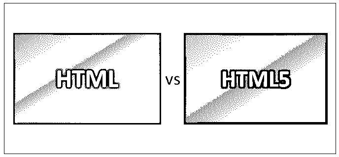
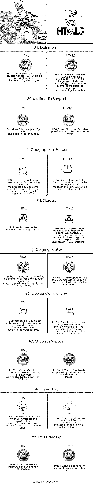

# HTML 与 HTML5

> 原文：<https://www.educba.com/html-vs-html5/>

## HTML 和 HTML5 的区别

HTML 是超文本标记语言，是广泛用于 web 应用程序或网站开发的编程语言。HTML5 是 HTML 编程的最新版本，允许更好地管理 web 应用程序或网站内容。虽然 HTML 不允许在编程语言中支持视频和音频数据，但 HTML5 允许将任何类型的数据合并到程序中。就浏览器兼容性而言，用 HTML 开发的应用程序可以在所有主流浏览器中访问，HTML5 只在少数浏览器中受支持，因为它不包含传统 HTML 代码的所有标签和元素。

### 什么是 HTML？

HTML t 代表超文本标记语言。浏览器不显示 HTML 标签，而是用来呈现页面内容。超文本是一种特殊的方法，通过点击打开下一页的超链接，我们可以在网上四处移动。标记是 HTML 标签，如开始和结束标签，里面有文本，我们可以通过它来格式化文本，放置超链接，图像等。Web.HTML 是蒂姆·伯纳斯·李在 1991 年创建的，他也是万维网的创始人。

<small>网页开发、编程语言、软件测试&其他</small>

### HTML5 是什么？

2014 年发布的 HTML5。HTML 不断更新自己，增加更多功能，让每个人都能更方便地访问互联网。HTML5 不同于 HTML，因为所有浏览器都支持它的所有特性。W3C 从 2012 年开始推荐 HTML5。它包括处理模型、详细的解析规则、错误处理、用于绘图的画布以及对本地存储的支持。HTML5 开始支持 JavaScript API，如用于识别位置的地理定位 API，跨平台移动应用支持。HTML5 定义了一种可以用 [HTML 或 XHTML 语言](https://www.educba.com/html-vs-xhtml/)语法编写的单一标记语言，并支持向后兼容以前的 HTML 版本。

### HTML 和 HTML5 的面对面比较(信息图表)

以下是 HTML 与 HTML5 的 9 大对比:

### HTML 和 HTML5 的主要区别

以下是 HTML 与 HTML5 最重要的区别:

*   在 HTML 中，不支持视频和音频，而在 HTML5 中，视频和音频被集成到其中。
*   HTML 兼容几乎所有的浏览器，而 HTML5 被大多数现代浏览器支持，如 Firefox、Mozilla、Chrome 等。
*   在 HTML 中，JavaScript 和浏览器界面将在同一个线程中运行，而在 HTML5 中，我们可以借助 web worker API 在后台运行 JavaScript，可以在不同的线程中运行。
*   在 HTML 中，借助其他工具如 Silver light、Flash 等支持矢量图形。，而在 HTML5 中，默认支持矢量图形；它内置了 canvas 和 SVG。
*   在 HTML5 中，用于显示 applet 的 applet 标签被删除，并引入了 object 标签，而在 HTML 中，applet 标签被使用。
*   在 HTML 中，
*   在 HTML 中，<acronym>标签用于显示缩写，而在 HTML5 中，这个标签被用于相同目的的<abbr>标签所取代。</abbr></acronym>
*   HTML 无法处理不准确的语法和其他错误，而 HTML5 能够处理这些错误。
*   在 HTML5 中，标签只能有一个属性边界，值必须是 0 或 1，而在 HTML 中，我们可以有很多属性。

*   在 HTML 中，客户端和服务器之间的通信将使用流和长池进行，因为它不支持套接字，而 HTML5 支持 web 套接字，通过 web 套接字，客户端和服务器之间的全双工通信是可能的。

### HTML 与 HTML5 比较表

下面是 HTML 和 HTML5 的对比表

| **比较的基础** | **HTML** | **HTML5** |
| **定义** | 超文本标记语言是 HTML 的首字母缩写，HTML 是开发网页的主要语言。 | HTML5 是 HTML 的新版本，它具有新的功能，以标记语言为核心技术，与互联网技术进行交互，以结构化和呈现内容。 |
| **多媒体支持** | HTML 不支持该语言的视频和音频 | HTML5 集成了对视频和音频的支持。 |
| **地理支持** | HTML 支持跟踪访问网站的用户的位置，但是这个过程很麻烦，而且当用户从移动设备登录时很难找到用户的位置。 | HTML5 使用了 JavaScript 地理定位 API，可以用来识别访问网站的任何用户的位置。 |
| **存储** | HTML 使用浏览器缓存作为临时存储 | HTML5 有多个存储选项，如应用程序缓存、SQL 数据库和 web 存储。我们可以借助 HTML5 中可用的 JS API 在后台编写 JavaScript 来存储 |
| **通信** | 在 HTML 中，客户端和服务器之间的通信是通过流和长池完成的，因为它不支持套接字。 | 在 HTML5 中，它支持 web 套接字，允许客户端和服务器之间的全双工通信。 |
| **浏览器兼容性** | HTML 与几乎所有的浏览器兼容，因为它已经存在了很长时间，并且浏览器做了足够的修改来支持 HTML 中的所有特性 | 在 HTML5 中，我们有许多新的标签、元素和删除/修改的少数标签元素，所以目前只有少数浏览器与 HTML5 完全兼容。 |
| **图形支持** | 在 HTML 中，借助其他工具，如 Silverlight、Adobe Flash、VML 等，可以支持矢量图形。 | 在 HTML5 中，默认情况下支持矢量图形，因为它内置了 canvas 和 SVG。 |
| **穿线** | 在 HTML 中，用户交互的浏览器界面和 JavaScript 在同一个线程中运行，这将导致性能问题。 | 在 HTML5 中，它有 JavaScript web worker API，允许 JavaScript 和浏览器界面在不同的线程中运行。 |
| **错误处理** | HTML 不能处理不准确的语法和任何其他错误。 | HTML5 能够处理不准确的语法和其他错误。 |

### 结论

最后，它概述了 HTML 和 HTML5 之间的区别。希望你看完这篇 HTML 和 HTML5 的文章后能更好的理解 HTML 和 HTML5。HTML5 将对 web 开发人员有用，因为它提供了许多功能，如视频和音频支持、新标签和元素。W3C 还宣布 HTML5 的未来更新将集中在隐私工具上。慢慢地，所有的 web 开发者都转向 HTML5，因为它比以前的 HTML 版本有更多的规范。

### 推荐文章

这是 HTML 和 HTML5 之间区别的指南。在这里，我们讨论了它们的含义、直接比较、主要差异以及信息图表。您也可以阅读以下文章，了解更多信息——

1.  [HTML vs XML](https://www.educba.com/html-vs-xml/)
2.  [HTML5 和 Flash](https://www.educba.com/html5-vs-flash/)
3.  [HTML vs CSS](https://www.educba.com/html-vs-css/)
4.  [C++ vs Java](https://www.educba.com/c-plus-plus-vs-java/)

