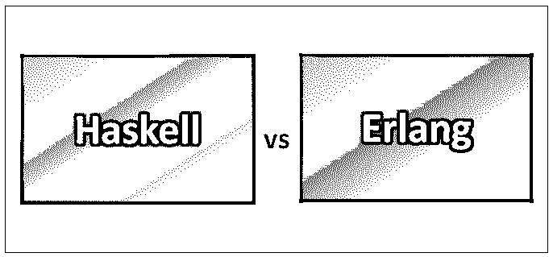
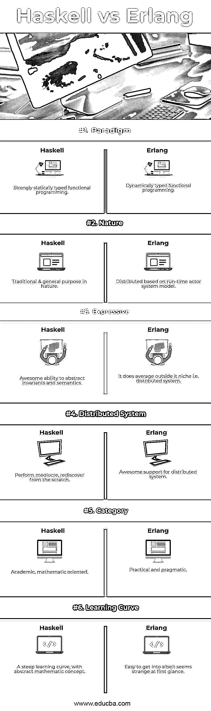

# Haskell vs Erlang

> 原文：<https://www.educba.com/haskell-vs-erlang/>

## Haskell 和 Erlang 的区别

Haskell 是一种标准的函数式编程语言，本质上是模块化和通用的。这种语言以数学家和逻辑学家哈斯凯尔·布鲁克斯·加里的名字命名。Haskell 围绕着函数的概念，函数是旨在执行特定任务的代码块。只有在需要时才调用函数。函数也被视为值，即两个函数可以像普通整数一样相加。这使得 Haskell 成为一种纯粹的函数式编程语言。Haskell 的两个重要方面是它的非严格语义和强静态类型。有了 Haskell，强大的数据类型与多态概念结合在一起，这意味着开发人员可以编写一个既能排序整数又能排序字符串的函数。与其他语言不同，开发人员必须为两种不同的数据类型编写两个独立的函数。

和 Haskell 一样，Erlang 也属于函数式编程语言，本质上是并发的和通用的。就像任何其他函数式语言一样，它专注于表达式求值，而不是命令执行，在命令执行中，表达式利用函数来推导基本值。尽管功能强大，但它像 Java 一样，因为它利用了虚拟机并支持多线程。Java 社区主要关注 Web 开发生态系统，而 Erlang 则主要关注嵌入式系统和健壮的服务器。事实上，Erlang 是为在网络中的分布式计算机上开发健壮的系统程序而设计的。Erlang 是免费的开源代码，世界各地的大学都在教授它。

<small>网页开发、编程语言、软件测试&其他</small>

Haskell 在 2010 年 7 月获得了它的第一个稳定版本。它促进了一种类型系统，这种类型系统有一个有趣的方面，称为“惰性求值”，通过这种方法，一个函数的结果可以传递给另一个函数，一个函数将另一个函数作为参数或返回它，因此，被视为高阶函数。另一个有趣的特征被称为单子，一种类似流水线的结构；生产线上的每个站点都执行不同的任务。由于这一特点，任何副作用都可以归类为不包括任何功能的单独活动。

Erlang 画出了它与 Java 的相似之处；对于提供垃圾收集，开发人员不必担心分配的内存空间返回问题。使用 Erlang 的动态类型特性可以有效地开发系统组件；这些组件不需要关心它们将要处理的数据类型。Erlang 程序可以非常容易地分发，并且可以在网络中的任何节点上运行，这使得 Erlang 对于构建系统组件非常有效。Erlang 语言还提供了 Java、C、C++的接口；因此，它可以很容易地实现。作为一个并发线程，它的线程监控对于状态机和事件分发非常有用。在每个平台上，都可以识别 Erlang 的字节码。事实证明，对于任何并发活动、容错、实时响应以及维护健康的后端系统所需的特性来说，它都是一个更好的选择。对于具有 HTTP 服务器的网络系统，像 SNMP 这样的协议包含所有组件，因此 Erlang 是网络和分布式系统的首选。它基于角色的模型使得它非常适合分布式系统。

### Haskell 和 Erlang 的面对面比较(信息图)

下面是 Haskell 和 Erlang 的 6 大区别

### 【Haskell 和 Erlang 的主要区别

两者都是市场上的热门选择；让我们讨论一些主要的区别:

1.  Haskell 是一种强静态类型的函数式编程语言，而 Erlang 是一种动态类型的函数式编程语言。
2.  Haskell 有一个更抽象的概念，与学术和数学有关，而 Erlang 本质上更实用，可以优先用于生产系统。
3.  Haskell 是一种传统的通用语言，具有纯函数的特性，而 Erlang 更适合分布式环境，在开发分布式应用程序方面表现突出，具有容错等特性。
4.  Haskell 是一种纯粹的函数式编程语言，与其他范式不兼容，而 Erlang 是一种基于字节码概念的混合动态类型函数式语言。
5.  Haskell 本质上是传统的和学术的，而不是实用的，而 Erlang 在设计分布式系统方面有专门的支持，它的根基在电信行业。
6.  Haskell 有更简洁的语法，更适合传统的编程竞赛，而 Erlang 是成功的，但是它的语法不容易理解。
7.  Haskell 在并发性方面并不出色，而 Erlang 适合基于并发的系统。
8.  尽管 Haskell 优雅而学术，但它在生产系统中并不流行，而 Erlang 以其实用的方法在生产系统中很流行。
9.  Haskell 是一种传统的编程语言，它被设计为在单个节点上运行，而 Erlang 有着出色的并发支持，可以在具有多个节点的分布式系统上高效运行。
10.  具有 lambdas 和递归定义的 Haskell 可以有效地抽象和形式化语义，而 Erlang 在其利基(即分布式系统)之外表现平平，不在 Haskell 的同一表达水平上。

### Haskell vs Erlang 对照表

下面是 Haskell 和 Erlang 的一些比较

| **性能****参数** | 哈斯克尔 | **二郎** |
| 范例 | 强静态类型函数编程 | 动态类型函数编程 |
| 自然 | 自然中的传统和通用目的 | 基于运行时角色系统模型分布 |
| 表达的 | 提取不变量和语义的强大能力 | 它确实超出了它的范围，即分布式系统 |
| 分布式的计算机系统 | 表现平平，从头开始重新发现 | 对分布式系统的强大支持 |
| 种类 | 学术、数学导向 | 实用务实 |
| 学习曲线 | 陡峭的学习曲线，带有抽象的数学概念 | 很容易进入，尽管乍一看似乎很奇怪 |

### 结论

Erlang vs Haskell 各有优缺点。Haskell 是一种更传统的纯函数式编程语言，属于学术领域，具有更抽象的概念。它的语法简洁，但同时，它的学习曲线可能很陡。它有几个特性，如 lambdas、递归定义，可以帮助有效地抽象和形式化语义。然而，对于像系统这样的产品，Haskell 是比 Erlang 更差的选择。Erlang 对容错和并发等特性有着惊人的支持。对于一个成功的分布式系统，需要有效地处理这两个特性。因此，Erlang 在设计基于 actor 模型的分发系统时表现得更好。

Erlang 和 Haskell 都有自己特定的用例。在他们特定的区域，他们表现得很有效率。当涉及到开发具有单个节点的传统系统时，Haskell 将以其抽象和简洁的语法等特性胜出。另一方面，Erlang 非常适合开发具有多个节点的分布式系统，因为它对并发性、基于网络的组件和容错的支持满足了所有要求。归根结底，是场景和用例决定了语言的使用。

### 推荐文章

这是 Haskell 和 Erlang 之间最大区别的指南。在这里，我们还将讨论信息图和比较表的主要区别。您也可以看看以下文章，了解更多信息–

1.  [Haskell 编程语言](https://www.educba.com/what-is-haskell-programming-language/)
2.  [Haskell vs Scala](https://www.educba.com/haskell-vs-scala/)
3.  [围棋 vs 二郎](https://www.educba.com/go-vs-erlang/)
4.  [仙丹 vs 二郎](https://www.educba.com/elixir-vs-erlang/)

