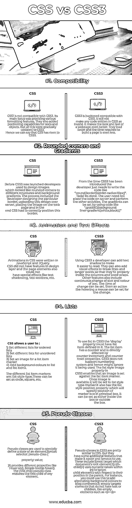

# CSS vs CSS3

> 原文：<https://www.educba.com/css-vs-css3/>

## CSS 与 CSS3 的区别

网络应用在当今世界扮演着非常重要的角色。互联网接管了几乎所有需要[设计师网页](https://www.educba.com/free-web-page-designing-software/)。用户必须被特定的网页所吸引，这样他们才会被更多的访问。因此，级联样式表(CSS)的作用非常重要。CSS 和 HTML 一起工作[并且提供了一个基本的风格和结构。它定义了 HTML 元素在网页上的外观。CSS3 是 CSS 的最新版本。它提供了类似于](https://www.educba.com/html-interview-questions/)的 JavaScript 功能。除此之外，它还提供了[移动开发特性](https://www.educba.com/mobile-app-development-training-and-certification/)。它还具有额外的功能，如图像，渐变，过渡等。让我们来看看 CSS 和 CSS3 的区别。

### CSS 和 CSS3 的直接对比(信息图表)

下面是 CSS 和 CSS3 的 5 大区别。

<small>网页开发、编程语言、软件测试&其他</small>

### CSS 和 CSS3 的主要区别

CSS vs CSS3 都是市场上的热门选择；让我们讨论一下 CSS 和 CSS3 之间的一些主要区别:

*   CSS 和 CSS3 的主要区别在于 CSS3 有模块。CSS 是基础版，不支持响应式设计。另一方面，CSS3 是最新版本，支持响应式设计。
*   CSS 不能拆分成模块，但是 [CSS3 可以拆分成模块](https://www.educba.com/what-is-css3/)。做老版本的 CSS 比 CSS3 慢。
*   除此之外，CSS3 还有许多对齐特性。CSS3 提供了一个盒子大小调整工具，允许用户在不改变元素尺寸或填充的情况下获得任何元素的正确大小。CSS 没有任何框大小调整工具，因此用户需要使用定义的标准过程来对齐文本。
*   CSS3 中的动画和 3D 转换[更好。借助 flash 和 JavaScript 可以在屏幕上移动元素。利用这一点，元素也将能够改变它们的大小和颜色。使用 CSS3 可以完成各种过渡、转换和动画。CSS 不提供 3D 动画和转换。](https://www.educba.com/css3-interview-questions/)
*   CSS 提供了基本的颜色模式和标准颜色。CSS3 支持 RGBA，HSLA，HSL 和渐变颜色。它还支持文本框的圆角图像。
*   在 CSS3 中可以定义多列文本块。CSS 只支持单个文本块。

### CSS 和 CSS3 对照表

CSS 和 CSS3 之间的主要比较如下:

| **CSS 与 CSS3 的比较基础** | **CSS** | **CSS3** |
| **兼容性** | CSS1 与 CSS3 不兼容。它的主要焦点是提供各种格式化特性。他们还增加了文本和物体的定位功能。但这一切都逐渐更新到了 CSS3。因此，我们可以说，CSS 已经上升到 CSS3。 | CSS3 向后兼容 CSS1。它不会使任何用 CSS1 编写的代码无效。它使网页的外观和感觉更好。它们加载速度更快，构建一个页面所需的时间甚至更少。 |
| **圆角和渐变** | 在 CSS3 推出之前，开发人员过去常常设计看起来像圆角的图像，以适应不同的结构和背景渐变。这个过程包括开发人员设计特定的边界，将这个设计上传到服务器，将图像放到网页上，最后，CSS 必须正确定位这个边界。 | 从引入 CSS3 开始，开发人员只需要编写代码，就像。round border { border-radius:10px；}".Tada！结束了。用户不需要将代码放在服务器上并执行其他活动。可以使用类似于“的代码来设置渐变。gradBG { background:liner-gradient(白色、黑色)；}" |
| **动画和文字效果** | [CSS 中的动画是用 JavaScript](https://www.educba.com/css-vs-javascript/) 和 JQuery 编写的。CSS 在设计层没有功能，页面元素也不能有特殊效果，比如文本阴影、文本部分等等。 | 使用 CSS3，开发人员可以添加文本阴影，使其更容易阅读。他们还可以添加视觉效果，以分行和较长的单词，使它们适合列和自动换行。其他功能还包括文本大小和颜色的连续变化。可以设置改变的时间。甚至像鼠标悬停这样的动作也可以设置为改变。 |
| **列表** | CSS 允许用户:1)为有序列表设置不同的列表 2)为无序列表设置不同的列表 3)为列表项标记设置图像 4)为列表和列表项添加背景颜色。不同的列表项标记是列表样式类型。这些可以设置为圆形、方形等。 | 要在 CSS3 中使用列表，必须在“display”属性中定义列表项。列表项有一个计数器，并直接受计数器增量和计数器重置属性的影响。CSS3 不支持编号系统，因此可能会忽略它的使用。CSS3 中的 list-style-image 属性允许根据列表项标记设置图像。一旦图像可用，它将被设置为列表样式类型标记。它还具有列表样式位置属性，该属性将指定标记框在主框中的位置。可以设置为盒内，也可以设置为盒外。 |
| **伪类** | 伪类用于专门定义元素的状态。语法:选择器:伪类{
属性:值；它提供了不同的属性，比如 Hover on()，简单的工具提示 hovers()。:first-child 伪类匹配任何元素的第一个子元素。 | CSS3 中的伪类与 CSS 非常相似。但是他们有一些额外的功能，使它更容易使用和著名。其中包括:
1): root target，哪个文档的根元素。2):n-child(n)使用(n)内的数值，根据子元素在父元素中的位置来定位子元素。例如，你可以用它给博客评论添加交替的背景颜色
3):空目标元素没有文本或者子元素，比如空元素< p > < /p > |

### 结论

以上 css 和 css3 的区别，说明了 css 是如何逐渐转化为 CSS3 的。平滑的过渡、简洁的设计和更快的性能将 CSS 带到了今天的位置。CSS 可以用于所有的 [web 应用开发](https://www.educba.com/how-to-build-web-applications-using-mongodb/)。CSS3 现在支持所有的浏览器，因此被广泛使用。随着时间的推移，CSS4 即将推出。在此之前，CSS3 对所有当前用户都是可用的，只是对现有框架做了一些小的改进。级联样式表将留在软件行业，帮助用户创建交互式和最时尚的 web 应用程序和页面。

### 推荐文章

这是 CSS 和 CSS3 之间主要区别的指南。在这里，我们讨论了 CSS 和 CSS3 的比较，主要区别，以及信息图和比较表。您也可以看看以下文章——

1.  [vista . js vs jquery](https://www.educba.com/vue-js-vs-jquery/)
2.  [HTML5 vs Flash](https://www.educba.com/html5-vs-flash/)
3.  [ASP.NET 与 C#的区别](https://www.educba.com/asp-net-vs-c-sharp/)
4.  [C# vs Js](https://www.educba.com/c-sharp-vs-js/)

