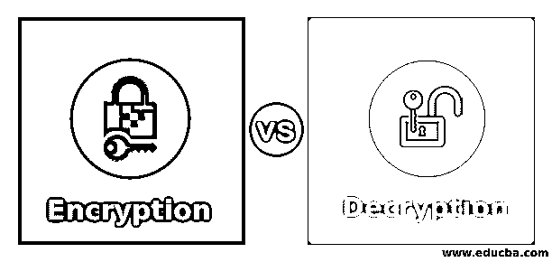
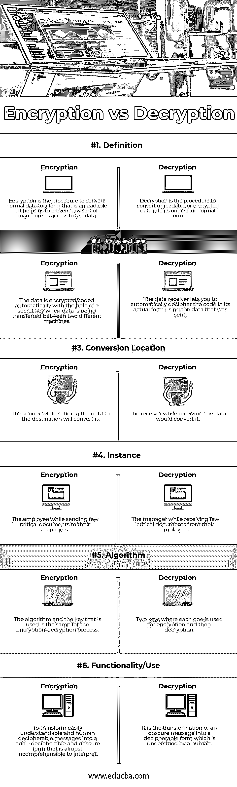

# 加密与解密

> 原文：<https://www.educba.com/encryption-vs-decryption/>

## 加密和解密的区别

加密是将纯文本转换为密码文本的过程，即将文本从可读格式转换为不可读格式，以保护双方或未经授权者之间的对话；另一方面，解密是将密文转换成明文的过程，即将不可读的文本转换成任何人都能理解的可读文本。这两种方法都使用密钥来执行所需的操作。

为什么应该使用加密和解密

<small>网页开发、编程语言、软件测试&其他</small>

*   他们也给我们的私人信息保密。
*   它们还有助于确保文档没有被更改。
*   加密防止抄袭，也保护知识产权。
*   它们对于使用网络通信非常有用，例如互联网和黑客可以很容易访问未加密数据的任何地方。
*   它们是重要的方法，因为它们帮助我们安全地保护我们不希望其他人访问的数据。
*   这些流程有助于保护我们的机密数据，如密码。

### 加密和解密之间的直接比较(信息图表)

以下是加密与解密之间的 6 大区别

### 加密和解密的主要区别

以下是要点列表，描述了加密与解密之间的主要区别:

*   在[加密过程](https://www.educba.com/what-is-encryption/)中，加密算法使用消息，即明文和密钥。而在解密过程中，解密算法使用密钥转换消息的加密形式，即密文。
*   加密发生在发送端，解密发生在接收端。
*   加密的主要功能是将明文转换成密文，而解密的主要功能是将密文转换成明文。
*   当机器(称为源)发送数据时，加密会自动发生。预先安装的程序在发送之前将信息转换成密码。
*   解密发生在目的地的机器上。机器将接收加密形式的数据并将其转换为原始形式。
*   加密和解密都是相互关联的，因为它们被认为是对数据隐私的最大偏好。

### 加密和解密的关键类型

*   **对称密钥–**对称密钥是指使用相同的密钥对明文进行加密和对密文进行解密的算法。
*   **非对称密钥–**非对称密钥是指使用两对密钥进行加密的算法。公开密钥对任何随机的人都可用，而秘密密钥只对消息的接收者可用。
*   **公钥–**它是一种不对称加密系统，使用两对密钥。公钥用于加密发送给接收方的数据或消息。
*   **私钥–**它是公钥和私钥非对称对的一部分。这个密钥[用于不对称加密](https://www.educba.com/asymmetric-encryption/)，因为我们使用相同的密钥来加密和解密数据。
*   **预共享密钥–**它指的是一个共享的秘密，在我们可以使用它之前，它在安全通道的帮助下在双方之间共享。

### 加密与解密对照表

下面是加密和解密之间最重要的比较

| **方面** | **加密** | **解密** |
| --- | --- | --- |
| 定义 | 加密是将普通数据转换成不可读形式的过程。它有助于我们防止对数据的任何未经授权的访问。 | 解密是将不可读或加密的数据转换成其原始或正常形式的过程。 |
| 程序 | 当数据在两台不同的机器之间传输时，数据会在密钥的帮助下自动加密/编码。 | 数据接收器可以让您使用发送的数据自动破译代码的实际形式。 |
| 转换位置 | 发送方在将数据发送到目的地时，会对数据进行转换。 | 接收方在接收数据的同时，会对其进行转换。 |
| 情况 | 该员工在向他们的经理发送一些重要文档时。 | 经理在从员工那里收到一些重要文件时。 |
| 算法 | 加密-解密过程使用的算法和密钥是相同的。 | 两个密钥，每个用于加密和解密。 |
| 功能/用途 | 将易于理解和人类解读的信息转换成不可解读和难以理解的形式。 | 它是将晦涩难懂的信息转换成人类能够理解的可解读形式。 |

### 结论

因此，加密和解密过程都属于密码学，即密码学和密码分析的混合。密码术包括通过对消息进行编码使其不可读来确保安全性的技术，而密码分析是指对消息进行解码，将不可读形式转换回其正常形式。

加密是为了在发送端对信息进行加密，然后再通过网络进行传输。然而，解密是在接收器端对编码内容进行解密。

### 推荐文章

这是加密和解密之间最大区别的指南。在这里，我们还将讨论信息图和比较表的主要区别。你也可以看看下面的文章来了解更多-

1.  [密码术 vs 加密](https://www.educba.com/cryptography-vs-encryption/)
2.  [数字海洋 vs 自动气象站](https://www.educba.com/digital-ocean-vs-aws/)
3.  [Linux vs Windows Server](https://www.educba.com/linux-vs-windows-server/)
4.  [对称密钥加密](https://www.educba.com/symmetric-key-encryption/)

