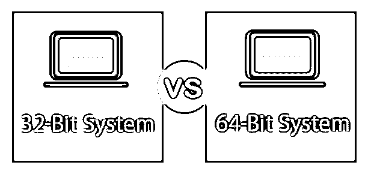
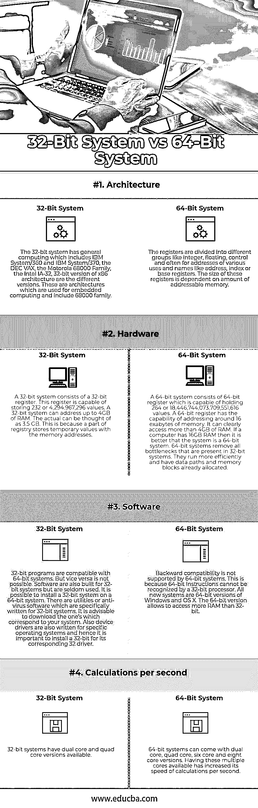

# 32 位与 64 位操作系统

> 原文：<https://www.educba.com/32-bit-vs-64-bit-operating-system/>

## 32 位和 64 位操作系统的区别

在计算机体系结构中，使用 32 位整数、内存地址和数据单元。64 位计算利用指定不同数据路径宽度、整数大小和 64 位宽度内存地址的处理器。它们是任何计算机的中央处理器。它还指定了利用特定架构的驱动程序和软件程序。不同的软件支持这两种体系结构，如果这两种体系结构是为不同的系统编程的，那么选择就很重要。32 位硬件和软件通常被称为 x86 或 x86-32。64 位硬件和软件被称为 x64 或 x86-64。让我们详细看看 32 位与 64 位操作系统之间的其他差异。

### 什么是 32 位？

在计算机系统中，32 位是指可以并行传输或处理的位数。换句话说，32 位是构成数据元素的位数。32 位寄存器可以存储 232 个不同的值。可以保存在 32 位中的整数值范围取决于所用的整数表示。对于两种最常用的表示法，范围是 0 到 4，294，967，295(232-1)，表示为(无符号)二进制数，范围是 2，147，483，648(231)到 2，147，483，647(231-1)，表示为二进制补码。一个重要的结果是，具有 32 位存储器地址的处理器可以立即访问最多 4gb 的字节可寻址存储器。通用计算中使用的著名 32 位指令集设计包括 IBM System/360 和 IBM System/370(具有 24 位寻址)、System/370-XA、ESA/370 和 ESA/390(具有 31 位寻址)、DEC VAX、NS320xx、Motorola 68000 系列(最初的两个型号具有 24 位寻址)、Intel IA-32 x86 结构的 32 位版本以及 32 位用于嵌入式计算的 32 位指令集架构包括 68000 系列和 Cold Fire、x86、ARM、MIPS、PowerPC 和 Infineon TriCore 设计。32 位通常是指保存、读取和处理数据的状态。当与[操作系统](https://www.educba.com/features-of-operating-system/)和处理器相关联时，这实际上意味着管理了多少个 1 和 0 来表示您的数据。系统能够处理的位数越多，一次能够管理的额外数据就越多。

<small>网页开发、编程语言、软件测试&其他</small>

### 什么是 64 位？

64 位属于可以并行处理或传输的位数，或用于数据格式中单个元素的位数。它也指描述特定类别的计算机体系结构、总线、内存和 CPU 的字长。在计算机设计中，64 位表示那些 64 位整数、内存地址或其它数据单元，它们的宽度至多为 64 位或 8 个八位字节。在微处理器中，64 位意味着寄存器的宽度。64 位微处理器能够处理 64 位代表的内存地址和数据。64 位寄存器存储 264 = 18 446 744 073 709 551 616 个单独的值。该名称也可用于表示低级数据类型的维度，如 64 位浮点数字。

### 32 位和 64 位操作系统之间的直接比较(信息图表)

以下是 32 位与 64 位操作系统之间的四大区别

### 32 位和 64 位操作系统之间的主要区别

32 位和 64 位操作系统都是市场上的热门选择。让我们讨论一些主要的区别:

*   从比较开始，简单地说，我们可以说 64 位处理器比 32 位处理器更有能力。它可以一次处理更多的数据。除此之外，它还能够存储更多的数据，存储更多的计算值，包括内存地址，这有助于访问大约 40 亿倍于 32 位处理器可以访问的物理内存。
*   32 位处理器可以轻松处理有限的 RAM。这可以认为是 4GB。另一方面，64 位系统可以访问更多。这一点很重要，因为操作系统应该以一种可以访问更多内存的方式来设计。操作系统的基本版本对应用程序可以利用的 RAM 有其限制。$GB 是 32 位系统可以利用的最大值。64 位系统的最新版本能够增强处理器的能力。像高性能视频游戏这样的应用需要高内存，这就是 64 位系统的优势所在。
*   如果你是 Windows 用户，你会注意到程序文件中有两个文件夹。一个作为程序文件，另一个作为程序文件(x86)。32 位架构虽然很老，但已经存在很长时间了。有许多应用程序承载并利用 32 位架构。新系统拥有 64 位系统，可以同时运行 32 位和 64 位软件。因此，他们有两个不同的目录。当遇到 32 位应用程序时，它被移动到 x86 文件夹，当遇到 64 位应用程序时，它被移动到另一个文件夹。
*   通过使用 64 位系统，许多多任务处理是可能的。用户可以轻松地在不同的应用程序之间切换，不会出现任何故障。要求高性能的游戏和消耗大量内存的应用程序可以在 64 位处理器上轻松运行。
*   32 位处理器非常擅长管理有限的 RAM(在 Windows 中为 4GB 或更少), 64 位处理器能够使用更多的 RAM。
*   64 位 Windows 操作系统所需的最少内存是 2 GB，而 32 位 Windows 需要 1 GB 的内存。这一点很明显，因为大寄存器需要更多的内存。
*   32 位处理器和 64 位处理器之间的一个很大的区别是它们每秒可以运行的计算次数，这影响了它们完成任务的速度。64 位处理器可以双核、四核、六核和八核版本进行家庭计算。多核可以提高每秒的计算次数，从而提高处理能力，帮助计算机运行得更快。在大多数情况下，需要许多计算才能顺利运行的软件程序可以在多核 64 位处理器上更快、更高效地运行。
*   需要注意的一点是，3D 图形程序和游戏从转移到 64 位计算机上并没有太大的好处，如果有的话，除非该程序是 64 位程序。一个 32 位处理器对于任何一个 32 位处理器的程序来说都是足够的。就电脑游戏而言，升级显卡比升级 64 位处理器能获得更高的性能。
*   最终，64 位处理器在家用电脑中越来越普遍。大多数制造商开发 64 位处理器的计算机，因为成本较低，而且目前有更多的用户使用 64 位操作系统和程序。计算机部件零售商提供的 32 位处理器越来越少，很快可能根本不提供。

### 32 位与 64 位操作系统对照表

下面是 32 位和 64 位操作系统之间的最重要的比较:

| **比较的基础** | **32 位系统** | **64 位系统** |
| **架构** | 32 位系统有通用计算，包括 IBM System/360 和 IBM System/370，DEC VAX，摩托罗拉 68000 系列，Intel IA-32，x86 架构的 32 位版本是不同的版本。这些是用于嵌入式计算的架构，包括 68000 个系列。 | 寄存器分为不同的组，如整型、浮点型、控制型，通常用于各种用途的地址和名称，如地址、索引或基址寄存器。这些寄存器的大小取决于可寻址内存的数量。 |
| **硬件** | 32 位系统由一个 32 位寄存器组成。该寄存器能够存储 232 或 4，294，967，296 个值。32 位系统可以寻址高达 4GB 的 RAM。实际可以认为是 3.5 GB。这是因为注册表的一部分存储了临时值和内存地址。 | 64 位系统由 64 位寄存器组成，它能够保存 264 或 18，446，744，073，709，551，616 个值。64 位寄存器能够寻址大约 16eb 的存储器。它显然可以访问 4GB 以上的内存。如果一台计算机有 16GB 内存，那么它比 64 位系统要好。64 位系统消除了 32 位系统中存在的所有瓶颈。它们运行效率更高，并且已经分配了数据路径和内存块。 |
| **软件** | 32 位程序与 64 位系统兼容。但是反过来是不可能的。该软件也是为 32 位系统构建的，但很少使用。可以在 64 位系统上安装 32 位系统。有专门为 32 位系统编写的实用程序或防病毒软件。建议下载与您的系统相对应的软件。此外，设备驱动程序也是为特定的操作系统编写的，因此为其对应的 32 个驱动程序安装 32 位驱动程序非常重要。 | 64 位系统不支持向后兼容。这是因为 32 位处理器无法识别 64 位指令。所有新系统都是 64 位版本的 Windows 和 OS x。64 位版本允许访问比 32 位更多的 RAM。 |
| **每秒计算次数** | 32 位系统有双核和四核版本。 | 64 位系统有双核、四核、六核和八核版本。拥有这些多核处理器提高了每秒的计算速度。 |

### 结论

如果您正在安装任何操作系统，了解计算机的处理器类型并确保安装正确的处理器是非常重要的。因此，了解计算机运行的操作系统的类型也很重要。大多数现代系统都有 64 位处理器，从许多方面提供了更好的性能。它们提供了更好的内存利用率和系统的快速运行。与 32 位处理器相比，它们还具有更高的内存利用率。但是在某些情况下，将不会有 64 位驱动程序，这时 32 位系统可以拯救你。购买 64 位操作系统和有助于提供最佳性能的 64 位应用程序是最佳选择。

简而言之，32 位和 64 位的主要区别在于 64 位能够处理更大的设计。由于 64 位处理和产生的数据量很大，导致方法发生了变化。然而，如果您计划拥有少于 3Gb 的 RAM，拥有一台旧的计算机或 32 位处理器，您通常会推荐 32 位系统。

### 推荐文章

这是 32 位和 64 位操作系统之间最大差异的指南。在这里，我们还将讨论信息图和比较表的主要区别。您也可以看看以下文章，了解更多信息–

1.  [Ubuntu vs Windows 10](https://www.educba.com/ubuntu-vs-windows-10/)
2.  [计算机硬件 vs 网络](https://www.educba.com/computer-hardware-vs-networking/)
3.  [计算机网络 vs 数据通信](https://www.educba.com/computer-network-vs-data-communication/)
4.  [外壳脚本操作符](https://www.educba.com/shell-script-operators/)

