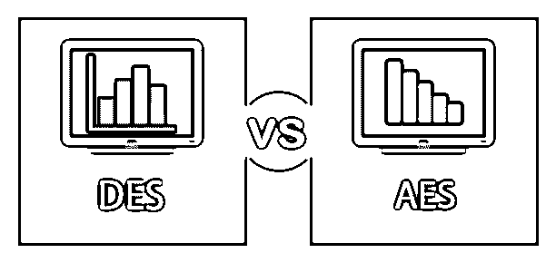
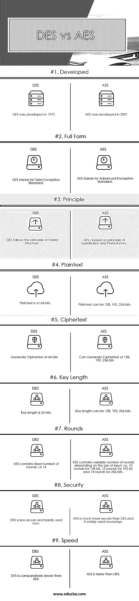

# DES 与 AES

> 原文：<https://www.educba.com/des-vs-aes/>

## DES 和 AES 的区别

在本主题中，我们将通过下面提供的简介、主要区别和比较表来了解 DES 和 AES 之间的区别。

DES(代表数据加密标准)和 [AES(高级加密标准)](https://www.educba.com/advanced-encryption-standard/)是对称分组密码。在学习 DES vs AES 之前，我们知道分组密码是什么吗？那么让我们来理解什么是分组密码。分组密码是一种加密算法，用于加密纯文本以生成加密文本(也称为密文)，其中密钥应用于整个块，而不是单个位。该算法总是使用共享/秘密密钥在固定长度的块上工作。相同的密钥用于加密和解密文本。这个密钥由双方共享，使用它来加密和解密数据，从而保护数据免受外部攻击。

<small>网页开发、编程语言、软件测试&其他</small>

### 什么是 DES？

它是由国家标准和技术研究所(NIST)在 1977 年推出的对称分组密码。它是 Feistel 结构(一种多轮密码，将整个文本分为两部分，并分别对每个部分进行操作)的实现。它使用 64 位输入密钥，并使用 56 位共享密钥生成 64 位密文。在 DES 中，整个纯文本在处理之前被分成两部分，每部分 32 位，对各个部分执行相同的操作。每个部分经历 16 轮运算，在这些运算之后，进行最终的排列以获得 64 位密文。

轮中涉及的各种函数是扩展、置换和替换，以及使用轮密钥的 XOR 运算。解密遵循与加密相同的[过程，但顺序相反。虽然 DES 由于使用较小的共享密钥而被认为在加密政府的高度机密数据时不太安全，但为了克服这一点，引入了 triple-DES，但它也不被认为是一种好的算法，因为它在加密数据时非常慢。即使是输入文本中的一个小变化也会在 DES 中产生完全不同的密文。](https://www.educba.com/what-is-encryption/)

### 什么是 AES？

它在 triple-DES 之后进入画面，因为它被发现很慢。它是当今使用最广泛的对称分组密码算法之一。它是由美国国家标准与技术研究所于 2001 年推出的。它至少比三重 DES 快六倍。与 DES 不同，它的工作原理是“替换和排列”。它遵循迭代方法。AES 处理字节而不是位。

在 AES 中，明文被认为是 126 位，相当于 16 个字节，密钥为 128 位，形成 4×4 的矩阵(4 行 4 列)。在这一步之后，它执行 10 轮。每轮有其子过程，其中 9 轮包括子字节、移位行、混合列和添加轮密钥的过程，第 10 轮包括除“混合列”之外的所有上述操作，以产生 126 位密文。在 AES 中，轮数取决于密钥的大小，即 128 位密钥为 10 轮，192 位密钥为 12 轮，256 位密钥为 14 轮。它用于许多协议，如 TLS、SSL 和各种需要高度加密安全性的现代应用程序。AES 也用于需要高吞吐量的硬件。

### DES 和 AES 之间的正面比较(信息图表)

下面是 DES 和 AES 之间的 9 大区别。

### DES 和 AES 之间的主要区别

让我们讨论一下 DES 和 AES 之间的一些主要区别。

1.  DES 和 AES 的主要区别在于加密过程。在 DES 中，明文在进一步处理之前被分成两半，而在 AES 中，整个块没有分割，整个块被一起处理以产生密文。
2.  AES 相对来说比 DES 快得多，与 DES 相比，它可以在几秒钟内加密大文件。
3.  由于 DES 中使用的共享密钥的位数很小，因此被认为不如 AES 安全。DES 被认为更容易受到暴力攻击，而 AES 没有遇到任何严重的攻击。
4.  在灵活性的基础上评估算法的实现，AES 比 DES 相对更灵活，因为它允许各种长度的文本，包括 128、192、256 位，而 DES 允许固定 64 位的文本加密。
5.  在 DES 轮次的处理中使用的函数是扩展、置换和替换、与轮次密钥的 XOR 运算，而在 AES 轮次中使用的函数是子字节、移位行、混合列和添加轮次密钥。
6.  AES 实际上在硬件和软件实现上都很有效，不像 DES 最初只在硬件上有效。

### DES 与 AES 比较表

下面是 DES 和 AES 之间最重要的比较:

| **比较的基础** | **DES** | **AES** |
| 发达的 | DES 是在 1977 年开发的 | AES 开发于 2001 年 |
| 完整形式的 | DES 代表数据加密标准 | AES 代表高级加密标准 |
| 原则 | DES 遵循 Feistel 结构原则 | 基于替换和置换原理的 AES |
| 纯文本 | 明文为 64 位。 | 明文可以是 128、192、256 位。 |
| 密文 | 生成 64 位密文 | 可以生成 128，192，256 位的密文 |
| 密钥长度 | 密钥长度为 56 位。 | 密钥长度可以是 128、192、256 位。 |
| 巡视 | DES 包含固定的回合数，即 16 回合 | AES 包含可变的循环数，取决于输入的大小，即 128 位为 10 个循环，192 位为 12 个循环，256 位为 14 个循环 |
| 安全性 | DES 安全性较低，现在很少使用 | AES 比 DES 安全得多，现在被广泛使用。 |
| 速度 | 相对而言，DES 比 AES 慢 | AES 比 DES 快 |

### 结论

DES 和 AES 都是用来加密数据的，并且各有各的用处。AES 作为 DES 的继任者来克服它的缺点。AES 也被美国政府接受，并且已经被接受为保护机密信息的可靠算法。虽然 DES 在数据安全领域做出了巨大的贡献，但在高安全性领域，它已经被 AES 所取代。

### 推荐文章

这是 DES 和 AES 之间最大区别的指南。在这里，我们还将讨论信息图和比较表的主要区别。你也可以看看下面的文章来了解更多-

1.  [HTML vs JavaScript](https://www.educba.com/html-vs-javascript/)
2.  [XHTML vs HTML5](https://www.educba.com/xhtml-vs-html5/)
3.  [编程 vs 网页开发](https://www.educba.com/programming-vs-web-development/)
4.  [Python vs C#](https://www.educba.com/python-vs-c-sharp/)

