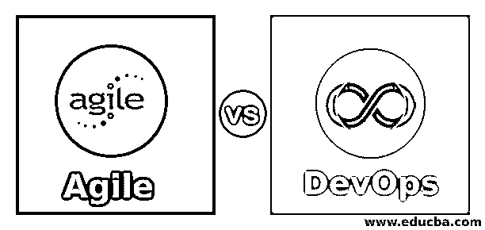
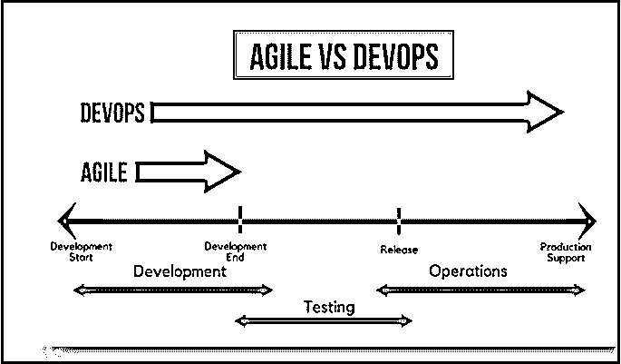
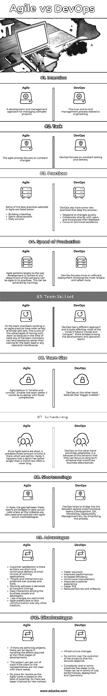

# 敏捷与开发运维

> 原文：<https://www.educba.com/agile-vs-devops/>

## 敏捷和开发运维的区别

敏捷 vs DevOps 是目前业界使用的两种软件开发方法之间的比较。敏捷是模块开发的标准实践，通过 SDLC 阶段提供增量特性，包括需求收集、开发、测试、调试和维护。而 DevOps 是与运营团队任务协作开发以加快软件开发生命周期的过程。敏捷方法侧重于持续的变更过程，而 DevOps 基于持续集成和持续部署(CI/CD)以及高质量的交付。与敏捷流程相比，DevOps 是一种更好的方法，适用于大多数需要上市时间的业务场景，具有大规模项目实现能力。

### 什么是敏捷和 DevOps？

让我们来看看敏捷与开发运维的一些快速对比:

<small>Hadoop、数据科学、统计学&其他</small>

| **敏捷** | **DevOps** |
| 软件开发敏捷实践的核心活动是需求阶段/设计阶段/开发阶段/测试阶段/调试阶段/维护阶段。 | DevOps 下的核心活动是流程/要求/设计/工程/施工/测试/调试/部署和维护。 |
| [敏捷的工具有编译器](https://www.educba.com/agile-coach-interview-questions/) /调试器/剖析器/ GUI 设计器/建模/ IDE/构建自动化/发布自动化/基础设施即代码/测试。 | DevOps 的工具有编译器/调试器/剖析器/ GUI 设计器/建模/ IDE/构建自动化/发布自动化/基础设施即代码/测试。 |
| BABOK，PMBOK，CMMI 是一些标准和知识体。 | 巴博克、CMMI、IEEE 标准、ISO 9001、ISO 和 ITIL 是一些标准和知识体系。 |

### 敏捷和开发运维之间的直接比较(信息图表)

以下是敏捷与开发运维之间的 10 大区别:

### 敏捷和开发运维之间的主要区别

两者都是企业中推荐的选项。让我们来看看一些主要的区别:

*   敏捷是关于软件开发的，DevOps 是关于软件开发和管理的。
*   敏捷以冲刺的方式运作，而 DevOps 更强调期限和基准。
*   敏捷不相信自动化，而在 DevOps 中，自动化是其核心。
*   DevOps 需要敏捷，以便更快、更高效地获得期望的结果，但反之则没有任何价值。
*   敏捷处于精益开发和 DevOps 的中期。

### 敏捷与开发运维对比表

让我们来看看敏捷与开发运维之间的主要比较——

| **比较的基础** | **敏捷** | **DevOps** |
| **意向** | 管理复杂项目的开发和管理方法。 | 这是一个与工程相关的端到端管理流程。 |
| **任务** | 敏捷过程关注持续的变化。 | DevOps 专注于持续的测试和交付。 |
| **做法** | 下面列出了敏捷中采用的一些最佳实践——

*   Create a to-do list.
*   Sprint development
*   daily inspection

 | DevOps 也有一些简化过程的最佳实践——

*   Quick response to change
*   Work directly with users and adopt their feedback.
*   Focus on technical excellence.

 |
| **生产速度** | 敏捷在很大程度上与开发的方式有关；公司的任何部门在实践中都可以是敏捷的。这可以通过训练来实现。 | DevOps 更注重软件部署，选择最可靠、最安全的路线。 |
| **团队技能组合** | 在敏捷实践中工作的所有团队成员都有各种各样相似的技能。这是拥有这样一个团队的优势之一，因为在需要的时候，任何团队成员都可以提供帮助，而不是等待团队领导或任何专家的干预。 | DevOps 另辟蹊径，相当有效；很多时候，它遵循的是“分而治之”。开发和运营团队之间的分工。 |
| **团队规模** | 敏捷信奉“更小更简洁”。团队越小，交付的复杂性就越低。 | DevOps 则认为“越大越好”。 |
| **调度** | 因为敏捷团队很短，所以有预先确定的时间，这就是冲刺。Hardy，有时冲刺会持续一个月以上，但通常会持续一周。 | 另一方面，DevOps 优先考虑可靠性。正是因为这种行为，他们可以专注于一个将业务干扰降至最低的长期计划。 |
| **缺点** | 在敏捷中，这些团队之间的差距在日常的 scrum 通话中被弥合，所有的回滚都用敏捷-scrum 方法来讨论和解决。 | DevOps 有助于在几个跨职能团队(开发、QA、监控、部署、管理等)之间架起桥梁。)通过简化流程。 |
| **优势** | 客户满意度是存在的，因为有小块工作应用程序的短而连续的交付。*   Human interaction is superior to processes and tools.*   Software is delivered at frequent times.*   Daily interaction between business people and developers.*   Later changes are welcome.*   Agile prefers face-to-face communication to other media.T13】 | 

*   A faster solution.
*   Performance improvement
*   Efficiency improvement
*   Continuous improvement
*   Improve customer experience.
*   Faster return on investment
*   Reduce failures and rollback.

 |
| **缺点** | 

*   If there are some big projects, in the initial stage of development, there may be problems in dealing with the required work.
*   If customers or representatives are not clear about their needs, the project may go off track.
*   There is no place for novices, because agile work is based on the level of professional knowledge. Therefore, there are fewer opportunities for newcomers.

 | 

*   Infrastructure change
*   Unable to control the development of products on which the service depends.
*   A degree of complexity, in some cases, has a steep curve. These factors can be cost, performance, deployment and operation.

 |

**注意—**还有其他几种练习可以进行。所列出的是最好的，因为它们适合几乎所有的开发场景(在每个场景下都有提及)。

### 结论

软件开发方法——是的，上面的讨论可以归结为一个协议，该协议将敏捷与开发运维作为一个整体的开发方法。DevOps 专注于其工作背后的频繁沟通、集成和协作方法。DevOps 将开发和运营团队聚集在一起。敏捷关注迭代的、进化的和增量的开发方法。敏捷优先考虑工作软件而不是文档。

### 推荐文章

这是敏捷与开发运维之间最大差异的指南。在这里，我们还通过信息图和比较表讨论了敏捷与开发运维的主要区别。你也可以看看下面的文章来了解更多。

1.  [PMP vs 敏捷](https://www.educba.com/pmp-certification-vs-agile-certification/)
2.  [萨斯对少萨](https://www.educba.com/sass-vs-less/)
3.  [HTML5 vs XHTML](https://www.educba.com/html5-vs-xhtml/)
4.  [SDLC 与敏捷](https://www.educba.com/sdlc-vs-agile/)

