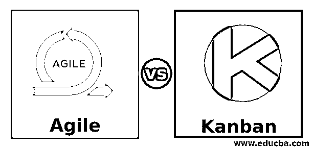
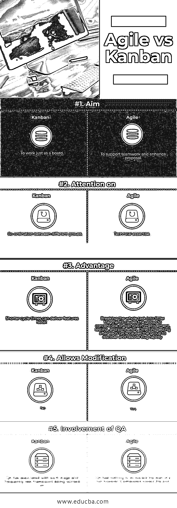

# 敏捷与看板

> 原文：<https://www.educba.com/agile-vs-kanban/>

## 敏捷和看板的区别

敏捷软件开发是一种[处理软件开发](https://www.educba.com/what-is-software-development/)的方式，在这种方式下，先决条件和安排通过自我整理和交叉有用的团队及其客户端客户端的集体努力而前进。它提倡多样化的安排、变革性的发展、早期的传递和不断的提高，并激发对变化的快速和适应性反应。

敏捷这个术语是由敏捷软件开发宣言在特定的环境下提出的。这个声明中包含的质量和标准来自并支持软件开发结构的扩展范围，包括 Scrum 和看板。

<small>项目进度与管理，项目管理软件&其他</small>

看板是一个众所周知的用于运行敏捷软件开发的系统。它需要极限的不断对应和工作的完全直截了当。工作上的事情通过看板上传向外传达，允许同事们随时看到每一项工作的情况。

有大量的叙述证明，接受敏捷实践和质量提高了软件专家、团体和协会的准备程度；尽管如此，一些观察研究没有发现任何逻辑证据。

“看板”是“视觉信号”的日语术语如果你在管理或创新部门工作，你的工作会周期性地变得难以察觉和触摸。看板有助于让你的工作引人注目，这样你就可以把它展示给其他人，让每个人都同意。

敏捷软件开发的一个典型标志是每日站立(或者称为每日 scrum)。在简短的会议中，同事们互相回答他们前一天为实现小组的重点目标做了什么，他们今天为实现目标打算做什么，以及他们看到的实现目标的任何障碍或阻碍。

看板是一种敏捷的风险板设备，旨在帮助想象工作，限制提前工作，并增加生产力(或流)。看板使用卡片、章节和不间断的改进来鼓励创新，管理团队关注工作的适当度量并完成它。

### 敏捷与看板的直接比较(信息图)

下面是敏捷和看板的 5 大区别。

### 敏捷和看板的主要区别

敏捷和看板都是市场上流行的选择；让我们讨论一下敏捷和看板之间的一些主要区别。

*   与传统的软件设计相比，敏捷软件开发主要针对具有动态性、不确定性和非线性的复杂框架和项目开发。
*   由于看板爱好者团队的不懈努力，看板在精益装配中已经取得了惊人的进步。David Anderson 的描述看板技术的工作将看板带入了软件和管理领域，Jim Benson 和 Tonianne DeMaria 的个人看板将看板的应用扩展到了你意想不到的地方。
*   敏捷编程的改进是由各种坚实的工作支撑的，涵盖了需求、编码、设计、建模、测试、过程、质量、计划、风险管理等领域。
*   看板流程只是一块板，名为“看板板”，它不仅承担了展示工作流程的重要工作，而且还改善了不同团队之间的工作流程。
*   目前，有些组织追求物理表单，有些组织追求虚拟表单。最后一点被证明是有用的，就可访问性和可用性而言。
*   板上的每件工作都是一张看板卡。使用卡片[实体/虚拟]的主要目的是让团队有足够的能力从外部跟进工作。
*   卡片对具体的工作内容、义务、评估完成情况以及工作内容的现状进行简短的思考。
*   这使团队能够预测困难，更快地捕捉到阻碍因素，扩大可识别性，减少依赖性。
*   实际上，敏捷编程高级技术可以与任何编程世界观或方言一起使用；它们最初几乎与项目排列条件相关，例如 Smalltalk 和 Lisp 以及后来的 Java。敏捷策略的潜在采纳者通常是中小规模的团队，他们会尝试一些非凡的框架，这些框架的需求很难得出结论，并且在框架创建过程中容易发生变化。
*   敏捷编程进步技术支持产品改进生命周期的广泛范围。一些关注实践，而一些强调处理工作流(例如，Scrum、看板)。有些帮助练习先决条件细节和进步，而有些则希望涵盖整个改进生命周期。

### 敏捷与看板对照表

下面是敏捷和看板之间的 5 个最重要的比较。

| **比较的基础** | **中的“T1”** | **敏捷** |
| **瞄准** | 像木板一样工作。 | 支持团队合作，完善提案 |
| **关注** | 不同团体之间的协调 | 技术专长 |
| **优势** | 较短的周期时间可以更快地交付特性。 | 将整个任务分解成更小的片段会使团队专注于顶级的改进、测试和共同努力。在每个周期之后指导测试会使团队快速发现并解决 bug。 |
| **允许修改** | 不 | 是 |
| **质量保证的参与** | QA 与每个阶段都有关联，并经常测试正在开发的框架 | QA 在跑步开始时无事可做，但在接近终点时却筋疲力尽。 |

### 结论

看板在当前的敏捷编程团队中非常引人注目，然而看板工作系统可以追溯到 50 多年前。在 20 世纪 40 年代末，丰田开始改进其设计流程，依赖于一种类似的模型，通用商店利用这种模型来储存货架。市场储存足够的物品来满足买家的需求，这是一种促进普通商店和顾客之间流动的训练。由于库存规模与利用率设计相协调，杂货店通过减少在某个随机时间必须持有的过剩库存，显著提高了库存管理的生产率。然后，商店目前可以保证购物者需要的给定商品在库存中是可靠的。

敏捷方法脱离了过去驱动编程专家的真正任务。沿着这些路线，习惯进步的困难和限制已经被处理。因此，敏捷方法已经被企业认为是任务推进的最佳答案。几乎每个产品工程师都以某种形式利用了敏捷方法。这种策略为帮助团体提供了一个简单的结构。这促使他们工作，并保持对快速运输的关注。该中心帮助有能力的协会减少与程序改进相关的一般风险。

### 推荐文章

这是敏捷和看板之间区别的指南。在这里，我们也用信息图和比较表来讨论敏捷和看板的主要区别。你也可以看看下面的文章来了解更多。

1.  [Winforms vs WPF](https://www.educba.com/winforms-vs-wpf/)
2.  [AUTOCAD vs CATIA](https://www.educba.com/autocad-vs-catia/)
3.  [Adobe Lightroom vs Photoshop](https://www.educba.com/adobe-lightroom-vs-photoshop/)
4.  [特雷罗 vs 斯莱克](https://www.educba.com/trello-vs-slack/)

