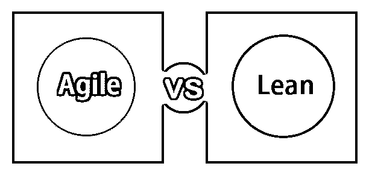
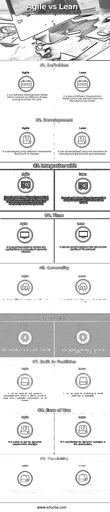

# 敏捷与精益

> 原文：<https://www.educba.com/agile-vs-lean/>

## 敏捷与精益的差异

 **敏捷是软件开发生命周期模型中的一种方法，它涉及不同的最终用户、所有者和组织良好的跨职能团队。为了向客户或最终用户交付业务解决方案，这种模型快速且易于遵循和实现。它提供了早期的交付和持续的改进，在需求频繁变化的情况下快速而灵活。精益流程是一个[软件开发模型](https://www.educba.com/software-development-vs-web-development/)，它是从制造实践和精益原则中衍生或提取出来的，并被转化到软件开发领域。这个模型提供了不同的亚文化和原则、价值观，以及一个坚实的框架模型和一套好的标准和实践。[精益发展模式](https://www.educba.com/lean-analytics/)涉及不同的原则。

### 敏捷与精益的直接对比(信息图)

以下是敏捷和精益的最大区别

<small>项目进度与管理，项目管理软件&其他</small>

### 敏捷和精益的主要区别

敏捷和精益都是市场上流行的选择；让我们讨论一下敏捷和精益之间的一些主要区别:

1.  敏捷软件开发模型就像是构建一个新事物，这是第一次，也只是一次，而精益软件开发模型是一种构建同样的东西，一次又一次，也是在同样的东西上。
2.  敏捷软件开发模型与精益软件开发模型有一套不同的原则，如消除浪费、加强学习、尽可能晚地决定、尽可能快地交付、授权给团队、建立完整性和看到整体。
3.  敏捷软件开发模型在它的模型中有一个用户原则，而精益软件开发模型纠缠于关键词浪费。
4.  敏捷软件开发模型交付的是产品，而精益软件开发模型交付的是价值。
5.  敏捷软件开发模型在其模型中应用启发式，而精益软件开发模型在其模型中应用工作产品
6.  敏捷软件开发模型没有任何削减成本的选项，而精益软件开发模型在其模型中有削减成本的选项
7.  敏捷软件开发模型具有某种不确定性或模糊性，而精益软件开发模型已经处理过了。
8.  敏捷软件开发模型为工作软件提供了更多价值，而精益软件开发模型通过消除无用的浪费为过程提供了更多价值，这可以减少或消除[软件需求](https://www.educba.com/career-as-a-software-developers/)。
9.  敏捷软件开发模型具有尽可能快的迭代开发步骤，而精益软件开发模型方法通过减少正在进行的工作中的工作流数量来进行更多的流程管理。
10.  敏捷软件开发模式有不同的方式，如 Scrum、看板、XP 等。而精益软件开发模型有不同的管理过程。

### 敏捷与精益对比表

让我们讨论一下敏捷和精益之间的比较

| ****敏捷与精益的基础对比**** | **敏捷** | **精益** |
| **定义** | 它是一个软件开发模型，在其整个生命周期中包含六个不同的阶段 | 它也是一种从制造模型衍生出来的软件开发模型。 |
| **开发** | 它是使用不同的框架开发的，比如 Scrum 或看板 | 它可以利用制造原理和工艺的转变来开发 |
| **整合** **与** | 它可以以这样一种方式开发，最终的开发和集成可以通过交付产品的小部分或频繁部分来完成 | 它可以通过使用精益模型中的原则来开发。 |
| **时间** | 它用于以动态的方式执行或交付应用程序或产品 | 它可以用来提高产品的速度和质量。 |
| **通用性** | 它的生命周期有六个不同的阶段。, | 它的发展模式有七个原则 |
| **原理** | 这是关于产品的范围和价值 | 它是关于产品质量及其发展速度的 |
| **内置设施** | 它可以用于任何产品的开发，无论是小的还是大的，并且可以选择一个合适的框架。 | 它可用于构建尽可能小的批量。 |
| **易用性** | 它更容易用于动态需求变更 | 它对于可交付物的动态变化是不灵活的。 |
| **灵活性** | 它支持不同框架使用的灵活性 | 它支持产品的连续检查和调整。 |

### 结论

敏捷软件开发模型包括一个带有迭代模型的增量方法。这使得连续的软件交付和发布能够以很小的时间间隔频繁地引起客户或最终用户的注意，这将确保并表明模型的价值，而精益模式采用从精益制造到精益软件开发模型的原则和过程，这将与基本上不同领域的类似原则过渡。一个[敏捷模型被自己开发](https://www.educba.com/agile-coach-interview-questions/)并且特别为软件开发过程提出。

敏捷软件开发模型具有更大的优势，而精益软件开发模型在实现产品交付方面的原则、过程和成熟度级别相比优势较小。敏捷软件开发模型或生命周期有六个阶段，而精益软件开发有七个原则。最终，最终用户的需求以及基于目标客户的数量和应用程序的复杂性，可以决定要考虑的软件开发模型是采用敏捷还是精益软件开发模型。与敏捷标准相关的不同过程和标准包括过程、工具、良好的文档、合同联络、对计划变更的快速响应等。这有利于客户在早期交付，并以频繁的时间间隔交付产品，导致客户满意和对工作软件的承诺。这进一步提高了客户对团队的信任。敏捷中有不同的框架，比如 Scrum 和看板。精益原则中使用的不同工具是高效的，并产生有效的结果，其中精益软件开发也可以被视为敏捷软件开发模型，因为它属于称为[敏捷模型](https://www.educba.com/agile-vs-waterfall-project-management/)的子集的保护伞。

### 推荐文章

这是敏捷和精益之间最大区别的指南。在这里，我们还通过信息图和比较表来讨论敏捷和精益的主要区别。你也可以看看下面的文章来了解更多。

1.  [敏捷 vs 开发运维](https://www.educba.com/agile-vs-devops/)
2.  [软件开发 vs 网页开发](https://www.educba.com/software-development-vs-web-development/)
3.  [敏捷 Scrum 面试问题](https://www.educba.com/agile-scrum-interview-questions/)
4.  [精益分析](https://www.educba.com/lean-analytics/)

**