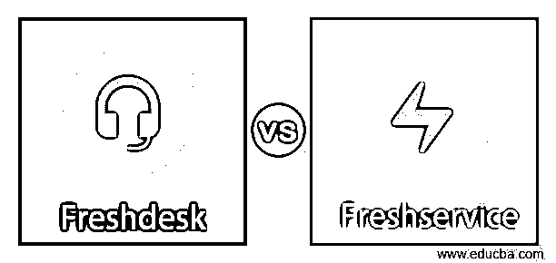
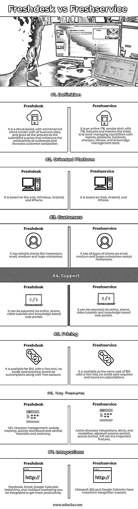

# Freshdesk vs Freshservice

> 原文：<https://www.educba.com/freshdesk-vs-freshservice/>

## Freshdesk 与 Freshservice 的区别

Freshservice 和 Freshdesk 的用途不同，都是 Freshworks 的产品。这是一个面向客户的帮助台软件，价格从每月 0 美元到 109 美元不等。而 freshservice 是一个内部服务帮助台软件，用于控制公司内部信息技术支持，每个用户每月的费用从 19 美元到 99 美元不等。本文讨论了重要的差异和显著的比较因素。

### Freshdesk 与 Freshservice 的直接比较(信息图表)

以下是 Freshdesk 与 Freshservice 之间的 7 大区别:

<small>网页开发、编程语言、软件测试&其他</small>

### Freshdesk 与 Freshservice 的主要区别

重要的区别，如工作，应用，集成，插件，支持，在这一节中解释。

#### 1.定义和功能

对于客户使用需要支持服务的网站或消费者登录门户的企业来说，Freshdesk 是一个重要的工具。像票据记录这样的功能可以使客户提交票据，这限制了工作人员通过电话保存详细信息的工作。其他功能，如知识清单，使用户能够访问管理消费者的信息门户，以便从内容开发中找到问题的解决方案，如对票证和文章的回复。而 freshservice 用于管理内部软件和硬件的公司 IT 部门。这对于跟踪和组织票证以及管理向员工发布的更新技术(如文档批准和笔记本电脑)非常重要。它适用于大型团队，需要技术资产管理

#### 2.定价

免费试用的 Freshservice 和 Freshdesk 属于相同的价格范围。freshservice 的价格范围从每月 19 美元降至 99 美元，相比之下，Freshdesk 的价格范围从每个用户每月 15 美元到每月 109 美元不等。Freshdesk 的重点是依赖于客户的工具，如从网站上记录票证，而 freshservice 旨在解决 IT 问题并管理信息技术的内部资产。Freshdesk 的价格是中小型企业可以承受的，并且还包括一个免费计划，该计划可获得基本支持。付费版本是自适应的，每月从 15 美元到 29 美元不等。

#### 3.易接近

Freshdesk 通过电话、社交媒体和邮件创建所有类型的支持票证。它摒弃了记录票证的必要性，从而节省了更多的时间，并使创建票证变得容易。它在控制面板上具有视觉吸引力，突出显示了主要的支持指标以及票证的所有描述，如编号、打开日期、状态以及对其采取必要措施的每个强制细节。它还有一个收件箱，突出显示所有访问频道的详细信息。而 Freshservice 有一个优雅的仪表板，带有一个简单的用户界面，在 IT 支持人员上显示关于请求、票据、新服务等查询的各种类别。有一个很吸引人的控制面板，显示了指标和票证状态的所有活动。服务目录等工具使用户能够请求有关作业的软件或硬件，并通过随机点击在部门中轻松安装和定制，包括自动启动请求，自动发送请求以获得任何批准。

#### 4.支持

Freshdesk 和 Freshservice 的服务支持具有相同的功能，并且它们的产品是由同一个组织开发和拥有的。客户获得了对这两种产品的支持以及联系电话和邮件地址。客户端支持以不同的方式扩展。服务支持在 Freshdesk 上有一个学院，技术人员可以支持代理参加有关代理和管理基础模块的课程，并掌握客户服务技能。它由知识库和模块组成，如如何设置和定制自助服务门户，以及社交、电话、电子邮件和网站渠道，以创建和提交可以将用户与首选社区联系起来的票证。而 Freshservice 通过网络研讨会和视频、代理指南、社区论坛、邮件知识库和电话为客户提供支持。它通过聊天提供通信渠道，而新部署的服务允许聊天工具使用通信渠道。社区论坛使用户能够在响应相关问题的社区成员上重新开始话题。

### Freshdesk 与 Freshservice 对比表

| **属性** | **新鲜的** | **新鲜服务** |
| **定义** | 它是一种基于云的全渠道客户服务，适用于所有规模的企业，并为提交的查询提供所有答案，从而提高客户的工作效率和客户满意度。 | 它是一个具有 ITIL 功能的在线 ITIL 服务台，并通过报告、问题、事件、变更、发布和知识管理工具实现了票证和资产管理功能。 |
| **面向平台** | 它基于 web、Windows、Android 和 iPhone。 | 它基于 Web、Android 和 iPhone。 |
| **客户** | 它拥有可靠的客户，如自由职业者、小型、中型和大型企业。 | 除了自由职业者，它拥有大、中、小型企业的所有类型的客户。 |
| **支持** | 可以通过在线、电话、视频教程和基于知识的门户网站访问它。 | 它可以通过在线、电话、视频教程和基于知识的门户网站访问 |
| **定价** | 它售价 19 美元，免费试用，不需要信用卡，基于订阅和免费账户 | 这款软件同样售价 19 美元，可以免费试用，不需要信用卡，基于订阅 |
| **主要特征** | API、缺勤管理、活动跟踪、活动仪表板和控制、保留和归档 | 活动目录集成、警报和上报、审批流程控制、访问控制、API 是重要的功能 |
| **集成** | 脸书、Gmail、谷歌日历、Mailchimp 和 HubSpot 营销可以集成在一起，以获得更高的工作效率 | 微软 365 和谷歌日历有重要的集成支持 |

### 推荐文章

这是 Freshdesk vs Freshservice 的指南。在这里，我们还将讨论 Freshdesk 与 Freshservice 的主要区别，并提供信息图表和比较表。您也可以看看以下文章，了解更多信息–

1.  [AppDynamics vs Dynatrace](https://www.educba.com/appdynamics-vs-dynatrace/)
2.  [GNSS vs GPS](https://www.educba.com/gnss-vs-gps/)
3.  [Arduino Mega vs Uno](https://www.educba.com/arduino-mega-vs-uno/)
4.  [什么是 Logstash？](https://www.educba.com/what-is-logstash/)

