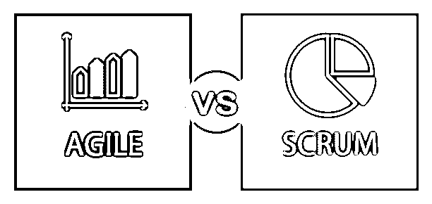
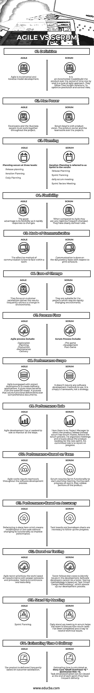

# 敏捷 vs Scrum

> 原文：<https://www.educba.com/agile-vs-scrum/>

## 敏捷和 Scrum 的区别

下面的文章提供了敏捷和 Scrum 的概要。敏捷是一种有时间限制的交互式方法，以增量方式构建和交付软件或应用程序。它不是在项目结束时一次性交付，而是通过将项目分解成一点点功能，对它们进行优先级排序，并在更短的周期内持续交付。这是一种设计或构建产品或应用程序的持续快速开发方法。范围由预算和时间表决定，它提供了很大的灵活性。

敏捷有一些质量策略，比如:

<small>项目进度与管理，项目管理软件&其他</small>

*   重构
*   小反馈周期
*   循环

Scrum 是领先的敏捷框架，以协作的方式交付业务成果。它实现了经验过程控制(计划和进度过程)的思想。它将复杂的工作分成更小的任务，以规划出在更短的时间内要完成的需求。它使所有的工作都变得透明，并且是可扩展的。主要优势是在短时间内为利益相关者生产出快速开发的产品。

### 敏捷和 Scrum 的直接比较(信息图)

以下是敏捷和 Scrum 之间的 14 大区别:

### 敏捷和 Scrum 的主要区别

敏捷和 Scrum 都是市场上流行的选择。

让我们讨论一下敏捷和 Scrum 之间的一些主要区别:

*   敏捷和 scrum 都是迭代开发。通俗地说，Scrum 是孩子，敏捷是父母，Scrum 属于敏捷过程。
*   敏捷是个人的，是过程和工具之上的互动。

敏捷有角色:

1.  节目编排者
2.  顾客
3.  测试员
4.  追踪者

*   敏捷中需要更积极的客户参与。
*   典型的[敏捷团队](https://www.educba.com/agile-team/)由 4 名开发人员、1 名测试人员和 1 名技术负责人组成。敏捷原则包括:团队和开发人员必须合作进行日常讨论。项目的最佳设计需要一个自组织的团队。
*   敏捷是多种软件方法的结合。在这里，流程步骤的更改是基于客户的要求进行的。
*   在这里，客户需求是不可预测的，并且会随着时间而变化。ReQtest 工具有助于管理需求。
*   敏捷增加了可预测性，加快了上市时间，同时节省了资金。
*   Scrum 是管理有效产品开发的敏捷框架。

Scrum 有三个角色:

1.  开发团队
2.  产品所有者
3.  Scrum 大师

*   没有特定的工程实践是首选的。
*   典型的 Scrum 团队是 6-10 人。

Scrum 的原则是:

1.  他们经常交付有价值的软件。
2.  检查并适应。

*   Scrum 是实现敏捷的方法论。一旦冲刺开始，就不允许有任何改变。
*   客户需求被放入项目待办事项中。
*   它不需要任何软件开发实践来使用；它们需要管理实践。

### 敏捷与 Scrum 对比表

下面是敏捷和 Scrum 之间最重要的比较。

| **比较的基础** | **敏捷** | **Scrum** |
| 定义 | 敏捷是一种增量和迭代的模型开发。 | 它是一种增量模式(在一段时间内一个接一个地构建产品),是一种敏捷方法。它们遵循固定长度的迭代。
优化预测，控制风险。 |
| 人力 | 开发人员和业务人员必须在整个项目中一起工作。 | Scrum 从产品愿景开始。产品负责人和项目团队。 |
| 规划 | 计划发生在三个层次:

*   Release plan
*   Iterative plan
*   Daily plan

 | 迭代计划在 scrum 中被称为 Sprint。

*   Release planning
*   Sprint
*   Daily Scrum meeting
*   Sprint review meeting

 |
| 灵活性 | 最大的优点是它的灵活性，因为它可以快速响应变化。 | 与敏捷相比，它们非常死板(没有频繁的变化)。他们有明确规定的规则。 |
| 交流方式 | 有效的沟通方式是团队内部的面对面交流。 | 根据打印时间表，每天/每周进行沟通。 |
| 易于改变 | 他们专注于客户满意度，在不改变环境的情况下经常交付结果。 | 它们适用于需要快速变化环境的项目。 |
| 工艺流程 | 敏捷流程包括:

*   explore
*   plan
*   produce
*   maintain
*   pay

 | [Scrum 流程包括](https://www.educba.com/scrum-process/) :

*   pre-competition
*   develop
*   After the game

 |
| 性能范围 | 敏捷通过项目开发来创建软件应用程序。它比瀑布模型有更多的好处。一个重视功能性可交付成果胜过综合文档的过程。 | 它不需要任何软件开发方法来使用。它只是一个框架，而不是战略。 |
| 绩效角色 | [敏捷开发](https://www.educba.com/agile-development/)在监控所有步骤中起领导作用。 | 这里没有[项目经理](https://www.educba.com/project-manager-goals/)来指导产品发布；相反，scrum 有 scrum Master，它遵循 scrum 过程。他组织会议并确保下一个 sprint 的产品积压。他的职责是汇报进展情况。 |
| 基于团队的绩效 | 敏捷工作需要整个软件开发过程中的团队合作。 | Scrum 需要 Sprint 功能来开始计划会议。在每个进度冲刺阶段，他们发布部分产品。 |
| 性能-基于准确性 | 重构在这里完成，这意味着在不改变其功能的情况下修改代码以提高性能。 | 任务板和燃尽图是跟踪进度所必需的。 |
| 基于测试 | 敏捷测试人员根据需求，用正确的概念和原则来区分工作的优先级。测试是持续的，并且尽早测试。 | 测试人员遵循测试用例来识别开发中的问题。软件开发人员不能通过测试人员。测试方法基于“测试驱动设计方法”，这加快了我们的开发过程。 |
| 起立会议 | 冲刺规划 | scrum 中的每日站立会议有助于团队讨论已经完成了多少任务以及解决技术问题的方法。 |
| 估计时间和交付 | 基于客户满意度，产品会频繁交付。 | 估计时间的计算方法是
故事成本*(人员开销+1) *(估计风险+1)。任务细节评估可以在每个 sprint 结束时查看。他们送货频繁。 |

### 结论

随着技术市场在竞争激烈的环境中快速增长，任何业务团队都希望以一种快速增长的方式来开发产品或传达他们的想法，以提供利润，并让许多客户购买他们的产品。敏捷过程主要通过提供有价值的软件交付来满足客户。敏捷的主要附加特性是它对快速变化做出反应的灵活性。Scrum 是一个关注最高商业价值的敏捷框架。

客户的反馈反映在最后的冲刺阶段。他们简化了流程，提高了生产率，改善了沟通，不像传统瀑布模型那样等待规划、设计周期完成。实时生产应用由产品 backlog 执行。敏捷方法强调渐进和重复的工作，而 Scrum 被用于软件开发过程。

### 推荐文章

这是敏捷和 Scrum 之间最大区别的指南。在这里，我们也讨论了敏捷和 Scrum 的关键区别，包括信息图表和比较表格。您也可以看看以下文章，了解更多信息–

1.  [敏捷 vs 公主 2](https://www.educba.com/agile-vs-prince2/)
2.  [敏捷 vs Scrum vs 瀑布](https://www.educba.com/agile-vs-scrum-vs-waterfall/)
3.  [拉拉维尔 vs Zend](https://www.educba.com/laravel-vs-zend/)
4.  [角度 5 对角度 4](https://www.educba.com/angular-5-vs-angular-4/)

