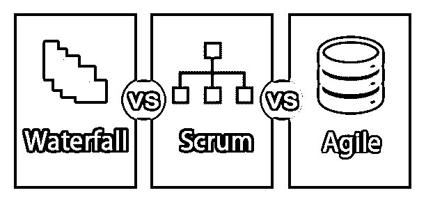
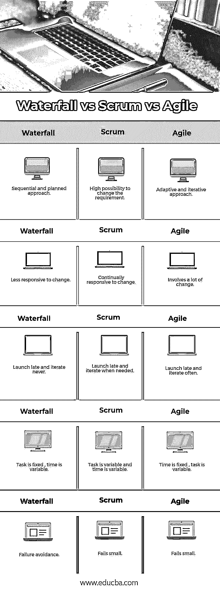

# 敏捷 vs Scrum vs 瀑布

> 原文：<https://www.educba.com/agile-vs-scrum-vs-waterfall/>

## 敏捷、Scrum 和瀑布的区别

敏捷软件开发是一种迭代的方法。不会在项目开始时进行深入的规划，相反，会鼓励不断变化的需求和来自用户的持续反馈，在一段时间内，跨职能团队以迭代的方式工作，这项工作被预先安排成基于客户价值的优先累积。每一次迭代中都需要一个工作产品。作为敏捷的一部分，它是让[敏捷](https://www.educba.com/agile-coach-interview-questions/)进化的主要设置之一。它允许复杂的软件和产品开发在迭代的方法上工作。存在一到两周的固定迭代被执行，它们被命名为 sprints，允许以常规方式发布软件。接下来的步骤是在每个冲刺阶段结束时决定的。瀑布方法遵循一个按时间顺序排列的线性过程，是工程和 IT 项目中最受欢迎的 SDLC 版本。一旦每个阶段完成，开发就进入下一个阶段。前一阶段的移动永远不能在这里存档，必须重新开始，整个过程将从头开始。在这里，需求将在流程的每个阶段得到审查和批准。

### 敏捷宣言的原则

*   通过持续的有价值的软件交付实现客户满意度
*   适应开发阶段的需求变化
*   射手传递量表
*   业务团队和开发人员之间的日常协作
*   向团队成员提供更大的支持、信任和更高的自主权。
*   开发团队内部的信息传递主要是通过面对面的交流来实现的。
*   工作软件测量项目的进度
*   保持恒定的速度可以实现可持续发展
*   主要重点是技术卓越。
*   团队应该有规律地繁殖以提高效率

### scrum 宣言的主要原则

*   经验过程控制:透明、检查和适应这三个主要概念是 scrum 构建的基础。
*   **自我组织:**这一原则的重点是在自我组织时提供卓越的价值，这提供了更好的认同和更有助于增长的创造性和想象力的环境。
*   协作:它需要表达、认知和分享。[项目管理是一个创造价值的过程](https://www.educba.com/project-management-interview-questions/)，团队合作和互动可以创造更大的价值。
*   **基于价值的优先化:**这个原则关注 scrum 如何帮助交付最大的商业价值，从项目的早期阶段开始，一直延续到整个过程。
*   这描述了时间在 scrum 中的角色，并有效地管理时间元素。Scrum 中有时间限制的元素包括每日站立会议、冲刺、冲刺评审会议和冲刺计划会议。
*   **迭代开发:**这个原则定义了迭代开发，即如何更好地管理变更，以及如何用构建的产品满足客户需求。

### 瀑布模型的优势

*   易于管理的流程
*   [瀑布图](https://www.educba.com/waterfall-project-management/)中的每个阶段都有起点和终点，很容易与利益相关者和客户分享进展。
*   它总是期望有一个记录在案的程序

### 敏捷、Scrum 和瀑布的面对面比较(信息图)

下面是敏捷、Scrum 和瀑布的五大区别

<small>项目进度与管理，项目管理软件&其他</small>

### 敏捷、Scrum 和瀑布的主要区别

敏捷 vs Scrum vs 瀑布都是市场上的热门选择；让我们讨论一下敏捷、Scrum 和瀑布之间的主要区别

*   瀑布本身为将要交付的内容提供了更多的信心。敏捷致力于开发环境的最佳实践。在这里，项目中的几个风险可以很好地处理，因为输出被不断地审查。
*   瀑布并不期望项目和团队成员共处一地。而敏捷和 scrum 期望工作人员共处一地。
*   敏捷解决了较少的项目返工，而且变更应该更早地被发现。Scrum 还允许更早地识别变更，而瀑布不会以同样的方式做出反应。
*   敏捷和 scrum 为最终产品提供了一个更小的蓝图。这使得对客户的承诺成为一个难点。而瀑布图向客户和开发人员展示了最终产品的更好的图像。
*   所有这些方法都有自己的工具来管理和建模他们的开发任务。

### 敏捷 vs Scrum vs 瀑布比较表

下面是敏捷、Scrum 和瀑布之间最重要的比较

| **瀑布** | **Scrum** | **敏捷** |
| 顺序和有计划的方法 | 改变要求的可能性很大 | 自适应迭代方法 |
| 对变化不太敏感 | 不断响应变化 | 涉及到很多变化 |
| 延迟启动，从不迭代 | 推迟发布并在需要时迭代 | 推迟发布并经常迭代 |
| 任务是固定的，时间是可变的 | 任务是可变的，时间也是可变的 | 时间是固定的，任务是可变的 |
| 故障避免 | 失败小 | 失败小 |

### 结论——敏捷 vs Scrum vs 瀑布

敏捷和瀑布是非常不同的最终产品。瀑布可以应用于几乎所有类型的 IT 项目，但是敏捷和 scrum 都有自己的限制，这取决于它们所涉及的项目类型。

### 推荐文章

这是敏捷、Scrum 和瀑布之间最大区别的指南。在这里，我们也讨论了敏捷与 Scrum 与瀑布的关键区别，包括信息图表和比较表。你也可以看看下面的文章来了解更多。

1.  [AWS vs Azure vs Google Cloud](https://www.educba.com/aws-vs-azure-vs-google-cloud/)
2.  [MATLAB vs R](https://www.educba.com/matlab-vs-r/)
3.  [手机应用 vs 网站](https://www.educba.com/mobile-apps-vs-website/)
4.  [PowerShell vs Python](https://www.educba.com/powershell-vs-python/)

