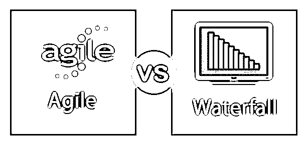
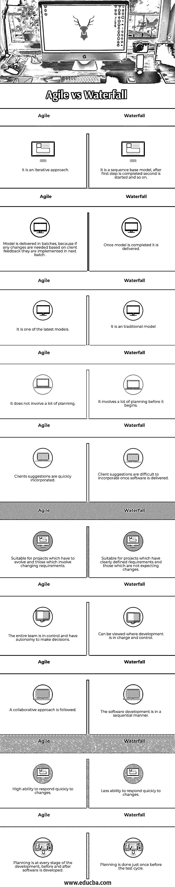

# 敏捷 vs 瀑布

> 原文：<https://www.educba.com/agile-vs-waterfall/>

## 敏捷和瀑布的区别

我们将从定义敏捷开始，然后转移到连接敏捷和瀑布框架。敏捷和瀑布在软件开发人员中非常受欢迎。这是因为他们在快速有效地交付软件方面为这些开发人员提供了帮助。敏捷宣言规定并概述了软件开发概念；使用敏捷宣言中陈述的开发方法之一并在此基础上进行开发被称为[敏捷开发](https://www.educba.com/agile-development/)。

### 敏捷与瀑布的直接比较(信息图)

下面是敏捷和瀑布之间的 10 大区别:

<small>项目进度与管理，项目管理软件&其他</small>

### 敏捷与瀑布的主要区别

让我们讨论一下敏捷和瀑布之间的一些主要区别:

*   首先，瀑布方法是顺序的和线性的，而敏捷方法是增量的和迭代的。
*   扩大项目规模，也就是说，通过额外的特性和版本进一步构建项目，在敏捷中受到限制，而在敏捷中却很容易做到。
*   瀑布模型中的客户参与度很低，而敏捷模型中的客户参与度很高。
*   所有进行的工作都有记录。然而，在敏捷中，很多重点并不放在文档上。
*   最终测试发生在项目以瀑布形式完成的时候。在敏捷中，持续测试发生在每个阶段。
*   在瀑布级别的灵活性中，是最小的，在敏捷级别的灵活性中是最高的。
*   [瀑布迭代模型](https://www.educba.com/waterfall-model/)适用于需求定义清晰、没有预期变化的项目。另一方面，敏捷允许需求的变化和发展。

**敏捷模式的特点:**

敏捷宣言主要有三个最基本的特征。

*   **迭代开发方法:**这意味着工作软件被快速交付给客户，并且从客户那里得到的反馈被用于下一批软件。这允许团队甚至在生产阶段的后期合并变更和修复 bug。
*   **简短的反馈循环:**这意味着客户的反馈是重要的，是软件开发人员所重视的。此外，他们把时间和资源花在最重要的事情上。
*   **规范的项目管理过程:**这意味着项目是非常结构化和组织良好的。每个团队都知道自己的角色和完成任务的时间表。

**瀑布模型的特点:**

瀑布模型是最早的软件开发模型之一；它在结构上毫不费力，使得软件开发人员易于使用和理解。

*   **可行性:**在开发软件之前，检查在该软件上工作是否可行。给定客户的需求，是否有可能构建软件，成本是多少，需要分配多少资源？
*   **需求分析和规格说明:**进行需求分析和规格说明是为了了解客户需要什么，以及公司是否有资源来满足这些需求。
*   **设计:**一旦完成以上两个步骤，开发者就可以勾勒出他们需要做什么，以及他们打算如何去做。他们花时间在绘图板上分析所有的步骤。
*   **编码:**一旦完成上述步骤，开发人员就进入[编码阶段](https://www.educba.com/careers-in-coding/)，在这里他们编写代码。这也是一个测试阶段，在这个阶段，他们测试他们的代码，对其进行更改，并尽可能地改进它。
*   **集成和测试:**这是测试的最后阶段，然后将所有的步骤合并，最终的软件就出来了；在交给客户之前，还要进行最后一次测试。

### 敏捷与瀑布比较表

下面是敏捷和瀑布之间最重要的比较:

| **瀑布** | **敏捷** |
| 它是基于序列模型；第一步完成后，开始第二步，依此类推。 | 这是一种迭代方法。 |
| 模型一旦完成，就交付了。 | 模型是分批交付的，因为如果基于客户反馈需要任何变更，它们将在下一批中实现。 |
| 这是一种传统模式。 | 这是最新款之一。 |
| 这需要在开始之前做大量的计划。 | 它不需要太多的计划。 |
| 一旦软件交付，客户的建议很难被采纳。 | 客户的建议很快被采纳。 |
| 适用于有明确要求的项目和不期待变更的项目 | 适合于必须发展的项目和那些涉及变化需求的项目。 |
| 它可以被看作是发展是负责和控制的。 | 整个团队都在掌控之中，并且拥有决策的自主权。 |
| 软件开发是按顺序进行的。 | 遵循协作方法。 |
| 对变化的快速反应能力较低。 | 对变化的快速反应能力强。 |
| 在测试周期之前，计划只进行一次。 | 规划存在于开发的每个阶段，在软件开发之前和之后。 |

### 结论

因此，我们想通过重申瀑布式开发方法是开发软件的传统方法之一，也是最早的方法之一来结束。在当今这个时代，敏捷框架和其他许多框架已经取而代之。它们是为牢记客户需求而设计的，在开发阶段的任何时候，甚至之后，都可以灵活地适应变化。这两个框架[都为软件开发人员提供了基准](https://www.educba.com/benchmark-testing/)基础；他们使用这里概述的基本原则，并用它们来开发软件。

### 推荐文章

这是敏捷和瀑布之间区别的指南。在这里，我们还讨论了敏捷和瀑布的关键区别，包括信息图和比较表。您也可以看看以下文章，了解更多信息–

1.  [敏捷 vs 瀑布项目管理](https://www.educba.com/agile-vs-waterfall-project-management/)
2.  [敏捷 vs Scrum vs 瀑布](https://www.educba.com/agile-vs-scrum-vs-waterfall/)
3.  [什么是敏捷冲刺](https://www.educba.com/what-is-agile-sprint/)
4.  [敏捷宣言的原则](https://www.educba.com/principles-of-agile-manifesto/)

