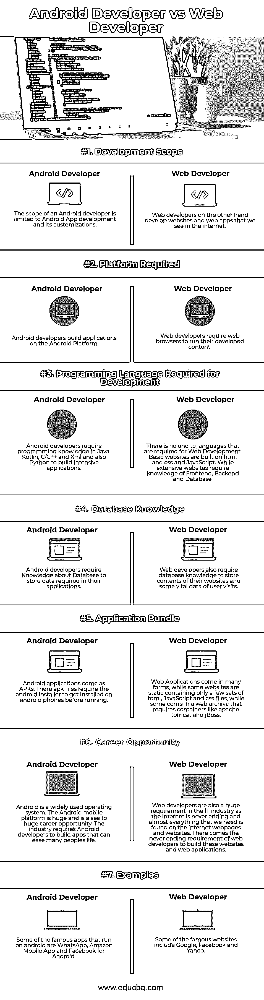

# Android 开发者 vs Web 开发者

> 原文：<https://www.educba.com/android-developer-vs-web-developer/>

## Android 开发者和 Web 开发者的区别

应用程序开发是行业中最热门的趋势，但是 web 开发是永远不会消失的。在当今以网络为导向的世界里，Android 开发和 Web 开发都是很好的职业选择。随着信息技术的扩展和互联网的发展为两者提供了平等的选择，现在每个人都为熟练工人提供了各种职业选择。

### 安卓是什么？

Android 是一个基于 Linux 的开源操作系统。大多数智能手机和平板电脑都使用 Android 作为操作系统。谷歌公司拥有安卓系统。2007 年，谷歌发布了第一个版本的 Android 软件开发工具包(SDK)。后来，在 2008 年 9 月，第一个商业版本发布并命名为 Android 1.0。

<small>网页开发、编程语言、软件测试&其他</small>

Android 源代码是免费和开源的。它根据 Apache 许可证版本 2.0 获得许可。Linux 内核的变化是在 GNU 通用公共许可证版本 2 下许可的。

Android 为移动设备的应用程序开发提供了统一的方法。这意味着当开发人员开发一个 Android 应用程序时，它可以在多个 Android 设备上运行。

谷歌在 2018 年 3 月 7 日的谷歌 I/O 大会上宣布了下一个 Android 版本 9，名为 Android Pie。Pie 是 Android Oreo 的最新增量更新。Pie 更新的目的是增强 Android 用户体验。它还增强了 Android 设备的功能和性能。

### 谁是 Android 开发者？

Android 开发人员是专门为 Android Play 商店设计应用程序的软件开发人员。Android Play 商店是苹果应用商店的直接竞争对手。这意味着 Android 开发人员的大部分工作都围绕着创建我们在 Android 智能手机和平板电脑上使用的应用程序。Android 开发人员可以为大型组织或应用程序开发公司工作。

### 谁是 Web 开发人员？

网站开发人员的角色是设计、编码和修改网站，从布局到功能，并根据客户的规格。努力创建视觉上吸引人的网站，具有用户友好的设计和清晰的导航。

作为一名网页设计师，需要 HTML、CSS 和 JavaScript 的基础知识。一旦开发者学会了基础知识，他们将能够创建至少静态的网站。另一方面，精通编程技能的专业开发人员，如–PHP、.NET、PYTHON、RUBY，以及 SQL Server、 [Mysql 等数据库管理，经历了更大的](https://www.educba.com/mysql-opensource/)和更具侵入性的网站的发展。

### Android 开发者和 Web 开发者的面对面比较(信息图表)

下面是 Android 开发者和 Web 开发者的 7 大区别

### Android 开发人员与 Web 开发人员的主要区别

Android Developer vs Web Developer 都是市场上的热门选择；让我们讨论一下 Android 开发人员和 Web 开发人员之间的一些主要区别:

*   Android 开发者开发针对 Android 手机的软件，而 web 开发者开发需要 Web 浏览器才能运行的应用程序。
*   Android 开发需要 Android 软件开发包，即 Android SDK。它还需要 Java 和 XML 知识来[构建一个 Android 应用](https://www.educba.com/application-platforms/)。另一方面，Web 开发人员需要 HTML、JavaScript、CSS 的知识来制作简单的静态网站。做一个集约化的网站，还需要其他编程语言和框架的知识。
*   由于当今世界对智能手机的依赖，对于能够为 Android 平台做出贡献并获得巨大成功的 Android 开发人员来说，这是一个巨大的职业机会。另一方面，网络开发对这个行业也很重要，因为大多数需要互联网和网站的东西都是媒体，这使得交流更容易。

### 安卓开发者

下面是 Android 开发人员和 Web 开发人员之间最重要的比较:

| **基本对比** | **安卓开发者** | **网络开发者** |
| **开发范围** | Android 开发者的范围仅限于 Android 应用程序开发及其定制。 | 另一方面，网络开发者开发我们在互联网上看到的网站和网络应用。 |
| **所需平台** | Android 开发者在 Android 平台上构建应用。 | Web 开发人员需要 web 浏览器来运行他们开发的内容。 |
| **开发所需的编程语言** | Android 开发人员需要 Java、Kotlin、C/C++和 XML 以及 Python 的编程知识来构建密集型应用程序。 | Web 开发所需的语言没有止境。基本的网站是建立在 HTML、CSS 和 JavaScript 之上的。而大量的网站需要前端、后端和数据库的知识。 |
| **数据库知识** | Android 开发人员需要数据库方面的知识来存储他们应用程序中所需的数据。 | Web 开发人员还需要数据库知识来存储他们网站的内容和一些重要的用户访问数据。 |
| **应用捆绑包** | Android 应用程序以 apk 的形式出现。他们的 apk 文件需要 android 安装程序在运行之前安装到 android 手机上。 | Web 应用程序有多种形式，有些网站是静态的，只包含几组 HTML、JavaScript 和 CSS 文件，而有些是 web 档案，需要像 apache tomcat 和 JBoss 这样的容器。 |
| **Career Opportunity** | Android 是一个广泛使用的操作系统。Android 移动平台是巨大的，是巨大职业机会的海洋。该行业要求 Android 开发者开发能够让许多人的生活变得轻松的应用。 | 网络开发人员也是 IT 行业的一个巨大需求，因为互联网是永无止境的，我们需要的几乎所有东西都可以在互联网网页和网站上找到。web 开发人员对构建这些网站和 web 应用程序的需求永无止境。 |
| **例题** | 一些运行在 Android 上的著名应用程序有 WhatsApp、亚马逊移动应用程序和 Android 版脸书。 | 一些著名的网站包括谷歌、脸书和雅虎。 |

### 结论

Android 开发者 vs Web 开发者只是偏好。一个开发者可能会选择 Android 开发作为自己的职业，可以做应用。这些应用程序可以通过智能手机和聪明的想法自动化许多流程。

此外，web 开发人员高度依赖软件公司和许多其他需要在线营销、响应网站/应用程序的企业，并且总是在寻找能够解决其业务问题的优秀 web 开发人员。

现在很明显，如果你愿意耐心学习并有解决问题的能力，Android 开发人员和 Web 开发人员都是很好的职业机会。

### 推荐文章

这是 Android 开发人员和 Web 开发人员之间最大差异的指南。在这里，我们还将讨论信息图和比较表的主要区别。你也可以看看下面的文章来了解更多。

1.  [软件开发 vs 网页开发](https://www.educba.com/software-development-vs-web-development/)
2.  [Web 开发人员 vs Web 测试人员](https://www.educba.com/web-developer-vs-web-tester/)
3.  [Linux vs Android](https://www.educba.com/linux-vs-android/)
4.  [敏捷 vs Scrum vs 瀑布](https://www.educba.com/agile-vs-scrum-vs-waterfall/)

