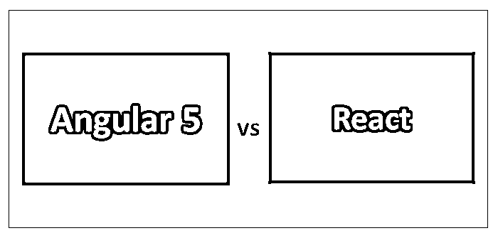
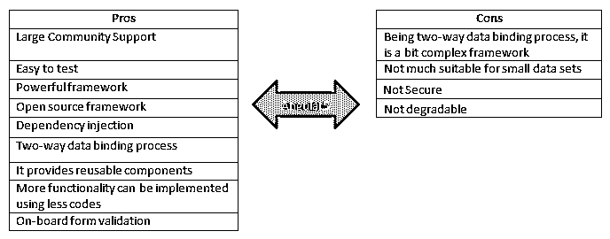
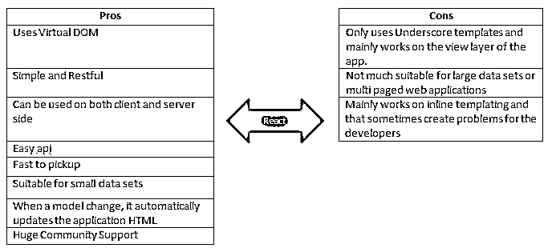
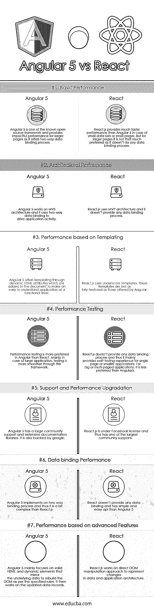

# 角度 5 vs 反应

> 原文：<https://www.educba.com/angular-5-vs-react/>

## **A** ngular 5 vs React 的区别

Angular 基本上是一个由谷歌 Angular 团队领导的基于 TypeScript 的开源前端 web 应用平台。Angular5 vs React 是一个基于 Javascript 的开源独立框架，旨在支持开发[数据密集型 web 应用](https://www.educba.com/how-to-build-web-applications-using-mongodb/)和测试驱动开发。它诞生于 2009 年，是一个大型商业产品的一部分。

### 重要特征

以下是 Angular5 和 React 的一些重要特性:

<small>网页开发、编程语言、软件测试&其他</small>

#### Angular 5 的特点

Angular 5 的一些重要特性如下所述:

*   双向数据绑定过程
*   依赖注入
*   易于测试的代码
*   深层链接
*   按指定路线发送
*   控制器
*   用指令扩展 HTML 属性的功能。

另一方面，React 基本上是一个 [javascript 库](https://www.educba.com/uses-of-javascript/)，主要用于构建和实现用户界面。React 最初是由受雇于脸书公司的乔丹·沃克创建的。它现在是当前软件行业中最流行的 javascript 库之一。

#### React 的特性

在下面找到 React 的几个重要特性。

*   JSX:它主要是一个扩展，经常被推荐作为 React JS 库的一部分使用。
*   **单向流**–React 主要以单向数据流的方式实现，更便于 app 搭建和相间升级。
*   **结构和组件**–它由不同的组件组成，可以增强和利用小型到大型项目的应用程序。
*   **许可**–React 获得了脸书的许可，并拥有巨大的社区支持。

### Angular5 的利与弊

在下面找出 Angular 5 的一些优缺点:

### 反应的利与弊

找出以下几点反应的利弊:

### Angular 5 和 React 的面对面比较(信息图)

以下是 Angular 5 和 React 之间的 7 大区别:

### Angular 5 和 React 之间的主要区别

无论是 Angular 5 还是 React 都是市场上的热门选择；让我们讨论一下 Angular 5 和 React 之间的一些主要区别:

1.  Angular 5 是一个强大的基于 javascript 的独立框架，而 React.js 是一个轻量级的 Javascript 框架。
2.  Angular 5 使用双向数据绑定过程，而 React.js 不提供任何数据绑定过程，因此它不适合大型 web 页面开发。React 主要用在[小型网页](https://www.educba.com/web-page-design-layout/)或者开发过程中的小型数据集的情况下。
3.  React 拥有脸书的许可，因此拥有比竞争对手更大的社区支持。另一方面，Angular 背靠谷歌；它还拥有巨大的社区支持。
4.  在性能方面，对于小数据集，React.js 比 Angular 5 快。
5.  [Angular 5 非常容易测试](https://www.educba.com/angular-commands/)。此外，从开发角度来看，Angular 5 中的单元测试比 React.js 中的单元测试更流畅。
6.  js 可以根据需要整合到应用程序中的不同功能提供更大的灵活性。
7.  Angular 使用 MVC，而 React 使用 MVP 架构。
8.  Angular 5 主要关注有效的 HTML 动态元素，而 React.js 依赖于直接的 DOM 操作来表示数据变化。
9.  在 Angular 5 的情况下，它具有较少的代码实现方法，因此多线性代码比其竞争对手更容易实现。

### 角度 5 和反作用对照表

下面是 Angular 5 和 React 的一些对比。

| 【Angular 5 与 React 性能对比的基础 | **角度 5** | **反应** |
| **基本性能** | Angular 5 是已知的开源框架之一，它提供了双向数据绑定过程，为较大的页面提供了有效的性能。 | 在小数据集或小页面的情况下，React.js 提供了比 Angular 5 快得多的性能。但是对于较大的页面来说，它并不是首选，因为它不做任何数据绑定过程。 |
| **建筑表现** | Angular 5 工作在 [MVC 架构](https://www.educba.com/mvc-interview-questions/)上，它使用双向数据绑定来驱动应用活动。 | React.js 使用 MVP 架构，它不提供任何数据绑定过程。 |
| **性能-基于模板** | Angular 5 通过[动态 HTML 属性](https://www.educba.com/html-attributes/)提供给模板，这些属性被添加到文档中，以使应用程序在功能层面上易于理解。 | React.js 使用下划线模板。这些模板不像 Angular 提供的那样功能齐全。 |
| **性能测试** | 性能测试在 Angular 中比在 React 中更受欢迎。主要是在大型应用的情况下，通过这个框架测试更顺畅。 | React.js 不提供任何数据绑定过程，因此它主要为单个页面或较小的应用程序提供快速测试体验。对于大型或多页面应用程序，它不如 Angular5 好。 |
| **支持和性能升级** | Angular 5 拥有大量的社区支持和丰富的文档库。它也得到了谷歌的支持。 | React.js 受脸书许可，因此拥有最大的社区支持。 |
| **数据绑定性能** | Angular 5 实现了一个双向绑定过程，因此它比 React.js 稍微复杂一些。 | React 不提供任何数据绑定，它的 API 比 Angular 5 简单易用。 |
| **性能-基于高级特性** | Angular 5 主要关注镜像底层数据的有效 HTML 和动态元素，以便按照指定的规则重建 DOM。然后，它处理更新的数据记录。 | React.js 采用直接 DOM 操作方法来表示数据和应用程序架构的变化。 |

### 结论

在一系列因素上比较 Angular 5 vs React 之后，可以得出结论，每一种都有自己的优缺点。因此，在选择其中任何一个之前，开发人员应该学习和分析 React 和 Angular 5 的不同方面。因此，基于项目需求的类型、工作时间和所有其他不同的讨论方面，应该选择这两者中的任何一个来达到期望的目标。

### 推荐文章

这是一个角度 5 与反应之间的顶部差异指南。在这里，我们讨论了 Angular 5 与 React 性能的直接比较、关键差异以及信息图和比较表。您也可以看看以下文章，了解更多信息–

1.  [奥雷利亚 vs 安格尔](https://www.educba.com/aurelia-vs-angular/)
2.  [反应与角度 2](https://www.educba.com/reactjs-vs-angular2/)
3.  [Angular 4](https://www.educba.com/reactjs-vs-angular-4/)[vs ReactJS](https://www.educba.com/reactjs-vs-angular-4/)
4.  [反应与角度](https://www.educba.com/reactjs-vs-angularjs/)

