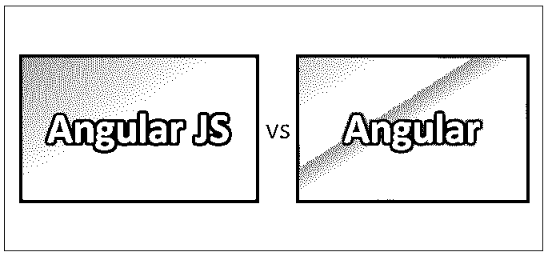
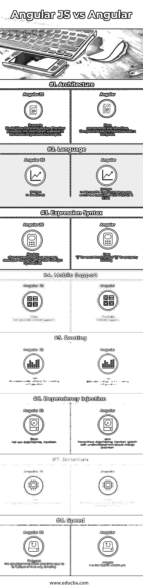

# 角度 JS 与角度

> 原文：<https://www.educba.com/angular-js-vs-angular/>

## 角度 JS 和角度的差异

Angular JS 是一个基于 JavaScript 的框架，以创建动态 web 应用程序而闻名。它使用 HTML 进行模板开发。Angular JS 中的指令使它能够开发可重用的以及模块化的代码。Angular 是一个为开发 web 应用程序而创建的著名开源 JavaScript 框架。前端开发人员需要选择其中一个版本来继续他们的项目开发。Angular 通过支持组件的层次结构来提供基于层次结构的架构，而组件的层次结构是由模板决定的。

**让我们更详细地研究一下 Angular JS 和 Angular:**

*   Angular JS 也称为 Angular 1，由谷歌在 2009 年开发，并于 2012 年发布了 1.0 版本。Angular 成为企业级和个人前端开发人员最广泛使用的开源 JavaScript 框架之一。Angular 不提供示波器或控制器的功能。因此，它的不同版本已经发布了从 Angular JS 版本 1.0 到 Angular 版本 2.0 的增量特性，并且当前具有 Angular 版本 4.0 的版本。
*   Angular JS 通过指令支持 HTML 属性，并通过表达式提供数据和 HTML 之间的数据绑定，从而形成一个易于阅读、高度表达和开发速度更快的平台。
*   Angular 是一个总括术语，用于 Angular 2、Angular 4 和 Angular JS 之后出现的所有其他版本。Angular 2 和 Angular 4 是用于 UI 应用程序的基于开源和类型脚本的平台。Angular 2 是在 Angular JS 上完全重新创建的。Angular 4 有一些额外的特性，并且向后兼容 Angular 2。Angular 还支持 ES6 特性，比如反射机制或迭代器、lambda 操作符等。，因为它是基于 typescript 的框架。
*   Angular JS 使开发人员能够编写基于 MVC 或 MVVM 架构(也称为 MVW(模型-视图-无论什么)架构)的应用程序。Angular JS 具有依赖注入的特性，支持模仿依赖的机制。
*   Angular JS 使用了范围和控制器的概念。开发人员可以添加许多变量，这些变量的范围和控制器一样。Angular JS 还有一个特性叫做 rootScope。在 rootScope 中添加的变量可以在整个应用程序中使用。

### 角度 JS 和角度 JS 之间的直接比较

以下是 Angular JS 与 Angular 的 8 大对比:

### Angular JS 和 Angular 之间的主要区别

以下是要点列表，描述主要区别:

*   Angular JS 表示 Angular 1.x 版本，其中 JS 代表 JavaScript。
*   Angular 表示使用 TypeScript 的版本 2 和更高版本。
*   Angular JS 是一个开源的 JavaScript 框架，可以免费使用，由每个人共享用于开发 web 应用程序。
*   Angular 是轻量级的，支持大多数主流浏览器，用于开发可测试的 JavaScript 代码。
*   Angular JS 支持很好的 MVC 数据绑定，有助于更快的应用程序开发。
*   Angular JS 提供了完整的快速前端开发解决方案，无需使用任何外部插件或框架。
*   利用 HTML 作为声明性语言使得 Angular JS 易于理解框架。
*   Angular JS 应用程序可以在所有主要平台上执行，包括基于 iOS 和 Android 的手机和平板电脑。
*   在 Angular JS 中禁用 JavaScript 时，将只显示一个基本页面。
*   Angular 2 中的 TypeScript 特性允许在面向对象编程概念的帮助下进行代码优化。
*   Angular 2 提供了更好的依赖注入和代码模块化方式。
*   Angular 2 支持多种编程语言，包括 Dart、TypeScript、ES5 和 ES6，用于编写程序。
*   Angular 2 使用更简单的路由机制。
*   与角度 JS 相比，角度 2 更难设置。
*   Angular 2 对于创建小型应用程序来说效率较低。
*   在 Angular 中，hash(#)用于定义局部变量。
*   Angular 4 是一个完整的类型脚本，用于构建大型复杂的应用程序。
*   与其他版本相比，Angular 4 中的测试更容易编写。
*   Angular 4 自带模块化动画包。
*   Angular 4 为视图引擎提供了更好的性能，有助于在 AOT 模式下生成更少的代码。
*   Angular 4 有效地用于具有单个页面和扩展界面的应用程序。
*   Angular JS 在显示大量数据时会变慢。

### 角度 JS 与角度对比表

以下是显示比较的一组点:

| **BASIS FOR****比较** | **角度 JS** | **角度** |
| **架构** | 支持模型-视图-控制器设计。视图处理模型中可用的信息以生成输出。 | 使用组件和指令。组件是带有模板的指令。 |
| **语言** | 用 JavaScript 写的 | 用微软的 TypeScript 语言编写，它是 ECMAScript 6 (ES6)的超集 |
| **表达式语法** | 图像/属性或事件的绑定，开发人员需要记住正确的 ng 指令。 | 使用“()”进行事件绑定，使用“[ ]”进行属性绑定 |
| **移动支持** | 不提供移动支持 | 提供移动支持 |
| **路由** | 使用 routeprovider.when()进行路由配置 | 使用@Route Config{(…)}进行路由配置 |
| **依赖注入** | 不使用依赖注入 | 使用具有单向基于树的变化检测的分层依赖注入系统 |
| **结构** | 与角形相比更难管理 | 更好的结构，更容易创建和维护大型应用程序。 |
| **速度** | 由于其双向绑定的特性，减少了开发工作和时间 | Angular 4 是目前最快的版本。 |

### 结论

Angular JS 之所以流行，是因为它的内置特性和开发反应性和响应性 web 应用程序的能力。当脸书在 2014 年推出其具有更好性能和结果的框架(如 ember.js 和 react.js)时，它向开发人员强调了 Angular JS 的缺点。正因为如此，Angular 团队推出了一个全新的重新编写的框架，而不是升级现有的 Angular JS 框架。之后，决定每六个月推出一个新的 Angular 版本，是现有版本的升级版，而不是重写。Angular 目前的现有版本是 5。由于 Angular 是 Angular JS 的重写，所以所有使用 Angular JS 创建的应用程序都必须从头开始重新开发以更新应用程序。这对开发者来说是一项具有挑战性的任务。此外，Angular 在性能方面相对高效，为开发者提供了从测试到混合应用再到动画的端到端完整解决方案。Angular 被证明是最有益的框架之一，尤其是对于构建大型复杂的应用程序。Angular 4 提供了一个内置的编译器来捕捉 IDE 中的模板错误。Angular 4 带来了改进的工具技术和减少的代码大小。

### 推荐文章

这是一个关于 Angular JS 和 Angular 之间的区别、它们的含义、直接比较、关键区别、比较表和结论的指南。您也可以阅读以下文章，了解更多信息——

1.  [角度与自举](https://www.educba.com/angular-vs-bootstrap/)
2.  [角度 JS 对节点 JS](https://www.educba.com/angular-js-vs-node-js/)
3.  [Angular vs JQuery](https://www.educba.com/angular-vs-jquery/)
4.  [角度 JS 对角度 2](https://www.educba.com/angular-js-vs-angular-2/)

