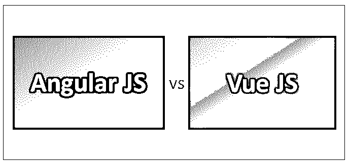
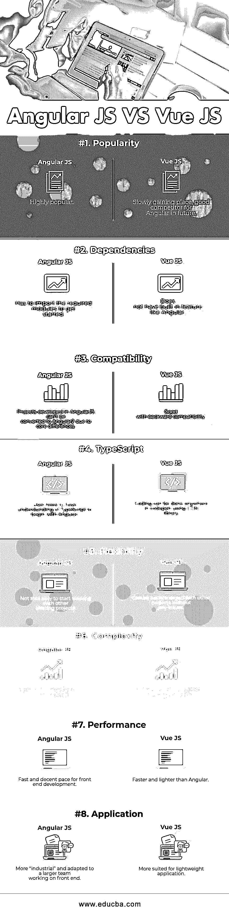

# 角 js vs js 视图

> 原文：<https://www.educba.com/angular-js-vs-vue-js/>

## Angular JS 与 Vue JS 的区别

[Angular JS 是一个](https://www.educba.com/what-is-angularjs/)基于 JavaScript 的用于构建 web 应用前端的开源框架。Angular JS 提供了一组特性，可以极大地减少代码量，从而减少使应用程序功能完善所需的工作量。Vue 是一个 JavaScript 前端框架。Vue 可以很容易地与其他项目和库集成。它的安装相当简单；即使是初学者也可以从“go”这个词开始构建用户界面。Vue 关心框架必须提供给开发者的特性，即性能、灵活性和易用性。就灵活性和易用性而言，Vue 是一个重大飞跃。

### 角度 JS

*   Google 开发人员维护 angular JS 来解决单页面应用程序开发过程中面临的挑战。Vue 的目的是组织和[简化 web 开发](https://www.educba.com/python-and-django-for-web-development/)。Vue 最初发布于 2014 年 2 月。它也被称为模型-视图-控制器(MVC)框架，因为它的方法是面向构建应用程序的模块化方法。
*   Angular JS 中有多个 [JavaScript 文件](https://www.educba.com/javascript-vs-ruby/)。核心文件包含在每个希望使用 Angular JS 的应用程序中，因为它包含了主要的框架特性。可以将附加文件和模块添加到构建在核心功能之上的功能中。
*   Angular JS 提供了为动态网站和网络程序构建 GUI(图形用户界面)的潜力。使用 Angular JS 框架可以流畅地创建单页应用程序，该框架允许编写定制的 HTML 代码并与其他 [UI 工具](https://www.educba.com/ui-design-tools/)集成。

### JS 视图

*   Vue 是尤雨溪在谷歌的多个项目中使用了 [Angular JS](https://www.educba.com/angular-js-interview-questions/) 后创建的。有了 Vue 的帮助，web UI 开发可以更加平易近人。开发人员更容易掌握，因为它不那么固执己见。Vue 的架构是递增适应的；这是 Vue 的关键优势之一。
*   Vue 的核心库主要关注声明性呈现和组件组合，可以嵌入到现有页面中。在设计反应式系统时，Vue 可以在短时间内成为救命稻草。它还提供无缝配置和定制，以满足现有网页的特定需求。
*   Angular JS 在创建动态 web 应用程序时非常有用。使用 Angular JS 的开发人员使用 HTML 作为模板语言，其语法用于简单地表达应用程序的组件。它的体系结构允许模型、视图和组件之间自动平滑的数据同步。对于基于单页面的 web 应用程序，Angular JS 更快更容易编码。它的模板与传统的普通 HTML 相同，并包括扩展的 HTML 术语，这意味着即使是初学者也可以直接使用 Angular JS。
*   Vue 利用了 DOM(文档对象模型)，其他 [JavaScript 框架如 React](https://www.educba.com/best-javascript-frameworks/) 、Ember 等也使用 DOM。不是直接改变 DOM，而是改变 DOM 的副本；最终的更改会被更新到真正的 DOM，用户将会看到这些更改。

### Angular JS 和 Vue JS 的面对面比较(信息图)

以下是 Angular JS 和 Vue JSL 的 8 大对比:

<small>网页开发、编程语言、软件测试&其他</small>

### Angular JS 和 Vue JS 的主要区别

以下几点解释了 Angular JS 和 Vue JS 之间的主要区别:

1.  Angular JS 是构建大型项目的绝佳选择，而 Vue JS 是轻量级项目的理想选择。
2.  Angular JS 不用单独添加安装；人们必须像添加任何其他 JavaScript 文件一样添加它，以便在应用程序中使用，而 Vue JS 使用 CLI 或 CDN 进行安装。
3.  Angular JS 是一个前端框架，可以用于任何后端编程语言，如 PHP、Java 等。，而 Vue JS 严格基于前端，分别使用 HTML、 [CSS 和 JS](https://www.educba.com/css-vs-javascript/) 。
4.  Angular JS 完全使用 JavaScript 创建，而 Vue JS 使用基于 HTML 的模板语法，并使用模型和组件等概念创建。
5.  Angular JS 支持实时应用程序，如即时消息或聊天应用程序，而 Vue JS 最适合轻量级单页面应用程序，因为它提供了一个简单的界面。
6.  Angular JS 是用于应用程序客户端的开源框架，而 Vue JS 是用于构建用户界面的开源渐进式框架。
7.  Angular JS 实现了 [MVVM](https://www.educba.com/mvp-vs-mvvm/) (模型-视图-视图模型)模式，而 Vue 主要关注于视图模型，这意味着它让我们可以看到数据部分的显示。
8.  一个人需要时间来适应角度，而 Vue JS 的学习曲线相对来说比角度 JS 容易；人们可以在几个小时内用 Vue JS 构建一个重要的应用程序，这是 Angular JS 所不能做到的。
9.  Angular JS 是一个 web 应用程序框架，而 Vue JS 是一个渐进式框架，非常适合构建单页面应用程序。
10.  Angular JS 是固执己见的，这意味着应用程序应该有一定的结构，而 Vue JS 是模块化的和灵活的。

**推荐课程:**

*   R 工作室方差分析技术课程
*   AngularJS 计划
*   ISTQB 级在线认证培训
*   软件测试基础认证培训

### 角度 JS 和 Vue JS 对照表

下面是 8 Angular JS 和 Vue JS 的对比表。

| **比较依据** | **角度 JS** | **检视 JS** |
| **人气** | 非常受欢迎 | 慢慢地获得了一席之地，是 Angular 未来的有力竞争对手 |
| **依赖关系** | 必须导入所需的模块才能开始 | 它没有像 Angular 这样的内置功能 |
| **兼容性** | 由于核心差异，在 AngularJS 中开发的项目不能转换为 Angular 2。 | 良好的向后兼容性 |
| **打字稿** | 用户首先需要了解 TypeScript，Angular | 使用 CDN 库可以在 codepen 的任何地方进行编码 |
| **灵活性** | 开始与其他现有项目合作并不容易 | 它可以很容易地与其他项目合并，没有任何问题 |
| **复杂度** | 对初学者来说开始有点困难 | 初学者可以从 CDN 库开始 |
| **性能** | 前端开发速度快而合理 | 比角形更快更轻 |
| **应用** | 更“工业化”，适应更大的团队在前端工作 | 更适合轻量级应用 |

### 结论

如果开发人员正在寻找更容易的产品创建，他们应该选择 Vue JS。如果您的 JavaScript 基础不太好，这将是一个更有帮助的选择。如果你的前端是 Laravel 社区，那么你肯定应该选择 Vue JS，因为 Laravel 社区认为 Vue JS 是他们最喜欢的框架。这将减少 50%的总处理时间，并释放服务器上的空间。

对于那些需要同时处理客户端和服务器端模式的开发人员来说，Angular JS 是一个更好的选择。如果希望创建具有多个组件和复杂需求的大型 web 应用程序，Angular JS 将是一个理想的选择。如果需要选择新项目的现有组件，也可以选择 Angular JS。

Vue JS 轻量级，充当 Angular JS 的钳工小哥哥。如果你想要一个不那么固执己见的框架，Vue JS 是比 Angular JS 更好的选择，而 Angular JS 是构建复杂应用程序的首选方式，而且质量很好。基本上，哪个是完美的取决于项目的性质和开发人员的学习能力。但是 Angular JS vs Vue JS，两者都是 JavaScript 框架，可以给你的应用开发带来最好的效果。

### 推荐文章

这是一个很有用的指南，可以帮助你区分 Angular JS 和 Vue JS。在这里，我们已经讨论了 Angular JS 与 Vue JS 的头对头比较、关键差异以及信息图和比较表。您也可以阅读以下文章，了解更多信息——

1.  [角度 vs 敲除](https://www.educba.com/angular-vs-knockout/)
2.  [角度与自举](https://www.educba.com/angular-vs-bootstrap/)
3.  [角度与反作用](https://www.educba.com/angular-vs-react/)
4.  [Angular vs JQuery](https://www.educba.com/angular-vs-jquery/)

