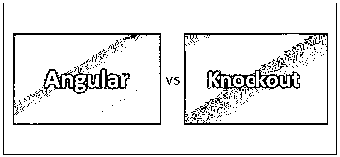
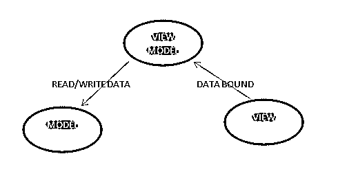
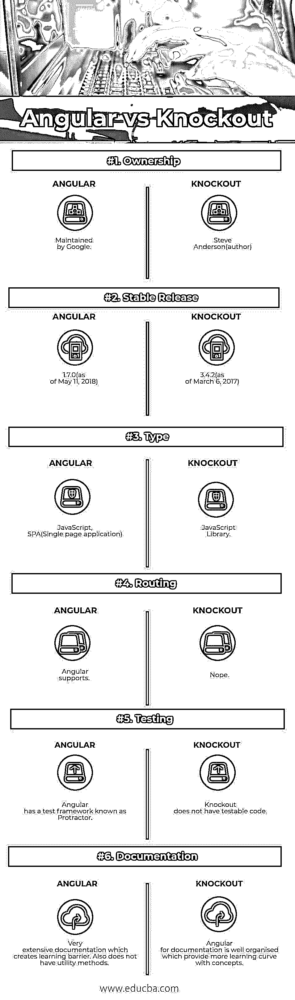

# 角度与击倒

> 原文：<https://www.educba.com/angular-vs-knockout/>

## 角度与挖空之间的差异

Angular 是一个开源的 JavaScript 框架，简化了 [JavaScript 对象](https://www.educba.com/javascript-objects/)和 HTML UI 元素之间的绑定代码。Knockout 是一个 JavaScript 库，它帮助您创建丰富的、响应性强的显示和编辑器用户界面，并具有清晰的底层数据模型。

**让我们更详细地研究一下棱角分明和挖空心思:**

<small>网页开发、编程语言、软件测试&其他</small>

Web 开发实际上是指与网站功能开发相关的活动。虽然每个网站的开发方式不同，但每个网站都有一些相似之处(组件)。

1.  客户端–指本地系统和浏览器。
2.  服务器(或后端)——处理数据库并生成站点代码。
3.  数据库——指生成或使用的信息

所以，开发一个网站没有单一的方法。模式、设计和结构的变化和网站本身一样多。通过比较这两个网站，人们可以很容易地理解模型和视图逻辑以及它们是如何工作的。就拿脸书和谷歌来说吧；我们知道他们的行为不同，但在本质上，他们或多或少是一样的；它们所要做的只是一种方式，通过这种方式，前端或视图可以到达所构建的适当模型，以检索数据。所以在任何场景下，总会有一种方式和一种观点；变化的是这两者(模型和视图)的连接方式。

### 棱角分明和突出的概念

本文涵盖了角度和淘汰的概念。在我们进一步讨论之前，我们先详细处理一些术语，这样读者的理解会清晰得多，也更容易把握更大的图景(也就是博客的标题)。

**MVVM—**弄清楚这个术语。

MVVM 在某种程度上基于 MVC，但目标是以模块化的方式创建用户界面。它将 UI 逻辑与业务逻辑分离开来。这里，在 MVVM 的例子中，视图被绑定到视图-模型，视图-模型从模型中读取和写入。MVVM 模式关注视图模型与动态更新视图的同步。

*   **MODEL**–通常在服务器端，也可以驻留在客户端(HTML 文件和本地存储)。
*   **视图**–是描述可视页面行为中的布局的标记。这是您定义数据绑定的地方。从这个角度来看，应该通过创建自定义绑定来最小化逻辑。这些绑定应该描述“是什么”，而不是描述“如何”。
*   **视图模型**–是专门为视图制作的模型。这是 JavaScript 代码将驻留在挖空应用程序中的地方。

### 角形和挖空的正面对比(信息图)

以下是 Angular 和 Knockout 之间的 6 大对比:

### 角形和挖空的主要区别

以下是描述角度和挖空之间差异的要点列表:

1.Knockout 具有声明性绑定、自动 UI 刷新、依赖性跟踪、模板化，并具有可扩展的功能，使自定义行为易于扩展，而 Angular 具有跨平台(web 应用程序、本机和桌面)的适用性，在代码生成和拆分期间具有速度和性能，在生成模板时具有生产力，构建 CLI 或 IDE 的 9 代码完成、错误检测)，它涵盖了从测试、动画到可访问性的整个开发概念。

**2。与淘汰相关的问题**

一切都在一个属性中完成(考虑这一行，Data-bind=" text: name，attr:{title: name，' data-id': person Id}，click: name click "而对于 Angular，一些问题是在声明命名时，这些是不可预测的，如 ng-mouse down，ng-class-even。没有通用的方法或流程来完成类似的任务；请承认这种情况

*   ngBind 与{ {文本})
*   ng-bind 与 data-ng-bind 与 class = " ng-class:{ expression }；"
*   ng-bind-templates vs { { text } } { { more text } }

**3。代码样本**

*   代码示例(淘汰)

`var myViewModel = {
personName: ko.observable('Bob'),
personAge: ko.observable(123)};`

*   代码示例(角度)

`

 Name: <input type="text" ng-model="name">

You Wrote:{{ name }}

`

4.数据绑定技术是连接 UI 层和业务逻辑的过程。

*   棱角分明

`Var model = {
firstName: ‘ Angular’,
lastName: ‘ blog’ } ;`

*   淘汰赛

`Var model ={
firstName: ko.observable (‘Knockout’),
lastName: ko.observable (‘Blog’)
};`

**5。浏览器支持**

*   迷人的

-Mozilla Firefox(版本 3.5-当前版)
-谷歌 Chrome(当前版)
-微软 Internet Explorer(版本 6-11)
-用于 Mac OS 的苹果 Safari(当前版)
-用于 iOS 的苹果 Safari(版本 6-8)
-Opera(当前版)

*   有角的

-Safari、Chrome、Firefox、Opera、IE9 和移动浏览器(Android、Chrome Mobile、iOS Safari)

### 角度和挖空比较表

下面是 Angular 和 Knockout 的对比表。

| **参数** | **角度** | **淘汰赛** |
| **所有权** | 由谷歌维护 | 史蒂夫·安德森(作者) |
| **稳定发布** | 1.7.0(截至 2018 年 5 月 11 日) | 3.4.2(截至 2017 年 3 月 6 日) |
| **类型** | JavaScript，SPA(单页应用程序) | JavaScript 库 |
| **路由** | 角形支架 | 不 |
| **测试** | Angular 有一个称为量角器的测试框架 | 淘汰没有可测试的代码 |
| **文档** | 非常广泛的文件，造成了学习障碍。它也没有实用方法。 | Angular for documentation 组织得很好，这提供了一个更好的概念学习曲线。 |

### 结论

在过去的二十年里，不仅网站的数量增加了，网站的变化也增加了。编程语言和计算领域新技术的激增，已经让开发人员找到了几乎所有业务或客户问题的解决方案。这项创新带来了一种全新的方式，网页可以通过这种方式连接到数据库，同时获取相关信息。开发一个网站没有单一的方法。在这篇 Angular vs Knockout 文章的开头，我们已经见证了脸书和谷歌的场景；他们的结构方式是绝对有益的。所以结论有点模糊，留下了对下述术语(对于挖空和有角度)的清晰观察，这些术语是

受欢迎程度–棱角分明

传统浏览器(IE 考虑)-淘汰

调试–角度

网络应用受欢迎程度——角度

性能–角度

我们希望这篇文章对读者来说是有益的，并鼓励他们探索庞大的网络生态系统，并对它们进行不同的分析。当你在浏览器中打开一个网页的时候，我希望你能理解其中的逻辑，并深入思考它们是如何制作的。

### 推荐文章

这是一个很有用的指南，说明了角形和挖空之间的区别。在这里，我们讨论了角与淘汰赛头对头比较，一个关键的差异，信息图，和比较表。您也可以阅读以下文章，了解更多信息——

1.  [Azure Paas vs Iaas](https://www.educba.com/azure-paas-vs-iaas/)
2.  [角度与反作用](https://www.educba.com/angular-vs-react/)
3.  [Angular vs JQuery](https://www.educba.com/angular-vs-jquery/)
4.  [硒 vs QTP](https://www.educba.com/selenium-vs-qtp/)

