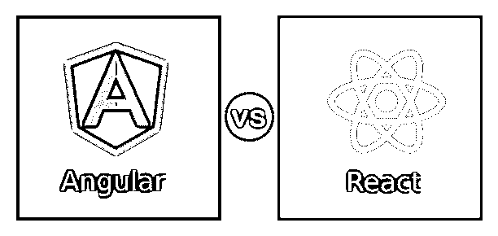
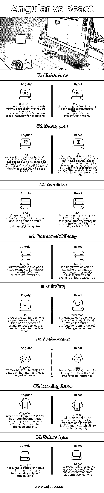

# 棱角反应

> 原文：<https://www.educba.com/angular-vs-react/>

## 角度和反应之间的差异

Angular 是一个客户端 JavaScript 结构框架，具有用于动态 web 应用程序的模型视图控制器(MVC)架构和模型视图模型(MVVM)。Angular 是重写的，是 AngularJS 不兼容的继承者。它最初是作为谷歌的一个项目开始的，但后来它变成了一个开源框架。React 是一个开源、声明性、高效、灵活的 JavaScript 库，用于构建具有渲染性能的用户界面。它是由脸书引入的，后来成为开源软件。React 主要关注模型视图控制器(MVC)架构中的视图。

### 什么是有角？

AngularJS 完全基于 HTML 和 JavaScript。AngularJS 通过使用指令扩展 HTML 来操作 DOM 对象，并借助特性数据绑定和依赖注入来解决开发单页面应用程序(SPA)的问题，这消除了大量代码；否则，我们需要写作。它将静态 HTML 转换为动态 HTML。Angular 被谷歌、福布斯、天气、医疗保健等使用。

<small>网页开发、编程语言、软件测试&其他</small>

### 什么是反应？

它解决了 web 应用程序中大型数据集的有效呈现问题。React 用于处理移动和 web 应用程序的视图层，以创建可重用的 UI 组件。它首先部署在脸书，然后在 Instagram 上。它将让开发人员无需重新加载页面就能创建大型 web 应用程序，因为它速度快且可伸缩。React 可以用作 AngularJS 或其他框架的视图组件。

### Angular 和 React 之间的直接对比(信息图)

以下是 Angular 与 React 之间的 8 大对比

### Angular 和 React 之间的主要区别

Angular vs React 都是市场上的热门选择；让我们讨论一些主要差异:

*   角度数据建模仅限于使用相对较小的数据模型进行反应。
*   由于更多的 DOM 元素，Angular 在性能上落后于 react。
*   Angular 有一个陡峭的学习曲线，而 react 需要更少的时间来掌握它。
*   在 angular 中，我们有很多现成的东西可以使用，我们可以把它作为代码重用，而 react，我们可以用我们喜欢的方式使用它。
*   在 Angular 中，我们可以在范围内绑定，而 react 将有一个值和更改属性的链接状态。
*   与 react 相比，角度模型较为复杂，因为 react 可以自由选择，不会产生性能问题。
*   Angular 是一个完整的框架，而 React 是一个库。
*   对于数据绑定，angular 使用 ngrx，而 react 使用 Redux。
*   Angular 很容易缩放，而 react 更容易测试，也可以缩放，但没有 angular 那么容易。
*   React 具有更好的第三方库兼容性，因为它是纯 JavaScript，而 Angular 是 Typescript，需要为每个库定义。
*   React 在前端和全栈社区更受欢迎，而 angular 正在改善他们的社区。
*   Angular 是一个免费的开源许可，而 react 附带了一些专利条款来使用它。
*   Angular 具有双向绑定，而 react 具有单向绑定。
*   Angular 需要一个用于路由器配置的模板或控制器，而 react 不处理，但有许多用于路由的模块。
*   React 很容易理解，尽管它需要更多的时间来设置，而 angular 很复杂，很难理解。
*   与 angular 相比，React 服务器端呈现允许创建通用的 web 应用程序。
*   Angular 是一个完整的框架，附带了许多捆绑在一起的东西，而 react 比 angular 灵活，使用独立和快速移动的库；我们需要关注更新和迁移。

### 角度与反作用对照表

以下是角度与反应之间的比较表

| **比较的基础** | **角度** | **反应** |
| **抽象** | 抽象为用户提供了快速开发和最少的细节，但是 Angular 的抽象是有漏洞的，因为我们在调试时需要调试内部。 | React 的抽象在某些方面不够灵活，比如不能属性化 HTML 标签，这可以通过实现 mixins 来解决。 |
| **调试** | 由于 Angular 是一个事件驱动的系统，如果发生任何问题，它将打印很长的堆栈跟踪，但它提供了类似服务的逻辑结构。如果 Angular JS 中有任何东西不工作，最好重写，因为调试不是一项简单的任务。 | 在 React 中，我们需要查看更少的 bug 和堆栈跟踪，因为它们之间有明显的区别。所以，它很容易调试，但当来到 HTML 时，很难比较原始 HTML 和结果 HTML，Angular JS 给出了几乎相同的 HTML。 |
| **模板** | 角度模板是带有特殊角度语言的增强型 HTML，它迫使我们学习角度语法。 | JSX 是一个可选的 HTML 类语法处理器，后来由 JavaScript 编译，它意味着 react 中的一切都是 JavaScript |
| **框架/库** | Angular 是一个框架，因为我们不需要分析库或其他东西。我们可以直接开始工作。 | React 是一个可以与各种语言配对的库，通用灵活，我们可以与 API 交换库。 |
| **绑定** | 在 Angular 中，我们只能绑定到 scope。如果我们想绑定到服务器或异步服务，我们需要一个中间模型。 | 而在 React 中，我们可以通过值链接(链接状态)进行绑定，它是值和 onChange 属性的单个属性 |
| **性能** | 一个有角度的框架是相当庞大的，在性能上比 React 稍微落后一点。 | React 有一个虚拟 DOM，因为它的库很小，并且它提高了性能。 |
| **学习曲线** | Angular 有一个很深的学习曲线，因为它有大量的文档，掌握它很复杂，因为我们需要理解代码和链接。 | React 将花费更少的时间来理解高标准，并且它几乎没有不言自明的生命周期方法。 |
| **原生应用** | Angular 有原生应用的原生脚本和混合应用的标志性框架。 | React 有针对原生应用的 react-native 和针对跨平台应用的 react-native-render。 |

### 结论

最后，这是两个惊人框架的概述，Angular vs React。我希望你对 Angular 和 React 框架有了更好的理解。最好了解 Angular 和 React 两种框架，如果你想选择一种，那么基于项目需求，你可以决定。如果在一个视图中有很多动态内容变化，您可以选择做出反应。如果想开发的非常快，可以选择 angular 作为一个完整的框架，有很多库。因此，我们需要评估该项目，并找出适合我们的需求。

### 推荐文章

这是角度与反应之间差异的有用指南；我们已经讨论了它们的含义、直接比较、关键区别和结论。您也可以阅读以下文章，了解更多信息——

1.  [有角度和敲除](https://www.educba.com/angular-vs-knockout/)
2.  [硒和幻象](https://www.educba.com/selenium-vs-phantomjs/)
3.  [角度与自举](https://www.educba.com/angular-vs-bootstrap/)
4.  [Angular vs JQuery](https://www.educba.com/angular-vs-jquery/)

