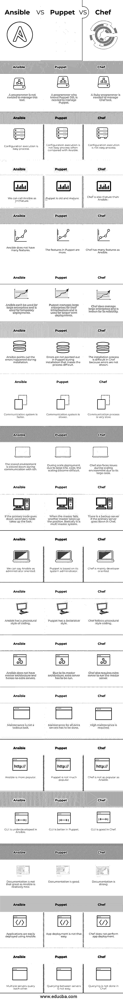

# Ansible vs 木偶 vs 厨师

> 原文：<https://www.educba.com/ansible-vs-puppet-vs-chef/>

## Ansible vs 木偶 vs 厨师的区别

Ansible、Puppet 和 Chef 是配置工具。迈克尔·德汉在 2012 年开发了 ansible。这是一个编排工具。Ansible 创造一致的环境。Ansible 是用 Python 、PowerShell、Shell、Ruby 编写的[。2005 年卢克·卡尼斯创建的木偶实验室开发了一个木偶。Puppet 用于长时间部署。Puppet 有很好的文档，支持更多的平台。木偶的工作速度更快，这也是雇主喜爱木偶的原因。亚当·雅各布在 2009 年开发了厨师。厨师可以与基于云的平台集成。厨师可以配置和维护公司的服务器。厨师](https://www.educba.com/python-keywords/)[支持 Linux](https://www.educba.com/linux-file-system/) 和微软 Windows。

### Ansible vs Puppet vs Chef 的面对面比较(信息图)

以下是 Ansible 和 Puppet and Chef 的 18 大区别:

<small>网页开发、编程语言、软件测试&其他</small>

### Ansible vs 木偶 vs 厨师的主要区别

让我们来看看下面的主要区别:

*   Ansible 是紧挨着 Chef 开发的最新配置工具，老一点的就是个木偶。因此用户发现 Ansible 更容易理解，而 Puppet 很难理解。
*   Ansible 是用 Python 写的，支持 YAML 脚本。Puppet 是用 Ruby 编写的，它支持特定于领域的语言。chef 是用 Ruby 用 DSL 写的，有原型编程。
*   它的配置只有一个活动节点，而 Puppet 和 Chef 遵循主从架构。
*   为了配置节点，Ansible 使用 ssh 运行系统。在 Puppet 和 Chef 中，只有客户机可以为系统配置机器和服务器。
*   对于配置，Ansible 不使用虚拟机。 [Puppet 需要](https://www.educba.com/puppet-alternatives/)一个客户端证书用于客户端系统配置。在 Chef 中，包含所有配置的工作站将配置传递给主服务器。
*   配置设置很容易实现。在《木偶与厨师》中，这是一个忙乱的过程。
*   YAML 语言用于管理 Ansible 中的配置。Puppet 用的是 Puppet DSL，Chef 用的是 Ruby DSL。
*   在 Ansible 中管理配置不需要程序员。由于 Puppet 和 Ruby 在其他两个工具中使用，所以应该知道如何用程序来管理这些工具。
*   YAML 语言很容易学习，因此掌握 Ansible 配置也很容易。而另一些则不容易，因此使用 Puppet 和 Chef 管理配置成为一项困难的任务。
*   Ansible 拥有执行配置的远程工具，而 Puppet 和 Chef 需要时间来执行。
*   Ansible 中的服务器将配置推送到节点。在 Puppet 和 Chef 中，客户机必须将配置拉至节点。
*   与木偶和厨师相比，Ansible 相对较新。
*   Ansible 中的初始设置很容易，而在 Puppet 和 Chef 中很难。
*   重点是 Ansible 的计算机自动化。在 Puppet 中，它检查 Puppet DSL 在 Ruby 上的进度。DevOps 自动化是 Chef 的重点。
*   在 Ansible 中，配置通过推和拉的方法分发到所有节点。在 Puppet 中，只有一个推送过程。Chef 仅支持拉过程。
*   为了 Ansible 中的正确工作流，最好安装 root access ssh 和 python。在 Puppet 和 Chef 中，不需要 python ssh 和。
*   与木偶和厨师相比，Ansible 有一个安全的环境。
*   与其他工具相比，Ansible 的价格较低。厨师的价格比木偶还低。木偶是三者中最贵的。

### 对照表

我们来讨论一下 Ansible vs 木偶 vs 大厨的顶级对比。

| **可回答的** | **木偶** | **厨师** |
| 不需要程序员来管理这个工具。 | 需要一个懂 Puppet DSL 的程序员来管理 Puppet。 | 需要一个 Ruby 程序员来管理 Chef 工具。 |
| 配置执行很容易处理。 | 与 Ansible 相比，配置执行不容易处理。 | 配置执行不容易处理。 |
| 我们可以称 Ansible 为不成熟。 | 木偶老了，成熟了。 | 厨师也比 Ansible 成熟。 |
| Ansible 没有太多特性。 | 《木偶》中的角色更多。 | Chef 有许多 Ansible 的特性。 |
| Ansible 不能用于大型企业，用于临时部署。 | Puppet 管理大型企业的基础设施，用于长期部署。 | 大厨确实管理大企业，以可靠著称。 |
| Ansible 指出了安装过程中出现的错误。 | Puppet 在安装过程中没有指出错误，这使得安装过程很困难。 | Chef 中的安装过程很困难，因为错误不会显示出来。 |
| 通讯系统更快。 | 通信系统速度较慢。 | 沟通过程很慢。 |
| 在与 ssh 通信的过程中，扩展后的环境速度会变慢。 | 在扩展部署期间，由于大量的 DSL 代码，扩展变得很困难。 | Chef 在扩展环境中也面临一些问题，因为它的代码很大。 |
| 如果主节点出现故障，辅助节点将接管任务。 | 当主设备失效时，另一个主设备接管位置。基本上是多主系统。 | 如果主服务器在 Chef 中停机，还有一个备份服务器。 |
| 我们可以说 Ansible 是面向管理员的。 | Puppet 基于它的系统管理员。 | 厨师主要面向开发者。 |
| Ansible 有一种程序化的编码风格。 | Puppet 具有声明式风格。 | Chef 遵循过程式编码。 |
| Ansible 没有主架构，因此没有额外的服务器。 | 由于其主架构，额外的服务器必须运行。 | Chef 还需要一台额外的服务器来运行主服务器。 |
| 维护不是一件乏味的工作。 | 必须维护所有额外的服务器。 | 需要高维护。 |
| Ansible 更受欢迎。 | 木偶不太受欢迎。 | 厨师没有 Ansible 受欢迎。 |
| 在 Ansible 中，GUI 未开发。 | GUI 在木偶中更好。 | 《大厨》里的桂不错。 |
| 由于 Ansible 相对较新，文档并不是很好。 | 文档是好的。 | 文档是强大的。 |
| 使用 Ansible 可以轻松部署应用程序。 | App 部署没那么容易。 | 厨师不执行应用程序部署。 |
| 多个服务器相互查询。 | 服务器之间的查询并不容易。 | 查询不是在 Chef 中完成的。 |

Puppet 和 Chef 主要关注配置，Ansible 则负责编排。Ansible 服务器需要在 Unix/Linux 和 windows 上工作，而 Puppet 和 Chef】可以主要在 Unix 和 Linux 上工作。Ansible 发展很快，社区支持也很大。

### 推荐文章

这是一个 Ansible vs 木偶 vs 厨师的指南。这里我们讨论信息图和比较表的主要区别。您也可以浏览我们推荐的其他文章，了解更多信息——

1.  [ROLAP vs MOLAP vs HOLAP](https://www.educba.com/rolap-vs-molap-vs-holap/)
2.  [AWS vs Azure vs Google Cloud](https://www.educba.com/aws-vs-azure-vs-google-cloud/)
3.  [DevOps 工具](https://www.educba.com/devops-tools/)
4.  [数据科学家 vs 软件工程师](https://www.educba.com/data-scientist-vs-software-engineer/)
5.  [terra form 与 Ansible 的主要差异](https://www.educba.com/terraform-vs-ansible/)

