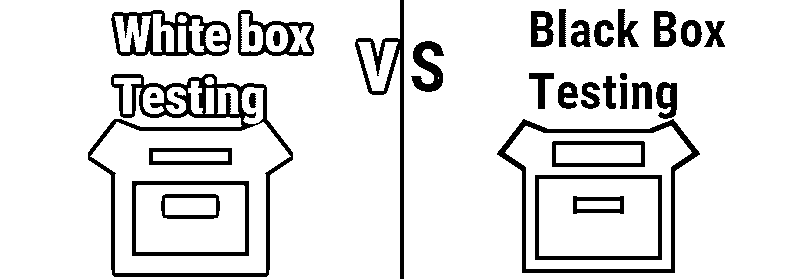
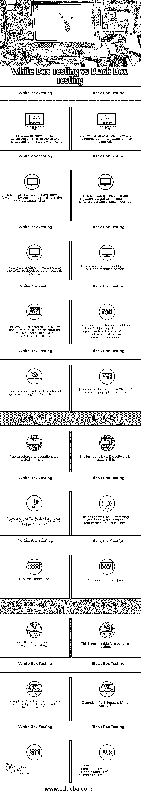

# 白盒测试与黑盒测试

> 原文：<https://www.educba.com/white-box-testing-vs-black-box-testing/>

## 白盒测试和黑盒测试的区别

软件开发生命周期中最重要的阶段之一是质量保证或软件测试，这是一个巨大的领域。有两种广泛使用的软件测试方法，即白盒测试和黑盒测试。让我们先看一下简单的定义，然后我们可以继续白盒测试和黑盒测试的详细区别和理解。

*   **白盒测试:**这种方法甚至可以测试产品的内部功能，并在生成输出之前查看数据发生了什么。
*   **黑盒测试:**这是一种测试产品的方法，以表明它是否给出了期望的输出。

### 白盒测试与黑盒测试的面对面比较(信息图)

以下是白盒测试和黑盒测试之间的 11 大区别。

<small>网页开发、编程语言、软件测试&其他</small>

### 白盒测试和黑盒测试的主要区别

让我们讨论一下白盒测试和黑盒测试之间的一些主要区别:

#### 白盒测试

白盒测试也称为开箱测试、透明测试或内部测试。这测试了软件的每一个方面，测试人员需要编程能力以及他正在测试的软件的完整设计。这种测试方法的主要目标是研究软件产品的整个内部结构，并查看数据消费、处理和输出生成是否按照设计正确进行。

**白盒测试适用于:**

*   找出不正确的语法。
*   识别逻辑错误和设计错误。

**优点:**

*   白盒测试有助于优化源代码。
*   所有的工作流程都将被涵盖。
*   由于白盒测试的测试人员将具有编程背景，因此将很容易识别逻辑错误和不适当的代码段。

**缺点:**

*   [白盒测试要求](https://www.educba.com/white-box-testing/)测试人员能够熟练编程并构建可用于运行回归等的测试套件。
*   白盒测试可能使用的计算资源可能很昂贵。
*   仍然有遗漏实现的逻辑中的隐藏错误的余地。
*   测试人员可能不得不开发他们自己的框架，没有外部工具可以帮助他们独立地进行全面的测试。

#### 黑盒测试:

[黑盒测试](https://www.educba.com/black-box-testing/)也叫外部测试、封闭测试、行为测试。这个测试的方法从名字本身就很明显，测试人员将简单地测试相应输入的输出，而不需要任何关于源代码的知识。

**黑色测试适用于:**

*   验证外部相关源代码和数据(如外部数据库)中的错误。
*   优化接口错误。用于检查缺失或错误的功能。
*   查找输入错误和访问错误。

**优点:**

*   测试大代码段的更有效的方法。
*   不需要技术背景或技术熟练程度。
*   测试用例的设计很容易。
*   黑盒测试可以非常容易地自动化。

**缺点:**

*   只能测试有限数量的输入。
*   如果测试人员不了解软件规范，就很难设计测试用例。
*   应用程序的覆盖范围有限，因此无法对所有组件进行详尽的测试。

### 黑盒测试与白盒测试对照表

让我们讨论一下黑盒测试和白盒测试之间最重要的区别。

| **黑盒测试** | **白盒测试** |
| 这是一种软件测试的方式，在这种方式下，软件的内部结构永远不会暴露出来。 | 这是一种软件测试的方式，其中软件的内部被暴露给测试环境。 |
| 这很像测试软件是否运行良好，以及软件是否给出了预期的输出。 | 这很像是测试软件是否按照预期的方式使用数据。 |
| 这甚至可以由非技术人员来执行。 | 该测试由软件测试工程师和软件开发人员执行。 |
| 黑盒测试人员不需要了解实现。他只需要知道相应输入的输出必须是什么。 | 白盒测试人员需要有实现的知识，因为他需要检查代码的内部。 |
| 这也可以称为“外部软件测试”和“封闭测试” | 这也可以称为“内部软件测试”和“开放测试”。 |
| 软件的功能在此进行测试。 | 以这种形式测试结构和操作。 |
| 黑盒测试的设计[可以从需求规格说明书中划分出来。](https://www.educba.com/black-box-testing-techniques/) | 白盒测试的设计可以从详细的软件设计文档中分离出来。 |
| 这样消耗的时间更少。 | 这需要更多的时间。 |
| 这不适合算法测试。 | 这是算法测试的首选。 |
| 例如，如果“a”是输入，那么“b”是输出吗？ | 例如，如果“a”是输入，那么它是否被函数 b()使用以返回正确的值“c”？ |
| 类型:

*   [Functional test](https://www.educba.com/what-is-functional-testing/)
*   [Non-functional test](https://www.educba.com/non-functional-testing/)
*   regression testing

 | 类型:

*   Path test
*   loopback test
*   Conditional test

 |

### 结论

嗯，白盒测试和黑盒测试各有利弊。采用一种测试方法，你将无法实现质量保证。这就是为什么它是明智的，而且，建议在确认和验证软件产品没有 bug 的时候同时使用这两种方法。还有一种叫做[灰盒测试](https://www.educba.com/grey-box-testing/)的东西，它是白盒测试和黑盒测试的结合，但我会把它留给你作为探索自我的练习。

### 推荐文章

这是白盒测试和黑盒测试的指南。在这里，我们还将讨论信息图和比较表的主要区别。您也可以浏览我们推荐的其他文章，了解更多信息——

1.  [数据仓库 vs 数据集市](https://www.educba.com/data-warehouse-vs-data-mart/)
2.  [冒烟测试与健全性测试](https://www.educba.com/smoke-testing-vs-sanity-testing/)
3.  [质量保证与质量控制](https://www.educba.com/quality-assurance-vs-quality-control/)
4.  [软件测试职业](https://www.educba.com/careers-in-software-testing/)

