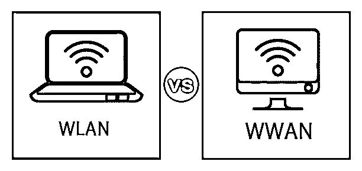
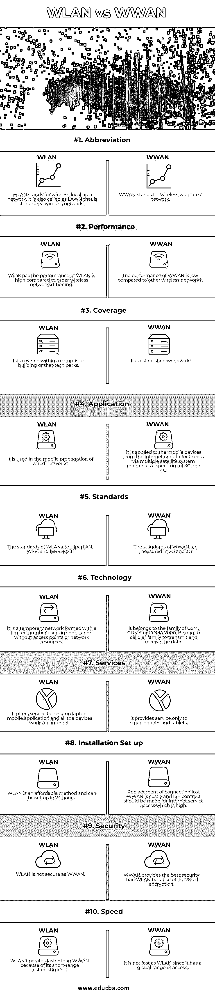

# WLAN vs WWAN

> 原文：<https://www.educba.com/wlan-vs-wwan/>

## WLAN 与 WWAN 的区别

在 WLAN vs WWAN 中，[无线网络](https://www.educba.com/types-of-network/)依靠微波来调节发射机和接收机通信设备，如台式机、笔记本电脑、移动应用程序和连接到互联网的商业网络。它是一种计算机网络技术，允许用户的设备在没有任何连接线的情况下访问信息。如果有任何设备连接到 Wi-Fi，则连接会建立到企业无线网络的特定范围。无线网络有四大类。

1.  无线局域网
2.  无线城域网
3.  无线广域网
4.  无线个人区域网

### 无线局域网与无线广域网的直接比较(信息图表)

以下是 WLAN 与 WWAN 之间的 10 大区别。

<small>网页开发、编程语言、软件测试&其他</small>

### 无线局域网与无线广域网的主要区别

让我们讨论一下 WLAN 和 WWAN 之间的一些主要区别。

*   无线局域网是由 IEEE 802.11 标准提出的。该标准是以 5 GHz 的频率建立的，以每秒 54 兆位传输数据。WLAN 具有丰富的信号范围，并且可以在房间或建筑物中建立，尤其是在短覆盖范围约 40 米的室内范围内。它是通过将两台或多台计算机连接到一个互联网网络而创建的。所有者控制网络运营商。如果无线网络的发展是增加到更高的比特率值，这些值没有达到网络那么高。最近，好的比特率值可以具有对应于每秒 540 兆比特数据传输的标准 802.11n 的网络设计。比特率值在 IEEE 802.11n、IEEE 802.11g、IEEE 802.11.b 和 IEEE 802.11.a 中测量
*   WWAN 为用户提供使用远程或公共或私有接入连接到无线网络的服务。连接建立在一个巨大的地理范围内，就像一个完整的城市使用移动运营商当前的网络结构。WWAN 始于 802.20 标准，其目标是实现移动宽带无线接入(称为 MBWA)的优化。这种 802.20 标准是 2.5 和 3G 经典模式的强劲竞争对手。WWAN 成功地使表面语音传输成为可能。它也在 GPS 是全球定位系统中测量，通用分组无线业务被称为 GPRS，EDGE 是全球演进的增强数据速率的缩写，通用移动电信系统被称为 UMTS，HSUPA 是高速上行链路分组，而 HSPDA 是高速下行链路分组接入。
*   WLAN 和 WWAN 是提供互联网连接的不同无线网络。如果用户在该范围内，则到网络的互联网连接非常快，并且提供对邮箱、文件下载、存储、网站加载等的快速访问。要强调的典型差异是覆盖范围，而一个是在家中建立的，另一个是在城镇上建立的。由于这一重大差异，无线广域网无法与无线局域网在相同的技术上运行。无线局域网(如 Wi-Fi)的覆盖范围有限，需要许多节点才能覆盖较广的区域。WWAN 采用电信方式，可适应更广的覆盖范围。由于 WWAN 同时覆盖更广的范围，所以它也实现了安全协议。使用的安全协议有 WPA、WLAN 和 WEP。即使它是先进的，它也不是一个有保证的选择。但是，很少有人使用它作为不安全的网络，因为它们容易受到加密的攻击。但是即使使用不安全的网络，它们也能接收信号。
*   WLAN 的性能比 WWAN 更重要。有限的范围涵盖少数人，并侧重于高性能的运行速度。但是它与网络连接无关，网络连接受限于 WLAN 或 WWAN 速度。WLAN 适用于将文件从一个设备或系统移动和托管到另一个设备或系统以及相关应用程序。WLAN 中部署的功能是 DLNA，这是一种连接 LAN 中设备的方法，用于管理所有媒体类型的存储。但这并不适合 WWAN，因为它的运行速度很低。很少有人根据自己的需求同时利用这两种技术。

### WLAN 与 WWAN 对比表

让我们讨论一下 WLAN 和 WWAN 之间的主要比较。

| **属性** | **无线局域网** | **WWAN** |
| **缩写** | WLAN 代表无线局域网。它也称为草坪，是一种局域无线网络 | WWAN 代表无线广域网 |
| **性能** | 与其他无线网络相比，WLAN 的性能很高。 | 与其他无线网络相比，WWAN 的性能较低。 |
| **覆盖率** | 它覆盖在一个校园或建筑或科技园内。 | 它在世界范围内成立。 |
| **应用** | 它用于有线网络的移动传播。 | 它适用于来自互联网的移动设备，或通过称为 3G 和 4G 频谱的多卫星系统的室外接入 |
| **标准** | 无线局域网的标准有 HiperLAN、Wi-Fi 和 IEEE 802.11 | WWAN 的标准以 2G 和 3G 来衡量 |
| **技术** | 它是由有限数量的用户在没有接入点或网络资源的短距离内形成的临时网络。 | 它属于 GSM、CDMA 或 CDMA 2000 系列。属于蜂窝家庭发送和接收数据 |
| **服务** | 它为台式笔记本电脑、移动应用程序和所有在互联网上工作的设备提供服务。 | 它只为智能手机和平板电脑提供服务 |
| **安装设置** | 无线局域网是一种负担得起的方法，可以在 24 小时内设置好 | 连接丢失的 WWAN 的替换是昂贵的，并且应该为昂贵的互联网服务接入签订 ISP 合同。 |
| **安全** | WLAN 不如 WWAN 安全 | 由于其 128 位加密，WWAN 提供了比 WLAN 更好的安全性 |
| **速度** | WLAN 比 WWAN 运行得更快，因为它是短距离建立的 | 它没有 WLAN 快，因为它的接入范围是全球的。 |

### 结论

简单来说，WWAN 使用电信，而 WLAN 不使用电信进行操作。WLAN 在安全的条件下工作，而 WWAN 则不那么安全。WLAN 比 WWAN 更快，因为它的覆盖范围更广。无线局域网因其有效的使用而拥有 DLNA。如果用户想在家里建立互联网连接，他可以首选 WLAN，如果他想成为互联网服务提供商的商人，那么他必须选择 WWAN。每种都有其独特的功能，并可根据其要求进行调整。

### 推荐文章

这是无线局域网与无线广域网的对比指南。在这里，我们讨论 WLAN 和 WWAN 之间的区别，以及主要区别、信息图表和比较表。您也可以浏览我们推荐的其他文章，了解更多信息——

1.  [WebLogic vs WebSphere](https://www.educba.com/weblogic-and-websphere/)
2.  [Android 开发者 vs Web 开发者](https://www.educba.com/android-developer-vs-web-developer/)
3.  [虚拟主机 vs 云主机](https://www.educba.com/web-hosting-vs-cloud-hosting/)
4.  [WebLogic vs JBoss](https://www.educba.com/weblogic-vs-jboss/)

