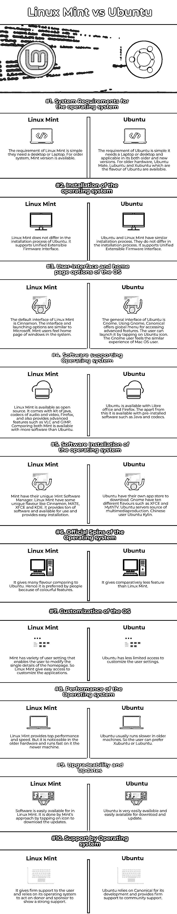

# Linux Mint vs Ubuntu

> 原文：<https://www.educba.com/linux-mint-vs-ubuntu/>

## Linux Mint vs Ubuntu 简介

Linux Mint 和 Ubuntu 是 Linux 最流行的两个操作系统。它们是便携的和用户友好的。Ubuntu 在早期被人们认为是最可靠和最好的选择，但现在它被市场上流行的 Linux Mint 打败了。它们有一种不同的独特的特性，这种特性根据其要求得到了有效的应用。在这个主题中，我们将学习 Linux Mint vs Ubuntu。

### Linux Mint 与 Ubuntu 的正面比较(信息图)

以下是 Linux Mint 和 Ubuntu 之间的 10 大区别

<small>网页开发、编程语言、软件测试&其他</small>

### Linux Mint 和 Ubuntu 的主要区别

让我们讨论一下 Linux 和 Ubuntu 之间的一些主要区别。

*   Linux Mint 和 Ubuntu 的重要部分是它的环境、界面、主页和不同风格的可用性。默认的 Ubuntu 可以从 17.0 版本的桌面环境 Unity 中获得。ubuntu 在 Gnome 中作为内置特性提供，它提供了高级选项。Linux Mint 没有默认选项，但是用户可以用 Cinnamon 定制他的界面。
*   Ubuntu 和 Linux Mint 附带了一系列预装软件、一个媒体播放器和一个办公套件。Linux Mint 和 Ubuntu re 可以通过 dpkg 获得，dpkg 是一个类似的包管理器。所以 Linux Mint 和 Ubuntu 的软件都差不多。因此，用户无法决定操作系统的性能因素。应用程序的安装和更新通过应用程序商店或 GUI 完成，不到一分钟即可完成。
*   Linux Mint 和 Ubuntu 是一个用户友好的工具，易于配置，适合初学者。经验丰富的用户可以有效地使用定制选项，根据其业务需求进行部署，并个性化其应用程序，如笔记本电脑和台式机。Linux Mint 更适合 Windows 用户，因为其界面类似于 MS-Office，而 Ubuntu 给 Mac 用户提供了类似的体验。
*   Ubuntu 的更新每半年发布一次，其发布周期是预先安排好的，五年提供一次桌面服务。支持时长长，可靠，公司专业支持。Linux Mint 更新不是预先安排的；它是在 Ubuntu 更新一个月后发布的。Ubuntu 和 Linux Mint 都有一个趋势分发平台，吸引了很多用户。如果用户更多，人们可以通过在线支持从他们那里获得指导，对于初学者来说，问题可以很容易地解决。Linux mint 是一个活跃的社区，非常有用，并通过官方的 Linux Mint 平台获得建议。
*   Linux Mint 和 Ubuntu 的安装是类似的，可以通过硬盘或 pen drive 轻松移植。图形用户界面帮助用户进行安装和定制。他们从事无处不在的安装程序。
*   尽管 Linux Mint 和 Ubuntu 为用户提供了各种类似的选项，但它们的性能水平不同。Linux Mint 以其先进的特性和高效率更胜一筹。它在用户中被标记为趋势，以定制功能选项和要求苛刻的软件和应用程序套件，该套件与 Linux Mint 一起提供。由于它的开发平台，它不适用于旧的硬件系统。

### Linux Mint vs Ubuntu 对比表

我们来讨论一下 Linux Mint 和 Ubuntu 的 10 大区别。

| 种类 | Linux 作为 | 人的本质 |
| 操作系统的系统要求 | Linux Mint 的需求很简单，他们需要一台台式机或笔记本电脑。对于较旧的系统，可以使用 Mint 版本。 | Ubuntu 的要求很简单；它需要一台笔记本电脑或台式机，并适用于其旧版本和新版本。对于较老的硬件，Ubuntu Mate、Lubuntu 和 Xubuntu 是 Ubuntu 的特色。 |
| 操作系统的安装 | Linux Mint 在 Ubuntu 的安装过程上没有区别。它支持统一的可扩展固件接口。 | Ubuntu 和 Linux Mint 有类似的安装过程。它们在安装过程中没有区别。它支持统一的可扩展固件接口。 |
| 操作系统的用户界面和主页选项 | Linux Mint 的默认界面是 Cinnamon。界面和启动选项与微软相似。Mint 用户在系统中感受 windows 的主页。 | Ubuntu 的通用界面是 Gnome。使用 Gnome，Canonical 提供了一个访问高级特性的全局菜单。用户可以通过点击 Ubuntu 图标来启动它。Gnome 用户感受到了与 Mac OS 用户相似的体验。 |
| 软件支持操作系统 | Linux Mint 是开源的。它附带了一套 java、音频和视频编解码器、Firefox，还提供了 VLC 和 GIMP 等高级功能。比较两者，Mint 可用的软件比 Ubuntu 多。 | Ubuntu 有 Libre Office 和 Firefox。除此之外，它还可以通过预装软件获得，如 Java 和编解码器。 |
| 操作系统的软件安装 | Mint 有自己独特的 Mint 软件管理器。Linux 薄荷有一些独特的味道，如肉桂，马黛茶，XFCE 和 KDE。它提供了大量的软件可供使用，并提供了简单的安装。 | Ubuntu 有自己的应用商店可以下载。Gnome 有十种不同的口味，比如 XFCE 和 MythTV。Ubuntu 服务器多媒体制作资源。.中国用户 Ubuntu Kylin。 |
| 操作系统的官方版本 | 与 Ubuntu 相比，它提供了许多不同的味道。因此，它因其丰富多彩的特点而受到人们的青睐。 | 与 Linux Mint 相比，它提供的功能相对较少。 |
| 操作系统的定制 | Mint 有多种用户设置，使用户能够修改主页的单个细节。所以 Linux Mint 提供了定制应用程序的简单途径。 | Ubuntu 对自定义用户设置的访问权限较少。 |
| 操作系统的性能 | Linux Mint 提供顶级的性能和速度。但是它在旧的硬件上是显而易见的，并且在新的机器上运行得更快 | Ubuntu 通常在老机器上运行较慢。所以用户可以更喜欢 Xubuntu 或者 Lubuntu。 |
| 可升级性和更新 | 软件在 Linux Mint 中很容易获得。Mint 的方法是点击图标下载更新。 | Ubuntu 非常容易获得，也很容易下载和更新。 |
| 操作系统支持 | 它给予用户坚定的支持，并依靠其操作系统作用于捐赠者和赞助者以示大力支持。 | Ubuntu 依赖 Canonical 进行开发，并为社区支持提供坚定的支持。 |

### 推荐文章

这是一个 Linux Mint vs Ubuntu 的指南。在这里，我们用信息图和比较表来讨论 Linux Mint 和 Ubuntu 的主要区别。您也可以看看以下文章，了解更多信息–

1.  [Linux vs Ubuntu](https://www.educba.com/linux-vs-ubuntu/)
2.  [Linux vs Solaris](https://www.educba.com/linux-vs-solaris/)
3.  [OS X vs Linux](https://www.educba.com/os-x-vs-linux/)
4.  [Linux vs BSD](https://www.educba.com/linux-vs-bsd/)

