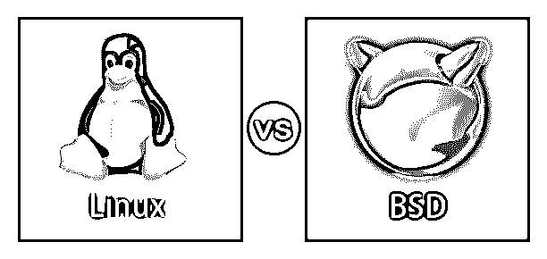
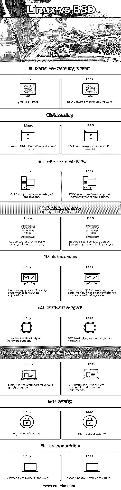

# Linux vs BSD

> 原文：<https://www.educba.com/linux-vs-bsd/>

## Linux 与 BSD 的区别

Linux vs BSD 是自由和开源的操作系统，它极大地受到了 Unix 操作系统的启发。BSD 代表伯克利软件发行版。Linux 是由芬兰学生 Linus Torvalds 开发的。两个 Linux 都有很多相似之处，而不是不同之处。但是与 BSD 相比，Linux 更受欢迎，使用也更广泛。BSD 是对 Bell Unix 的修改和更新的集合，它是在加州大学伯克利分校开发的。后来，它演变成一个正常的操作系统。Linux 有时也被称为 GNU/Linux，因为它的发行版是由多个软件构建的。

### Linux 与 BSD 之间的直接比较(信息图表)

以下是 Linux 与 BSD 之间的 9 大区别:

<small>网页开发、编程语言、软件测试&其他</small>

### Linux 和 BSD 之间的主要区别

让我们讨论一下 Linux 和 BSD 之间的一些主要区别:

即使 Linux 和 BSD 之间有如此多的相似之处，它们之间也有如此多的技术差异。从技术上讲，Linux 不是操作系统；相反，它更像一个内核。操作系统的核心被称为内核。内核既不是软件也不是硬件。它介于硬件和软件之间。操作系统是在内核之上开发的。内核为用户提供了系统中可用资源的优势。

下面提到了 Linux 和 BSD 之间的主要区别:

#### 1.操作系统和内核

*   从技术上讲，Linux 是一个内核。Linux 发行版集合了创建一个完整的 Linux 操作系统所需的所有软件。市场上有各种 Linux 发行版，如 Ubuntu、Red Hat、Debian、Mint、Arch 等。另一方面，BSD 可以同时充当操作系统和内核。比如像 NetBSD，FreeBSD 等 BSD 操作系统。，既有操作系统又有内核。它以单个封装的形式提供。
*   FreeBSD 的安装是直接的，提供操作系统和内核。但是要安装 Linux，必须首先选择一个 Linux 发行版。Linux 发行版是使用 Linux 内核开发的。
*   默认情况下，BSD 提供了一个端口系统来帮助安装各种软件包。ports 系统中的所有软件包都以源代码的形式提供，系统应该在运行之前编译这些源代码。它们也可以预装的二进制形式提供。

#### 2.许可差异

*   尽管大多数人不太关心许可，但是 Linux 和 BSD 之间的许可差异是非常显著的。
*   Linux 使用的许可是 GNU 通用公共许可证，通常称为 GPL。在这种类型的许可中，任何人都可以添加不同的特性或根据它们修改 Linux 内核源代码，但是修改后的 Linux 内核的源代码应该公开发布供公众使用。
*   另一方面，BSD 有自己的牌照。BSD 许可证授予开发人员修改或添加新特性和组件到 BSD 发行版或内核的权限。在 BSD 许可中，开发人员不需要像在 Linux 中那样发布他们修改过的源代码。即使 BSD 是开源的，如果愿意，修改它的开发人员也可以将其声明为闭源。他们也可以向任何人发布源代码。

#### 3.软件的兼容性和可用性

*   公众根据操作系统的兼容性和可用性来决定操作系统的适应性和受欢迎程度。一个操作系统与市场上可用的最新应用程序越兼容，并且它越可用，那么它就越会受到公众的欢迎。Linux 开发人员可以很容易地修改 Linux 操作系统或向其添加新功能，并且可以很容易地以预编译并准备安装的二进制包的形式发布给公众。
*   这些包可以在 yum、apt 或任何其他包管理器的帮助下安装。对于 Linux 操作系统来说，这种可能性要容易得多，因为它是开源的。
*   另一方面，这在 BSD 的情况下是困难的，因为有数千个端口系统可供用户下载各种程序的源代码。这些源代码一旦下载成功，也应该在开发者的系统中编译。这给 BSD 开发人员和用户带来了很多头疼的问题，这进一步导致了它的不受欢迎。
*   即使 BSD 提供了预编译的二进制包来解决这个问题，应用程序仍然很难使用。

#### 4.Linux 和 BSD 之间的选择

*   在基于 Unix 的开源操作系统中，Linux 是最受欢迎的。因为这个原因，Linux 比 BSD 拥有更多的硬件支持。在 FreeBSD 的情况下，开发团队有许多工具，允许他们为自己的系统创建自己的工具。另一方面，GNU 套件为 Linux 系统提供了不可定制的工具。
*   BSD 中的应用程序数量可能会非常少。开发人员已经为 BSD 构建了 Linux 兼容性包，它允许在 BSD 平台上使用 Linux 应用程序。另一方面，Linux 的应用程序没有这个问题，因为许多公共 Linux 平台都是可用的。
*   Linux 平台用户可以使用许多发行版。一些著名的 Linux 发行版包括 Red Hat、Debian、Slackware、Gentoo、Puppy Linux、Solus 等。主要的 BSD 操作系统是 OpenBSD、FreeBSD 和 NetBSD。苹果个人电脑的操作系统 macOS，是 BSD 平台的闭源操作系统。

### Linux 与 BSD 比较表

让我们讨论 Linux 和 BSD 之间最重要的比较:

| **比较** | **Linux** | **BSD** |
| **内核 vs 操作系统** | Linux 是一个内核。 | BSD 更像一个操作系统。 |
| **发牌** | Linux 拥有 GNU 通用公共许可证(GPL)。 | BSD 有自己的许可证，称为 BSD 许可证。 |
| **软件可用性** | 快速支持各种应用。 | BSD 需要更多的时间来支持不同类型的应用程序。 |
| **包支持** | 支持许多第三方包来满足所有需求。 | BSD 对用户方便的包有一个保守的方法。 |
| **性能** | Linux 速度非常快，运行应用程序的性能也很高。 | 尽管 BSD 表现出很好的性能，但它在协议网络领域的性能很差。 |
| **硬件支持** | Linux 有各种各样的硬件支持。 | BSD 对各种硬件的支持有限。 |
| **图形支持** | Linux 对各种图形供应商有很强的支持。 | BSD 图形驱动程序的可持续性较差，性能较低。 |
| **安全** | 高度安全。 | 高度安全。 |
| **文档** | 高质量的文档是可用的。 | 高质量的文档是可用的。 |

### 结论

BSD 和 Linux 都是免费的，是基于 Unix 的开源操作系统。尽管 Linux 和 BSD 有许多相似之处，但它们也有相当多的不同之处。根据需求和方便程度在 Linux 和 BSD 之间进行选择是开发者的选择。

### 推荐文章

这是一个 Linux vs BSD 的指南。在这里，我们讨论 Linux 和 BSD 之间的主要区别，以及信息图表和各自的比较表。您也可以浏览我们推荐的其他文章，了解更多信息——

1.  [Debian vs Arch](https://www.educba.com/debian-vs-arch/)
2.  [Ubuntu vs Centos](https://www.educba.com/centos-vs-ubuntu/)
3.  [PowerShell vs Bash](https://www.educba.com/powershell-vs-bash/)
4.  [卡莉 Linux vs Ubuntu](https://www.educba.com/kali-linux-vs-ubuntu/)

