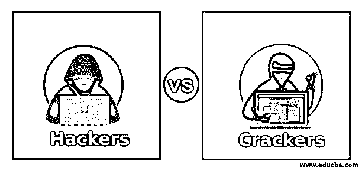
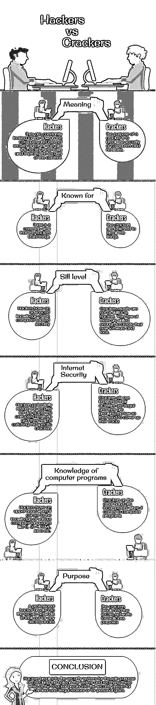

# 黑客 vs 破解者

> 原文：<https://www.educba.com/hackers-vs-crackers/>

## 黑客与破解者的区别

我们大多数人害怕黑客这个术语。我们认为黑客对我们的电脑是一种威胁，他们可以获取任何他们想获取的秘密信息。但是，事实并非如此，在这里，我们给你带来了黑客和破解者之间的确切区别。这将终结所有关于黑客的神话。黑客和破解者正是那些对计算机和网络有着广泛了解的人，从它们是如何构建的、如何工作的、[编程](https://www.educba.com/concepts-of-programming-languages/)、代码以及其他一切与安全相关的东西。一般来说，人们认为这两者之间几乎没有区别。然而，事实并非如此。这两者为相反的利益而工作。一个可能是为了好，另一个则完全是出于恶意和犯罪的原因。这是两者之间的实际分界线。

简而言之，人们可以将黑客定义为识别安全系统缺陷并努力改进它们的人。而黑客可能会不道德地利用高度敏感的信息，并利用安全系统中的缺陷为自己谋利。黑客通常会破坏互联网安全，无需支付版税就能访问各种软件。另一方面，黑客是互联网安全专家，他们甚至可能被雇用来定位和识别互联网安全系统中的漏洞，并修复这些漏洞和缺陷。黑客用他们的知识来帮助安全系统，而黑客用他们的知识来违反法律和破坏安全。这两种帽子有时被称为白帽子和黑帽子。黑客是好人，被称为白帽子，而黑帽子通常指为了个人利益而破坏计算机安全的黑客。

<small>网页开发、编程语言、软件测试&其他</small>

### 黑客与破解者的直接对比(信息图)

以下是黑客与破解者之间的最大区别:

### 关于黑客的一切

黑客一词的最初使用可以追溯到 20 世纪 50 年代，当时在麻省理工学院，一些学生对实验和学习技术有着强烈的渴望。在当时，hack 指的是非常原创和巧妙的东西，仅仅是为了探索计算机和技术领域。目前，这些术语被用于相当负面的意义。这是因为大多数时候，人们混淆了术语黑客和破解。但这完全不能和饼干混淆。我们稍后将详细讨论破解程序。

白帽子，正如他们有时被称为的那样，大多是程序员。他们获得编程、计算机语言和代码的高级知识。他们是在法律范围内的道德黑客。他们不会非法访问任何系统或网络。他们一直在寻找计算机和互联网安全的漏洞，他们唯一的目的就是纠正这些漏洞，提高内容的安全性。这些公司雇佣这些白帽子来审计和检查他们的网络安全。这些黑客作为专业人员工作，利用他们在该领域的先进知识来纠正漏洞，并降低可能危及公司安全的风险。他们发现网络安全中的弱点，不知疲倦地工作，尽最大努力寻求解决这些网络问题的方法。他们找出这些漏洞背后的原因，并努力修复它们。

#### 这些黑客对什么感兴趣？

他们对了解事物如何运作感兴趣。他们喜欢探索和发现计算机系统、编程和网络。虽然有些人可能只对学习感兴趣，但其他人将他们的热情转化为他们的职业，从而使他们成为职业黑客。他们基本上非常熟悉破解者所知道的各种软件工具、技术和代码。他们知道黑客会如何试图攻击网站和计算机系统上的任何安全内容。他们设计黑客会使用的软件和工具，然后他们用更多的安全工具和技术来改进系统。这确保了计算机系统和网络系统变得足够安全，不会被黑客破坏。白帽子也闯入安全系统，但他们闯入的目的完全是无恶意的。他们这样做只是为了测试他们自己的系统的安全性，他们这样做是合法的，并得到了雇佣他们从事这项工作的各种公司的许可。白帽子打着[道德黑客](https://www.educba.com/ethical-hacking-software/)的旗号，不涉及任何非法黑客行为。职业黑客对任何公司和个人都没有恶意。

### 关于饼干的一切

我们已经了解了黑客，他们如何工作，他们的兴趣是什么，他们做什么。现在，当我们谈论黑客时，我们必须知道，黑客也是黑客。但是他们的工作方式有很大不同。虽然黑客完全是为了公司或个人的利益而工作，但黑客的工作方式却完全相反。黑客的目的是破坏计算机和网络的安全。这是非法活动。他们利用自己的知识谋取私利，并破坏网络安全。他们获取大量关于计算机、其编程、软件、代码和语言的知识和知识，并利用这些知识和知识侵入计算机以获取犯罪收益。

饼干也被称为黑帽子。他们恶意地获取人们的帐户，并可以在网络上滥用安全信息。他们可以窃取信用卡信息；他们可以破坏重要的文件，泄露重要的数据和信息或个人细节，并出售它们以谋取私利。他们的目的可以从很小的个人利益到更大的犯罪利益。它们可以让公司员工泄露高度安全的信息。它们违反了计算机安全。一旦他们获得了对系统的控制权，他们就可以做任何事情，比如窃取数据、破坏数据、利用数据为自己谋利等等。

#### 这些饼干对什么感兴趣？

虽然一些黑客纯粹是被他们在黑客领域的能力的宣传所驱动，但一些黑客是出于犯罪和恶意目的。他们故意破坏计算机和网络安全，仅仅是为了获利，或者可能其中有挑战。他们感兴趣的是不用支付版税就能访问各种程序和软件。他们的唯一目的是非法入侵导致安全问题。信用卡持有者的账户可能被盗，重要数据可能丢失，安全信息可能泄露。一些黑客对通过[逆向工程](https://www.educba.com/reverse-engineering-with-python/)修改软件感兴趣。他们这样做仅仅是为了娱乐或者展示他们的知识和能力。

### 饼干的种类

有各种类型的破解程序，包括脚本小子，包猴，s'kiddiots，拉默，warez d00dz(花花公子)，和 wannabes。通常，他们不太熟练，也不具备编程和代码方面必要的深入知识。他们几乎总是依赖他人创建的软件工具来执行他们的操作。大多数时候，他们不知道这个程序到底是做什么的。他们只知道破解安全网络的过程，缺乏高级知识。他们算不上什么威胁，但他们的威胁不容忽视。他们基本上丑化网页，并用他们的设计取而代之。

### 黑客 vs 破解者

有一种普遍的观点认为黑客建造东西，而破解者破坏东西。这基本上是两个完全不同的术语。它们看起来很相似，但是两者的实际工作方式有所不同。虽然黑客拥有与计算机相关的安全方面的高级知识，但破解者通常不如黑客熟练。他们中很少有人有足够的技术来创造他们的新软件和工具。因此，他们通常依赖于某些不那么有名的，事实上，名声不好的网站来下载一些自动程序来执行他们的行为。黑客试图通过各种网络对抗黑客对计算机和互联网安全造成的潜在威胁。黑客总是知道他们的活动是非法的，他们正在违反法律，所以他们倾向于掩盖他们的踪迹。

然而，专业黑客有足够的能力和相当熟练的工作，有可能恢复被破坏的网络的安全设置，他们帮助抓住特定的黑客。虽然大多数破解者技术不太熟练，但他们中的许多人已经足够了。他们拥有先进的技能和广博的知识，就像职业黑客一样。他们有能力创建工具和软件，帮助他们利用他们在高度安全的程序中发现的各种弱点。这使得抓住这些饼干变得更加困难。因为他们不会留下痕迹，熟练的破解者的数量非常少，但是我们不应该忽视他们。它们肯定会对互联网安全构成严重威胁。

到目前为止，我们很清楚黑客是有道德的专业人士，而破解者是不道德地非法闯入安全系统的。除了这种道德上的差异，两者之间的一个主要差异是他们对计算机系统和安全系统的理解。他们创建程序和软件工具的能力和能力是两者的主要区别。黑客可以用多种语言编写代码。当谈到各种计算机语言的知识时，如 C、C++、HTML、 [Java](https://www.educba.com/bundle/pwyw-javascript-2016-bundle/) 等，他们占了上风。也；他们完全了解这些代码做什么，以及这些软件是如何工作的。另一方面，破解者在计算机程序方面是无能的。他们吹嘘自己有能力闯入安全系统并利用它们为自己谋利。这里的区别很明显。黑客出于恶意目的闯入安全网络，而专业黑客则不会。因此，正是它们的工作方式，使得它们彼此完全不同。

### 结论

因此，我们可以得出结论说，黑客闯入安全系统的唯一目的是检查系统中的漏洞，并致力于纠正这些漏洞，而黑客闯入安全系统是出于犯罪和非法的原因或个人利益。白帽子根据法律合同执行安全测试。“黑帽子”并不遵循任何这样的协议。他们这样做是为了破坏系统的安全性。虽然黑客将安全系统中的任何弱点的知识保留给自己，并利用它来为自己谋利，但黑客这样做是为了使有关公司或个人意识到可能的破坏，这种破坏可能导致他们在黑客手中遭受相当大的损失。基本上，我们可以说，道德黑客使用和应用他们的知识和经验来帮助维护计算机系统和网络的安全。

而破解者利用他们通常并不先进的知识来破坏法律？这两个术语有时会互换使用，但我们必须知道，这两者之间的差异相当大，相当可观。我们甚至可以说，这是对黑客的尊重，也是对黑客的侮辱。黑客行为可能比破解更有害，因为黑客拥有程序、代码等方面的深入知识。然而，由于他们的工作仅仅是开发安全系统，他们实际上对安全系统没有任何威胁。然而，这些黑客对互联网安全构成了严重威胁。在当今时代，这是一个越来越大的威胁。因此，对检察官采取适当的法律行动，从而减少威胁，具有重要意义。这两个术语非常相似，但不同之处在于各自的工作方式。这就是两者如此不同的原因。因此，我们一定不能混淆这两个术语，并记住合法和道德地进行黑客攻击，永远不要想到破解。

### 推荐文章

这是一本黑客与解密高手的指南。在这里，我们讨论了信息图表与职业机会和认证的直接比较。您也可以看看以下文章，了解更多信息–

1.  [道德黑客定义](https://www.educba.com/ethical-hacker-definition/)
2.  [道德黑客软件](https://www.educba.com/ethical-hacking-software/)
3.  [投资网络安全](https://www.educba.com/invest-in-cybersecurity/)
4.  [网络安全面试问题](https://www.educba.com/network-security-interview-questions/)

