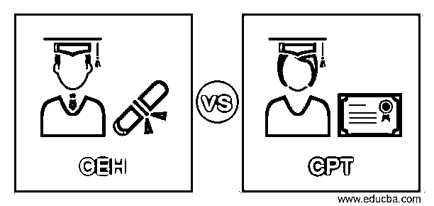
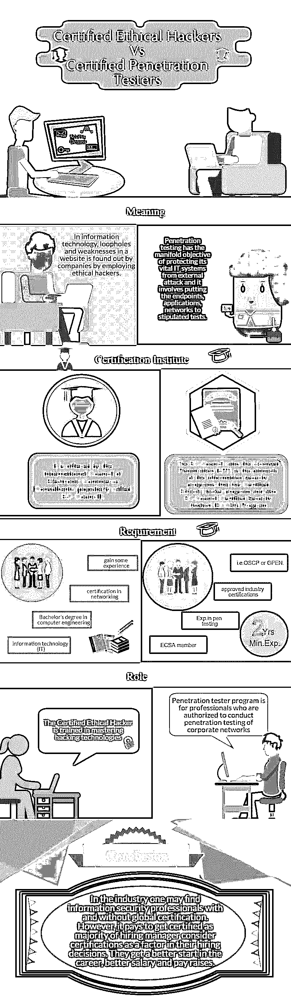

# CEH vs CPT(认证道德黑客 vs 认证渗透测试员)

> 原文：<https://www.educba.com/certified-ethical-hacker-vs-certified-penetration-testers/>

## CEH 与 CPT 的区别

**认证道德黑客–**人们谈论网站被“黑”并不罕见，您可能已经看到过关于热门网站被一群人或个人黑的新闻报道。在网络世界中，从事这种“犯罪”行为的人被称为黑客。他们可能是聪明的程序员或网络管理员，他们这样做可能是为了寻求刺激，或者是为了窃取信息或控制网站或门户。

为了找到系统或财产的漏洞，最好的方法是雇用一个小偷并找出它。在信息技术中，公司的漏洞和弱点被公司通过雇佣道德黑客发现。他们是训练有素的认证人员，有多年的经验来检测漏洞，以便公司可以尽快堵塞漏洞，防止网站遭受意外黑客或病毒攻击时造成巨大损失。

<small>网页开发、编程语言、软件测试&其他</small>

网络攻击的严重性可以从美国白宫的行动计划来衡量，该计划将花费 190 亿美元用于网络安全[倡议](https://www.educba.com/cyber-security-interview-questions/)，包括教育消费者使用双重认证。在此之前，最近的黑客入侵损害了美国公民的个人数据-在 11 月；联邦当局指控三名男子侵入包括 JP 摩根、道琼斯、史考特和 eTrade 在内的九家金融机构的系统，使 1 亿名客户的数据面临风险。

Ponemon Institute 在 2014 年进行的一项研究显示，数据泄露给受影响公司造成的平均成本为 350 万美元。

许多行业研究和调查报告表明[网站和计算机网络](https://www.educba.com/computer-network-vs-data-communication/)的安全漏洞不断增加，从而增加了受过训练或获得许可的职业黑客的机会。

### CEH 与 CPT 的面对面比较(信息图)

以下是 CEH 和 CPT 的最大区别:

### 如何成为一名认证的道德黑客？

有许多机构提供黑客培训课程，但最终它应该引导你获得国际电子商务顾问委员会(俗称 EC- Council)提供的[Certified Ethical Hacker(CEH)](https://www.eccouncil.org/programs/certified-ethical-hacker-ceh/ "Certified Ethical Hacker (CEH)")认证。

对于任何人来说，成为一名道德黑客或认证道德黑客都不容易，因为之前在 It 行业的经验是该领域任何正式教育的一项要求。理想情况下，道德黑客应该具有计算机工程或信息技术(IT)学士学位的编程背景。第一步是获得网络认证，在参加思科 CCNA 认证(思科认证网络助理)之前获得一些该领域的经验。它是一种证书，用于验证专业人员理解、配置、操作、配置中级交换和路由网络以及排除故障的能力，还包括使用 WAN 通过远程站点验证和实施连接。

此后，最好去获得更多的安全认证， [CISSP](https://www.educba.com/course/cissp-training/ "CISSP Training") 或 TICSA。这将使这个人能够在信息安全领域获得一个职位。在这个阶段，获得渗透测试的经验会更好。渗透测试涉及对组织中 IT 实施安全性的评估。这样做的目的是识别网络中存在的漏洞。易受攻击的领域包括服务器、操作系统、无线网络、移动设备、服务、配置和应用程序。这些测试可以手动完成，也可以通过运行自动化程序来完成。

此后，在行业中获得更多曝光后，可以尝试国际电子商务顾问委员会(EC-Council)提供的国际认证道德黑客(CEH)认证。根据 EC 的说法，认证道德黑客计划是专业人士最想要的信息安全培训计划的顶峰。

除了网络课程之外，一个有道德的黑客应该掌握 Unix/Linux 命令和发行版的知识，用 C 语言编程的知识，LISP，T4 Perl 或者 Java。MySQL 等数据库的知识对于有道德的黑客来说也会派上用场。

除了技术知识，他们还需要有解决问题和人际交往的技能或社会工程。他们应该让人们公开他们的凭证，重启或关闭系统或执行文件。

道德黑客行为有五个阶段——1)侦察，2)获取访问权限，3)枚举，4)保持访问权限，5)最后掩盖你的踪迹。侦察包括通过探测目标系统来收集有关恶意攻击的预定目标的信息。端口进行扫描以发现系统中的弱点，并发现防火墙和路由器周围的漏洞。一旦被检测到，黑客就能找到进入系统的方法。有两种侦察方式——主动和被动。

被动侦察可能与信息安全或 IT 系统无关，但它可能是关于公司日常事务的知识——员工到达和离开的时间。也可能是互联网协议(IP)变更、命名约定、隐藏的服务器或网络。黑客监控数据流，查看交易发生的时间和流量路线。

进入系统是黑客攻击最重要的阶段。它可以发生在局域网(LAN)或互联网上，本地访问 PC，甚至离线访问。它包括基于堆栈的缓冲溢出、拒绝服务(DoS)和会话劫持。

枚举或扫描阶段包括根据侦察期间收集的信息检查网络。使用的工具有拨号器、端口扫描器、网络映射器、清除器和漏洞扫描器。

维护访问权限对于将来使用至关重要。有时，他们通过后门、木马、rootkits 保持独占访问。最后一步是掩盖痕迹以避免被安全人员发现。认证道德黑客(CEH)计划详细涵盖了这些主题，并在授予认证之前由 EC-Council 进行测试，从而使候选人有资格接受行业中具有挑战性的任务。考试测试考生在以下方面的知识和技能-

Learn how to protect businesses from the dangers of malicious hacking efforts. Assess the security of computer systems using penetration testing techniques. Develop ethical hacking skills.

### 渗透测试

[渗透测试](https://www.educba.com/course/introduction-to-kali-linux-penetration-testing/ "Introduction to Kali Linux Penetration Testing")具有保护其重要 IT 系统免受外部攻击的多重目标，它涉及对终端、应用、网络进行规定的测试。它使安全专业人员能够通过在发现漏洞的地方启动补救措施来提前抵御任何可能的威胁。

定期的 pen 测试有助于公司预先了解 IT 系统面临的所有安全风险。及时的补救措施可以防止黑客入侵网络，泄露有价值的数据。它避免了可能高达数百万美元的安全违规成本，以及涉及第三方数据的客户数据保护和企业对企业信息的图像丢失。渗透测试有助于组织满足 GLBa、HIPAA 和 Sarbanes-Oxley 等合规/审计法规。通过与渗透测试的安全违规相关的罚款，公司可以节省大量资金。它们将能够符合联邦 FISMA、PCI-DSS 或 NIST 规定的测试。

### 欧盟委员会许可的渗透测试

欧盟委员会将[许可渗透(LPT)](https://cert.eccouncil.org/licensed-penetration-tester.html "Licensed Penetration (LPT)") 与认证道德黑客计划和欧盟委员会认证安全分析师(ECCSA)计划一起评为信息安全计划的巅峰。

EC-Council LPT 考试是授予认证前最具挑战性的实践考试。该课程的在线版本有超过 39 个密集模块，超过 2300 张幻灯片，深入渗透测试的复杂方面。该课程提供了 1100 种工具，帮助他们深入渗透测试科学。

EC-Council 表示，LPT 考试是在经过全面的工作、角色、工作任务和技能差距分析后，与全球中小企业和从业者合作开发的。它实时模拟一个跨国组织的复杂网络。

该课程的在线版本使信息安全人员能够从世界任何地方学习渗透测试，并申请 LPT 许可证。该许可证向您的利益相关者保证，您拥有“基于实践技能的能力”来执行全面的安全评估。

### 资格标准

不是所有的 IT 专业人员都有资格申请 EC-Council 许可，尤其是 Pen 测试。候选人必须是信誉良好的 ECSA 会员，拥有至少两年的 pentesting 经验，并拥有 OSCP 或 GPEN 等行业认证。申请人可以通过在线表格直接向 EC-Council 申请。

### 认证的优势

*   该认证允许候选人在全球范围内进行渗透测试和咨询。
*   作为法律和道德安全专家的行业认可度。
*   获得软件、模板和测试方法的 EC-Council。

虽然不同的机构提供认证，欧洲委员会认证使他们能够实践他们的技能，使他们能够作为一个持牌渗透测试。

虽然道德黑客和渗透属于信息安全领域，但它们在角色和功能上有微妙的不同。认证道德黑客接受掌握黑客技术的培训，而授权渗透测试程序则面向被授权对企业网络进行渗透测试的专业人员。

https://cert.eccouncil.org/lpt-application-form.html.在线接受欧盟委员会认证考试申请

Ankit Fadia 的认证道德黑客也是一个程序，是公认的世界各地。它是由全球著名的计算机安全权威设计的。它提供了网络罪犯和恐怖分子使用的最新工具、技术和方法。它还展示了如何与它们战斗。Ankit Fadia 还展示了他是如何在你眼前侵入网站、账户、手机和密码的。

渗透测试和道德营销的潜力是巨大的，印度领先的服务行业门户网站 Naukri.com 在这一领域显示了 115 个空缺职位。

认证道德黑客(CEH)和渗透测试员的角色是不同的，尽管他们都属于信息安全领域。CEH 负责通过执行某些保护系统免受外部威胁的例程来保护 IT 系统。在这个领域，根据知识、能力和经验，专家被聘为安全审计员、网络安全专家、渗透测试员、网站管理员、安全顾问。拥有欧盟委员会认证的这些领域的专家在政府部门、军事和国防领域需求量很大。符合 EC 委员会教学大纲的道德黑客课程为信息安全人员获得 EC 委员会认证做准备。一些国家的私立学校和大学都提供这种课程。

### 结论

在这个行业中，人们可能会发现有或没有全球认证的信息安全专业人员。然而，获得认证是值得的，因为大多数招聘经理认为认证是他们招聘决策的一个因素。他们在职业生涯中有一个更好的开始，更好的薪水和加薪。

根据美国劳工统计局的数据，从 2014 年到 2024 年，信息安全分析师的需求预计将增长 18%，比大多数其他职业都要快。根据全国软件和服务公司协会(NASSCOM)的数据，印度只有 5 万名网络安全专业人员，但该国到 2020 年需要 500 万名专业人员。

该国每年需要 77000 名新的道德黑客，但目前，只有 15000 人接受过这方面的培训。即使是最优秀的黑客也需要多学习，获得全球认证才能获得可信度。随着对道德黑客和渗透测试员的需求不断增长，私营部门涌现出了几个提供各种课程的机构。

据麦肯锡称，大约 70%的印度公司容易受到网络攻击。在最近的一次事件中，一家公司不得不支付巨额资金来重新控制其被盗数据。

在美国，法规在合规性方面非常严格。印度没有美国国会在 1996 年通过的健康保险流通和责任法案。该法案旨在保护和处理美国的机密健康信息。不符合 HIPAA 的公司很难在美国开展业务。

专家说，除了道德黑客攻击，渗透测试、漏洞评估也越来越受欢迎，但经常与渗透测试混淆。

### 推荐文章

这是 CEH 与 CPT 之间最大差异的指南。在这里，我们讨论了 CEH 与 CPT 的直接比较、主要差异，以及信息图和比较表。您也可以看看以下文章，了解更多信息–

1.  [卡莉 Linux vs Ubuntu](https://www.educba.com/kali-linux-vs-ubuntu/)
2.  [Linux vs Ubuntu](https://www.educba.com/linux-vs-ubuntu/)
3.  [道德黑客定义](https://www.educba.com/ethical-hacker-definition/)
4.  [CEH vs CPT(认证道德黑客 vs 认证渗透测试员)](https://www.educba.com/certified-ethical-hacker-vs-certified-penetration-testers/)

