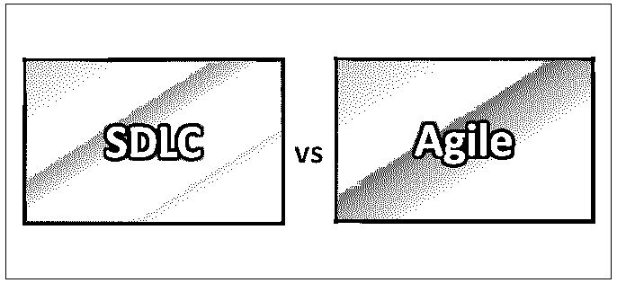
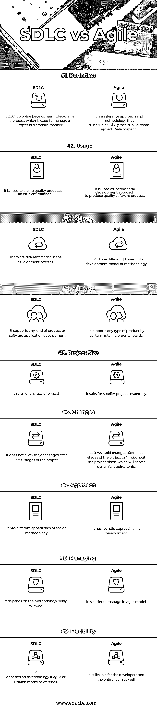

# SDLC 与敏捷

> 原文：<https://www.educba.com/sdlc-vs-agile/>

## SDLC 和敏捷的区别

SDLC(软件开发生命周期)是信息技术组织中软件或系统项目所遵循的一种过程。 [SDLC](https://www.educba.com/sdlc-interview-questions/) 是一个框架，它定义了[软件开发](https://www.educba.com/software-development/)中的不同步骤或过程。软件开发生命周期(SDLC)也称为应用程序开发生命周期。软件开发生命周期中涉及的不同步骤是规划、分析、设计、实现和维护。软件开发生命周期过程可以应用于硬件或软件组件或配置，以定义其范围和生命周期过程。该软件开发生命周期将确保向最终客户交付高效和高质量的软件或硬件产品，以确保硬件或软件组织中的高质量产品或服务开发。这将确保业务的顺利进行。

<small>网页开发、编程语言、软件测试&其他</small>

敏捷是一种方法论，而 SDLC 是一种用于项目管理领域的过程，用于执行软件开发生命周期的过程。敏捷软件开发是一种面向软件开发生命周期过程的方法，其中客户的需求和解决方案将通过多个跨职能团队和最终用户或客户或客户的协作工作来实现。它有助于持续的项目交付、持续的项目改进、即时的变化和快速的开发。敏捷宣言写于 2001 年初。最初创建了一个正式的过程，后来命名为敏捷。

### SDLC 和敏捷之间的直接比较(信息图表)

以下是这两者之间的 9 大对比:

### SDLC 和敏捷的主要区别

两者都是企业中推荐的选项。让我们来看看一些主要的区别:

1.  SDLC ( [软件开发](https://www.educba.com/what-is-software-development/)生命周期)是设计和开发交付给客户的产品或服务的过程，在信息技术或硬件组织的软件或系统项目中遵循，而敏捷是一种可以通过使用 Scrum 框架来实现项目管理过程的方法。
2.  SDLC 有不同的模型，如瀑布模型、敏捷模型、迭代或增量模型、螺旋模型、RAD–快速应用程序开发模型、V 形模型和进化原型模型，而敏捷模型包含一组最佳工程实践和最佳标准，还能为他们节省资金、提高可预测性、减少失败并提高交付项目的质量。
3.  SDLC 包含 LLD(低层次设计)和 HLD(高层次设计)，它们用于根据个人的技术或业务知识，从高层次和低层次的角度对不同类型的团队成员和客户分析和理解项目，而敏捷模型有不同的阶段，如规划、需求、分析、设计、编码、单元测试、系统[集成测试](https://www.educba.com/integration-testing/)、非功能测试和验收测试。
4.  SDLC 将更容易了解或看一眼就能理解项目，而敏捷更容易理解、使用和实现。
5.  SDLC 有不同的模型，管理项目的各个部分取决于模型，而敏捷对于开发人员和整个团队来说更容易管理和灵活。
6.  SDLC 描述了为交付成功的项目交付、维护和支持而执行的所有活动，而敏捷宣言有多达 12 个不同的原则。
7.  SDLC 提供了一种系统化的方法来构建软件，以在时间表内成功交付产品，而敏捷有更快的开发方法，并以有效和高效的方式加速开发过程。
8.  SDLC 包含将在每个阶段详细记录的文档，以便以低效率的方式明确进度可见性，而 Agile 提供持续集成和持续交付模型，通过根据动态需求变化频繁交付基于需求的应用程序中的小变化。

### SDLC 与 Agile 对比表

如您所见，SDLC 和敏捷之间有许多比较

| **比较的基础** | ****SDLC**** | ****敏捷**** |
| **定义** | SDLC(软件开发生命周期)是一个用于平稳管理项目的过程。 | 它是在软件项目开发的 SDLC 过程中使用的一种迭代方法。 |
| **用途** | 它用于以高效的方式创造高质量的产品。 | 它被用作生产高质量软件产品的增量开发方法。 |
| **阶段** | 发展过程中有不同的阶段。 | 它的发展模式或方法会有不同的阶段。 |
| **平台** | 它支持任何类型的产品或软件应用程序开发。 | 它通过分解成增量构建来支持任何类型的产品。 |
| **项目规模** | 它适合任何规模的项目 | 它尤其适合较小的项目。 |
| **变化** | 它不允许在项目初始阶段之后进行重大更改。 | 它允许在项目的初始阶段之后或整个项目阶段进行快速变更，这将服务于动态需求。 |
| **接近** | 它基于方法论有不同的方法。 | 它有一个现实的发展方法。 |
| **管理** | 这取决于所采用的方法。 | 在敏捷模型中更容易管理。 |
| **灵活性** | 这取决于方法论，如果一个敏捷或统一的模型或瀑布 | 对于开发人员和整个团队来说，它都是灵活的。 |

### 结论

SDLC 是一个过程，而敏捷是一种方法，当 SDLC 有不同的方法时，SDLC 和敏捷都是必须考虑的，敏捷就是其中之一。SDLC 有不同的方法，如敏捷、瀑布、统一模型、V 模型、螺旋模型等。方法的选择取决于项目的需求和规模，同样的方法可以扩展到 STLC，称为[软件测试生命周期](https://www.educba.com/software-testing-life-cycle/)。

敏捷模型主要支持较小的项目，以便在短时间内和预算内交付高质量的项目。SDLC 有不同的阶段，阶段可以根据方法而变化，与其他方法相比，敏捷有不同的阶段。方法的选择取决于项目和需求，团队的规模，以及项目的复杂性和规模。

### 推荐文章

这是 SDLC 和敏捷之间的顶级比较的指南。在这里，我们还将讨论信息图和比较表之间的主要区别。你也可以看看下面的文章来了解更多。

1.  [软件开发 vs 网页开发](https://www.educba.com/software-development-vs-web-development/)
2.  [PMP vs 敏捷](https://www.educba.com/pmp-certification-vs-agile-certification/)
3.  [数据科学家 vs 软件工程师](https://www.educba.com/data-scientist-vs-software-engineer/)
4.  [詹金斯 vs 竹子](https://www.educba.com/jenkins-vs-bamboo/)

