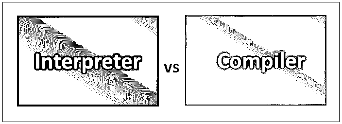

# 解释器 vs 编译器

> 原文：<https://www.educba.com/interpreter-vs-compiler/>

## 解释器和编译器的区别

解释器 vs 编译器是程序执行的两种方式，用编程或任何脚本语言编写。当一个代码被提交时，一个编译器获取整个程序，编译器的工作就是把它转换成存储在文件中的目标代码。考虑到编译过程，编译器会更快。这种目标代码通常被称为二进制代码，一旦被编译，就可以在链接后由机器直接执行。翻译要快得多。它直接执行用任何编程语言编写的指令，而不需要将代码转换成对象或机器代码。

### 解释器和编译器的直接比较(信息图表)

下面是解释器和编译器之间的 5 大区别

<small>网页开发、编程语言、软件测试&其他</small>

### 解释器和编译器的主要区别

解释器和编译器之间最重要的区别是解释器现在执行代码，而编译器首先准备源代码，然后才执行。以下是这两种情况下明显的一些其他差异。

*   一旦一个程序被编译，不需要其他的安装。编译器简化了分发过程。除此之外，代码还能够在一个特定的平台上执行。这里操作系统可能不同，或者处理器可能需要程序的不同编译版本。解释器不必担心，因为程序已经分发了。此外，它可以分发给不同平台上的不同用户。但是这涉及到解释器必须运行在特定平台上的基本要求。代码可以以原始形式发布，也可以以中间形式发布。
*   当涉及到跨平台程序时，通常首选解释编程语言。原因是当使用解释器创建程序时，代码被翻译成适用于实际平台的适当形式。相反，当一个程序被编译时，你可以注意解释器和编译器平台之间的细微差别。这通常是部分发生的，因为编译语言大多是小写的。此外，除此之外，正在使用的库应该支持不同的库。
*   当速度是一个因素时，编译器赢得了比赛，也输掉了比赛。冗杂？让我们解释一下为什么两者都有。一个程序，当被编译时，运行起来比解释程序快。而当程序被解释时，编译和运行需要更多的时间。编译器因此产生更快的程序。此外，优化编译器代码也更容易。更容易优化代码。一个预先有完整的代码。因此，要优化代码并使之更快，有许多方法。
*   为了调试，必须使用解释器而不是编译器。解释器只有一个版本的可执行文件。因此，任何开发都不需要调试版本。当使用解释器时，特定于平台的错误也更少。由于没有创建目标代码，并且代码的转换是在移动中完成的，所以关于源代码的所有信息总是可用的。另一方面，编译器有一个目标代码，更重要的是，它有所有的代码。在编译器中寻找错误真的很让人头疼。

### 解释器与编译器对照表

让我们来看看解释器和编译器之间的主要比较——

| **比较的基础** | **解释器** | **编译器** |
| **基本差异** | 编译器是一种将高级编程语言编写的代码转换成机器代码的程序。处理机器代码是计算机的责任。 | 另一方面，解释器也是一个包括源代码、预编译和脚本的程序。与编译器不同，解释器在运行程序之前不会将代码转换成机器代码。当程序运行时，它们将代码转换成机器代码。 |
| **创建程序的步骤** | 1)创建一个程序
2)不需要链接文件或者机器码。3)当一个代码被执行时，一个源代码可以一行一行地执行。 | 1)创建一个程序
2)一旦完成，所有代码都将被解析和分析，以获得任何需要的修正。如果没有错误，那么编译器会将源代码转换成机器码。
3)此后，该代码链接到任何程序中的不同代码。
4)运行这个程序。 |
| **机器代码存储** | 默认情况下，这项工作由解释器完成，因此它不存储机器代码。由于没有目标代码，这里涉及的内存管理较少。 | 生成的机器代码存储在磁盘上。在这种情况下，内存管理更加重要，因为目标代码占用空间。 |
| **错误** | 解释器逐行解释代码。因此，一旦该行被解释，它就会显示错误。解释器相对更快，因此找出错误要快得多。您可以很容易地找到抛出特定错误的那一行。 | 它仅在代码完全编译后显示所有错误，并且同时显示所有错误。由于代码是一次性编译的，所以很难找出代码中的错误。 |
| **代码优化** | 解释器一行一行地开始这个过程。如果有任何错误，必须解决它，然后进入下一行。因此，在这种情况下很难优化代码。 | 由于编译器一次看到整个代码，因此优化代码更容易。一个预先有完整的代码。因此，要优化代码并使之更快，有许多方法。 |

### 结论

我们已经经历了解释器和编译器之间的许多变化。经过以上讨论，我们可以得出结论，有些时候某些技术选择需要与您的需求相关。如果用户想要开发的速度和简易性的结合，那么你可以选择解释器驱动的语言。此外，当任何项目开始时，所有的资源都必须得到照顾。由于其跨平台的功能，解释器也是更受欢迎的。考虑到编译过程，编译器会更快。因此，如何使用解释器和编译器取决于用户。

### 推荐文章

这是解释器和编译器之间最大区别的指南。在这里，我们还将讨论信息图和比较表的主要区别。你也可以看看下面的文章来了解更多-

1.  [PHP vs.Net](https://www.educba.com/php-vs-dot-net/)
2.  [JavaScript 与安圭拉](https://www.educba.com/javascript-vs-angularjs/)
3.  [Java vs Node JS](https://www.educba.com/java-vs-node-js/)
4.  [编程与脚本](https://www.educba.com/programming-vs-scripting/)

