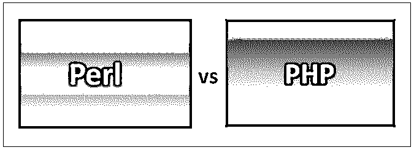
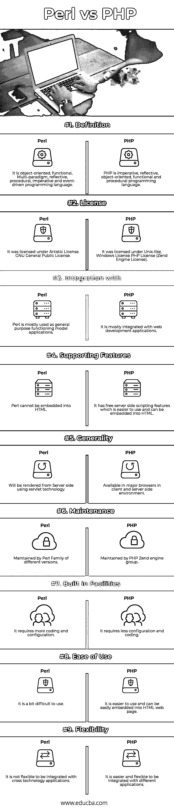

# Perl 与 PHP

> 原文：<https://www.educba.com/perl-vs-php/>

## Perl 和 PHP 的区别

Perl 是一种动态的、高级的和通用的编程语言，它没有任何官方的缩写，例如实用的提取和报告语言，也很少有其他没有任何标准形式的语言。Perl 首次发布于 1987 年，也就是 30 年前。Perl 的最新稳定发布版本是 5.28.0。Perl 最新的预览发布版本是 5.29.4，发布于 2018 年 10 月。它完全是使用 C 编程语言开发和实现的。它是一种纯粹动态的学科。它是由作者拉里·沃尔设计的。它支持跨平台操作系统。它是在 GNU 通用公共许可证下授权的。它有不同的文件扩展名，如。pm，。pl，。豆荚，。t 等。它具有灵活性和强大的功能，可以在许多应用中使用。

PHP 被称为超文本预处理器，是一种服务器端脚本语言。它是为 web 开发目的而开发和设计的。它是由拉斯马斯·勒德尔夫设计的，于 1994 年首次亮相。它是一种并且可以用作通用编程。拉斯马斯·勒德尔夫被称为 PHP 之父。哈克和猎鹰影响了它。它受到 Perl、C++、C、Tcl 和 Java 等不同编程语言的影响。它主要是使用 C 编程语言和 C++编程语言的一些特性开发和实现的。PHP 支持不同的跨平台操作系统，如 Windows 和 UNIX 类系统。

<small>网页开发、编程语言、软件测试&其他</small>

### Perl 和 PHP 的面对面比较(信息图)

以下是 Perl 和 PHP 的 9 大区别:

### Perl 和 PHP 的主要区别

两者都是企业中推荐的选项。让我们检查一些关键的区别:

*   Perl 是一种通用编程语言，用于执行数据操作和许多其他开发和管理功能，而 PHP 用于开发 web 应用程序，也用作服务器端脚本语言。
*   Perl 提供了与不同的第三方数据库和许多其他工具的集成特性，而 PHP 可以与 Oracle、MySQL、MSSQL、PostgreSQL 等数据库集成。
*   Perl 支持不同的特性，如 Unicode 字符、过程化和面向对象的编程，这是可扩展的，也可以嵌入到其他几个系统中，而 PHP 支持几个协议特性，如 IMAP、POP3、LDAP 等。还增加了对 Java 和其他分布式体系结构的支持。
*   Perl 具有网络加密、事务管理和数据库集成的特性，而 PHP 则具有高效、简单、安全、熟悉和灵活等特性。
*   Perl 是以严格的方式解释的，编译后的代码在执行之前会被转换成字节码，而 PHP 在使用系统之前需要安装不同的重要组件，比如 PHP 的数据库、服务器和解析器。
*   Perl 支持多种平台，如 Unix、Macintosh、Windows、Symbian 等。，而 PHP 在开发应用程序时有不同的标记、语法风格和编码标准要遵循。
*   Perl 有几个特性受到了其他不同语言的影响，比如 C、Lisp、Smalltalk 和 Bourne Shell 等等。，而 PHP 有不同类型的数据类型要在代码中声明，如双精度、整数、布尔、空、字符串、对象、数组、资源等。
*   Perl 有不同类型的基本数据，如数组、散列和标量，以声明简单的变量、数字、字符串或任何引用以及任何有序或无序的列表，而 PHP 有不同的数据类型以及常量和变量。
*   Perl 有不同的操作符，如等式操作符、算术操作符、赋值操作符、逻辑操作符、按位操作符、类似引号的操作符、逻辑操作符和其他一些杂项操作符，而 PHP 有不同的操作符，如算术操作符、条件(三元)操作符、逻辑(关系)操作符、比较操作符和赋值操作符。
*   Perl 具有子例程功能，可以在运行不同程序的过程中调用子程序或进程，而 PHP 具有不同的浏览器或客户端相关的 HTTP 方法或浏览器功能，可用于 web 开发。

### Perl 与 PHP 对照表

让我们来看看 Perl 和 PHP 之间的主要比较——

| **比较的基础** | **Perl** | **PHP** |
| **定义** | 它是一种面向对象、功能性、多范式、反射性、过程性、命令性和事件驱动的编程语言。 | PHP 是一种命令式、反射式、面向对象、函数式和过程式编程语言。 |
| **执照** | 它是根据艺术许可证 GNU 通用公共许可证授权的。 | 它是在类似 Unix 的 Windows 许可证 PHP 许可证(Zend Engine 许可证)下授权的 |
| **Integration****同** | Perl 主要用作通用功能模型应用程序。 | 它主要与 web 开发应用程序集成在一起。 |
| **Supporting**

**特性**

 | Perl 不能嵌入到 HTML 中 | 它有免费的服务器端脚本功能，更容易使用，并可以嵌入到 HTML 中。 |
| **通用性** | 将使用 servlet 技术从服务器端呈现 | 适用于客户端和服务器端环境中的主流浏览器 |
| **维护** | 由不同版本的 Perl 家族维护 | 由 PHP Zend 引擎组维护 |
| **内置设施** | 它需要更多的编码和配置 | 它需要更少的配置和编码 |
| **易用性** | 有点不好用。 | 它更容易使用，可以很容易地嵌入到 HTML 网页中 |
| **灵活性** | 与跨技术应用程序集成是不灵活的 | 它更容易和灵活地与不同的应用程序集成。 |

### 结论

Perl 是一种用于开发通用应用程序的通用编程语言，而 PHP 是一种可用于开发 web 应用程序的脚本语言。Perl 的类型规则是动态且强大的，而 PHP 的类型规则是动态且脆弱的。Perl 的正则表达式函数可以作为 PHP 的扩展。Perl 语言最初启发了 PHP 编程。

PHP 可以与不同的框架一起使用来开发网页，并与不同的 web 框架集成。PHP 提供了不同的选项来开发网页。与 Perl 和 PHP 相比，PHP 比 Perl 更受青睐，因为 PHP 选项更适合于基于项目及其复杂程度的不同需求的开发选项。PHP 比较好用，开始开发部署。

### 推荐文章

这是 Perl 和 PHP 之间最大区别的指南。在这里，我们还将讨论信息图和比较表的主要区别。你也可以看看下面的文章来了解更多。

1.  [PHP vs JavaScript](https://www.educba.com/php-vs-javascript/)
2.  [Perl vs Python](https://www.educba.com/perl-vs-python/)
3.  [Go vs PHP](https://www.educba.com/go-vs-php/)
4.  [Perl vs Ruby](https://www.educba.com/perl-vs-ruby/)

