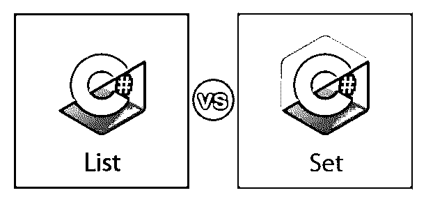
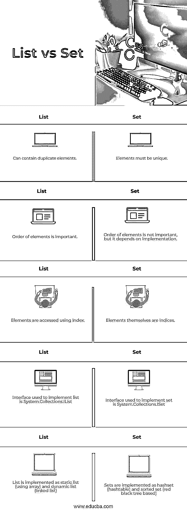
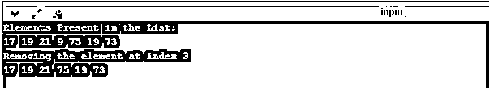
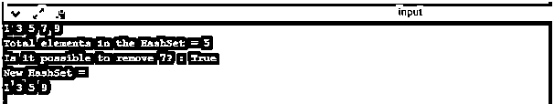

# 列表与集合

> 原文：<https://www.educba.com/list-vs-set/>

## C#中的列表和集合介绍

列表和集合是 C#支持的众多数据结构中的两种。列表是线性的抽象数据结构。它包括以线性方式排列的元素。可以在列表的不同位置添加元素。该列表有一个名为 length(列表中元素的数量)的属性。在这个主题中，我们将学习列表和集合。

**Note**: Be careful as lists are different from arrays. The lists have variable size, i.e. elements can be appended in the list while arrays have fixed size.

集合是一种抽象的数据结构。集合有唯一的元素，元素的顺序并不重要。集合中的元素不能通过索引访问。元素本身是集合中的索引，可以使用 foreach 循环访问特定的元素。

<small>网页开发、编程语言、软件测试&其他</small>

### 列表和集合之间的直接比较(信息图表)

下面是列表和集合之间的 5 大区别

### 列表和集合的主要区别

以下是主要区别:

1.  列表可以包含重复的元素，而集合不能，因为集合只能有唯一的元素。因此，如果您想要独特的元素，请使用集合。
2.  列表中的元素是有序的，虽然顺序在集合中并不重要，但它取决于集合的实现。
3.  使用列表中的索引来访问元素，而元素本身是集合中的索引。因此，foreach 循环用于访问集合中的元素。但是，它也可以用来访问列表元素，如上面列表的代码所示。

让我们看看 list 和 set 接口的一些方法。

#### 目录

以下是 IList 接口实现的一些方法:

*   **int Add(element)–**将元素添加到列表的末尾，并返回一个表示成功插入的值。
*   **void Insert(int，element)–**在列表的给定位置插入元素
*   **void Clear()–**从列表中删除所有元素
*   **bool Contains(element)–**检查元素是否出现在列表中
*   **void Remove(element)–**从列表中删除给定的元素
*   **void remove at(int)–**删除给定位置的元素
*   **int index of(element)–**返回元素的位置
*   这是一个索引器，允许访问给定位置的元素

以下是列表的示例代码之一:

`// C# Program to remove the element at  // the specified index of the List<T>  using System;  using System.Collections.Generic;
class StaticList {
// Main Method      public static void Main(String[] args)
{
// Creating an List<T> of Integers
List<int> firstlist = new List<int>();
// Adding elements to List          firstlist.Add(17);          firstlist.Add(19);          firstlist.Add(21);          firstlist.Add(9);          firstlist.Add(75);          firstlist.Add(19);          firstlist.Add(73);
Console.WriteLine("Elements Present in the List:");
// Displaying the elements of List          for(int k=0;k<firstlist.Count;k++)
{
Console.Write(firstlist[k]+" ");
}
Console.WriteLine(" ");
// removing the element at index 3
Console.WriteLine("Removing the element at index 3");
// 9 will be removed from the List          // and 75 will come at index 3          firstlist.RemoveAt(3);
// Displaying the elements of List          foreach(int k in firstlist)
{
Console.Write(k+" ");
}
}
}`

**输出:**

#### 一组

以下是 ISet 接口实现的一些方法:

*   **bool Add(element)–**如果元素被添加到集合中(前提是它不在集合中),则返回 true，否则返回 false
*   **bool Contains(element)–**如果元素已经存在于集合中，则返回 true，否则返回 false
*   **bool Remove(element)–**如果元素存在于集合中并且可以被删除，则返回 true 否则返回 false
*   **void Clear()–**从集合中删除所有元素
*   **void intersect with(Set other)–**它找到两个集合(同时出现在两个集合中的元素)的交集，一个集合是调用该方法的集合，另一个集合是作为参数传递的。
*   **void union with(Set other)–**它找到两个集合(两个集合中的所有元素)的并集，一个是调用方法的集合，另一个是作为参数传递的集合。
*   **bool IsSubsetOf(Set other)–**如果集合(在其上调用该方法)是作为参数传递的另一个集合的子集，则返回 true，否则返回 false
*   **bool IsSupersetOf(Set other)–**如果集合(在其上调用该方法)是作为参数传递的另一个集合的超集，则返回 true，否则返回 false
*   **int Count–**返回集合中元素的个数

以下是该集合的示例代码之一:

`using System;
using System.Collections.Generic;
class HS {
// Driver code
public static void Main()
{
// Creating a HashSet of odd numbers
HashSet<int> odd = new HashSet<int>();
// Inserting elements in HashSet          for (int i = 0; i < 5; i++) {              odd.Add(2 * i + 1);
}
Console.WriteLine("Elements in the HashSet:");         // Displaying the elements in the HashSet
foreach(int i in odd)
{
Console.Write(i+" ");
}
Console.WriteLine("\nTotal elements in the HashSet = "+odd.Count);
Console.WriteLine("Is it possible to remove 7? : "+odd.Remove(7));
Console.WriteLine("New HashSet = ");
foreach(int i in odd)
{
Console.Write(i+" ");
}
}
}`

**输出:**

### 对照表

下表说明了 list 和 set 之间的区别:

| **列表** | **设置** |
| 1.可以包含重复的元素 | 1.元素必须是唯一的 |
| 2.元素的顺序很重要 | 2.元素的顺序并不重要，但它取决于实现 |
| 3.使用索引来访问元素 | 3.元素本身就是索引 |
| 4.用于实现列表的接口是 System。Collections.IList | 4.用于实现 set 的接口是 System。Collections.ISet |
| 5.列表实现为静态列表(使用数组)和动态列表(链接列表) | 5\. Sets are implemented as hashset (hashtable) and sorted set (red-black tree-based) |

### 推荐文章

这是一个列表和集合的指南。在这里，我们已经讨论了列表与集合的关键区别，包括信息图和比较表。您也可以看看以下文章，了解更多信息–

1.  [C#列表与数组](https://www.educba.com/c-sharp-list-vs-array/)
2.  [C#数组 vs 列表](https://www.educba.com/c-sharp-array-vs-list/)
3.  [C#函数](https://www.educba.com/csharp-functions/)
4.  [C#命令](https://www.educba.com/c-sharp-commands/)

