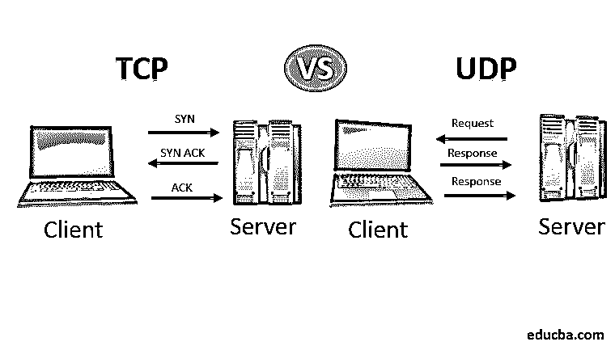
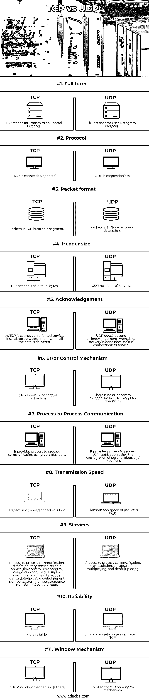

# TCP 与 UDP

> 原文：<https://www.educba.com/tcp-vs-udp/>

## TCP 和 UDP 的区别

下面的文章提供了 TCP 和 UDP 的概要。TCP 是面向链路的，UDP 是无连接的。TCP 将发送方链接到接收方，直到可以传输数据。在传输数据之前，UDP 不会创建连接。TCP 值得信赖。期望接收器接收通过 TCP 协议传输的数据。如果数据在传输过程中丢失，它将检索数据并发回数据。TCP 还将监控错误包和跟踪包，以防止数据丢失或损坏。

### 什么是 TCP？

TCP 代表[传输控制协议](https://www.educba.com/what-is-tcp-protocol/)。TCP 是面向连接的协议，即它提供了处理(端到端)通信的过程。传输控制协议用于表示 TCP/IP 协议中其他协议之间的关系。它位于应用层和网络层之间，是应用程序和网络操作之间的中介。TCP 以数据包的形式传送数据或消息。TCP 提供不同的功能，如序列号、流量控制、错误控制、确认号、拥塞控制等。，以确保正在传送的数据包不会受到其他活动的影响。

<small>网页开发、编程语言、软件测试&其他</small>

### 什么是 UDP？

UDP 代表[用户数据报协议](https://www.educba.com/user-datagram-protocol/)。它用于从一台主机向另一台主机发送小消息。它是一种无连接协议，即从一端向另一端传输数据；不需要建立连接。UDP 也位于应用层和网络层之间。它还以数据包的形式传送数据或信息；这些数据包被称为用户数据报。UDP 使用多路复用来处理来自多个进程的传出用户数据报，并使用多路分解来处理传入用户数据报，这些数据报会进入同一台主机上的不同进程。

### TCP 与 UDP 的直接比较

下面列出了 TCP 与 UDP 之间的 11 大区别:

### TCP 与 UDP 的主要区别

让我们讨论一下 TCP 和 UDP 之间的一些主要区别:

*   TCP 和 UDP 的主要区别之一是 TCP 是面向连接的，而 UDP 是无连接的。为了传输数据，TCP 必须与其它主机建立连接。
*   在数据传输过程中，TCP 使用序列号对数据包进行编号。以便在接收方，可以使用序列号按顺序收集数据。而 UDP 不使用序列号对数据包进行编号，所以很困难。
*   TCP 提供流量控制服务来处理接收数据的溢出，而 UDP 不提供流量控制服务。
*   TCP 提供可靠的服务，UDP 不提供可靠的服务。
*   在 TCP 中，数据段的重新传输通过窗口机制进行。由于 UDP 中没有窗口机制，所以它不支持数据报的重传。
*   在 TCP 中，确认号被赋予数据段，而在 UDP 中，确认号不用于数据报。
*   TCP 是链接的，而 UDP 是无连接的。这意味着 TCP 跟踪所有传输的数据，需要(通常)每个字节的确认。UDP 通常用于一些丢失数据报无关紧要的协议。它不使用任何认证。由于其确认机制，TCP 是一种安全的信息传输协议。它保证没有信息被发送到顶层应用程序，这些信息是无序的、重复的或缺少部分的。
*   TCP 提供诸如进程间通信、流传递服务、流控制、错误控制、拥塞控制、全双工通信、复用、解复用、确认号、系统号、序列号和字节号等服务，而 UDP 具有诸如进程间通信、复用、解复用以及封装、解封装等功能。
*   TCP 具有诸如使用滑动窗口的流量控制、窗口边调整启发式和拥塞避免算法来管理数据流的特性。而 UDP 不提供管理数据流的功能。
*   与 UDP 相比，TCP 中的数据质量可持续性更好，因为它可以管理小到非常大的数据，而 UDP 可以管理小到中等数量的数据。

### TCP 与 UDP 的对比表

下表总结了 TCP 和 UDP 之间的比较:

| **分** | **TCP** | **UDP** |
| **完整表格** | TCP 代表传输控制协议。 | UDP 代表用户数据报协议。 |
| **协议** | TCP 是面向连接的。 | UDP 是非连接的。 |
| **数据包格式** | TCP 中的数据包称为数据段。 | UDP 中的数据包称为用户数据报。 |
| **割台尺寸** | TCP 报头是 8 个字节。 | UDP 报头是 20 到 60 个字节。 |
| **确认** | 因为 TCP 是面向连接的服务，所以当所有数据都被传送时，它发送一个确认。 | 当数据传递完成时，UDP 不发送确认，因为它是一种无连接服务。 |
| **错误控制机制** | TCP 支持错误控制机制。 | 除了校验和之外，UDP 中没有错误控制机制。 |
| **进程间通信** | 它提供了一个使用端口号处理通信的过程。 | 它提供了使用端口号和 IP 地址的组合来处理通信的过程。 |
| **传输速度** | 数据包的传输速度很低。 | 分组的传输速度很高。 |
| **服务** | 处理通信、流传递服务、可靠服务、流量控制、错误控制、拥塞控制、全双工通信、多路复用、多路分解、确认号、系统号、序列号和字节号的过程。 | 处理通信、封装、解封装、多路复用和解复用的过程。 |
| **可靠性** | 比较靠谱。 | 与 TCP 相比，可靠性中等。 |
| **窗口机制** | 在 TCP 中，窗口机制是存在的。 | 在 UDP 中，没有窗口机制。 |

### 结论

在本文中，我们已经了解了什么是 TCP 和 UDP，它们之间的比较和主要区别。

### 推荐文章

这是 TCP 与 UDP 的对比指南。在这里，我们讨论了 TCP 与 UDP 的概述，并看到了两者的直接比较以及主要差异。您也可以浏览我们推荐的其他文章，了解更多信息——

1.  [FTP vs TFTP](https://www.educba.com/ftp-vs-tftp/)
2.  [抽象 vs 封装](https://www.educba.com/abstraction-vs-encapsulation/)
3.  [OSI 模型 vs TCP/IP 模型](https://www.educba.com/osi-model-vs-tcp-ip-model/)
4.  [Mac 与 IP 地址](https://www.educba.com/mac-vs-ip-addresses/)

