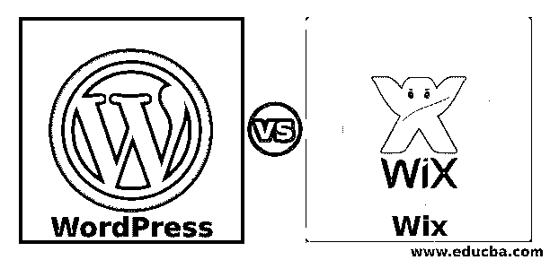
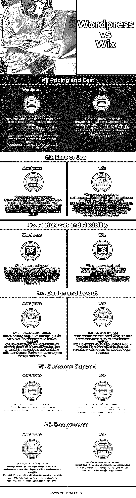

# WordPress vs Wix

> 原文：<https://www.educba.com/wordpress-vs-wix/>

## WordPress 和 Wix 的区别

WordPress 是一个开源的，最流行的创建网站和博客的软件工具。在一个共同的方式，它是最好的软件工具，更容易和强大的博客和内容管理系统(CMS)。即使你不知道如何创建一个网站，也没有任何问题，因为 WordPress 有成千上万的主题可以用来创建网站和内容管理，所以用户不需要知道任何编程或设计技巧。要使用 WordPress，我们不需要安装任何软件，因为 WordPress 可以在线运行，可以在任何地方通过互联网进行修改，并保存您的更改。WordPress 没有限制或规则来托管你的网站；你可以把你的 WordPress 网站放在任何一个主机提供商那里。目前，互联网上近 42.1%的网站是建立在 WordPress 上的。WordPress 是在 2003 年作为一个独立项目创建的；后来，它变成开源的，由开发者社区贡献。由于 WordPress 是独立的软件，我们需要将它安装在网络服务器上，然后只有我们可以使用它来建设和内容管理的网站。

Wix 是一个高级的、流行的网站构建器，通过它用户可以使用 Wix 中的在线拖放工具为桌面和移动设备创建网站和博客站点。Wix 将作为一个托管网站平台，以特定的价格提供构建网站所需的所有组件。Wix 提供内容管理软件、附加软件和不同功能的扩展，如在线营销、脸书、Twitter 和 git 等社区论坛。他们还提供不同价格的主机服务。Wix 创建于 2006 年。用户可以从 Wix 创建免费网站，但他们不能利用所有的功能；如果他们想拥有所有的功能，我们需要购买一个计划，提供网站的高级访问。Wix 是一个我们可以注册的工具；它允许建立，然后管理网站，并照顾托管。

<small>网页开发、编程语言、软件测试&其他</small>

### WordPress 和 Wix 的面对面比较(信息图表)

以下是 WordPress 和 Wix 的 6 大对比:

### WordPress 和 Wix 的主要区别

让我们讨论一下 WordPress 和 Wix 之间的一些主要区别:

*   WordPress 是开源的，可以免费使用和修改，而 Wix 免费提供一个基础网站，设施有限；我们需要使用高级服务来使用所有功能。
*   Wix 易于使用，因为它提供了拖放功能，而在 WordPress 中，我们需要熟悉所有选项以及如何使用它们。
*   Wix 通过电子邮件、电话、教程等获得广泛的客户支持。虽然 WordPress 没有官方支持，但是它通过论坛和社区提供支持。
*   Wix 有许多插件和应用程序，可以用来给网站添加更多的功能，而 WordPress 有如此多的免费插件，将近 56，000 多个。所以 WordPress 有更多的插件。
*   Wix 主题可以在没有任何 web 编程知识的情况下定制，而 WordPress 主题只有在我们具备了 [HTML/CSS](https://www.educba.com/html-vs-css/) 的基础知识的情况下才能定制；否则很难得到想要的样子。

### WordPress 和 Wix 的比较表

以下是 WordPress 和 Wix 的对比表。

| **比较的基础** | **WordPress** | **Wix** |
| **定价和成本** | WordPress 是开源软件，可以免费使用和修改，但我们需要获得域名和虚拟主机才能使用 WordPress。我们可以根据自己的需要选择托管计划，如果我们选择高级 WordPress 主题，WordPress 网站的成本会增加。所以 WordPress 比 Wix 便宜。 | 由于 Wix 是一个高级服务提供商，它免费提供一个基本的网站生成器，通过它我们不能使用自定义域名和充满大量广告的网站。为了避免这些，我们需要根据我们的需求升级到高级计划。 |
| **易用性** | WordPress 很容易学，但是我们需要熟悉网站的不同部分以及如何使用它们。我们需要写我们的内容和定制我们想要的主题。WordPress 没有拖放功能。 | Wix 非常容易学习，因为它带有易于使用和构建网站的工具。它提供了带有拖放界面的工具，通过它我们可以选择网站上的元素并对它们进行定制。我们不需要学习或编写任何代码。所以 Wix 比 WordPress 好用。 |
| **特性集和灵活性** | WordPress 最初用于博客，后来用于网站、作品集和网络商店开发。它有能力添加插件来增加我们需要的功能，如脸书，谷歌分析，安全插件等。 | Wix 附带了许多支持博客、电子商务网站等的特性。Wix 提供了许多免费和付费的附加软件，我们可以根据自己的需求进行选择。 |
| **设计和布局** | WordPress 有很多免费主题和高级主题。正如我们所知，免费主题支持有限，功能较少，而高级主题有很多功能，可以定制网站和切换到不同的主题。所以 WordPress 有很好的设计和布局。 | Wix 有很多很好的可视化模板可供选择。所有的模板都是响应式的，我们可以像设计一样进一步定制，重新排列元素等。它有一个缺点，一旦我们选择了一个模板，我们就不能在将来改变它。 |
| **客户支持** | WordPress 没有官方支持，但是它有很多在线社区，和网络开发者的论坛。 | Wix 有一个官方支持论坛，提供各种主题、教程、电话和电子邮件支持。此外，Wix 网站为每个元素都提供了一个帮助图标。 |
| **电子商务** | WordPress 提供了更多的模板，所以我们可以用电子商务插件创建我们自己的电子商务在线商店，通过它我们可以销售商品、订阅等。WordPress 比 Wix 为整个网站提供了更多的选择。 | 由于 Wix 提供了如此多的模板，它提供了溢价类别的电子商务模板，我们可以通过销售和接受付款。 |

### 结论

最后，概述了 WordPress 和 Wix 网站构建软件工具之间的区别。希望你看完这篇 WordPress vs Wix 的文章后，能更好的理解 WordPress vs Wix 的利弊。虽然 WordPress 比 Wix 更强大，但我们需要学习 HTML/CSS 来获得网站想要的外观。而 Wix 将负责定制、内容管理等。

### 推荐文章

这是 WordPress 和 Wix 之间区别的有用指南。在这里，我们讨论了直接比较，以及信息图和比较表。您也可以阅读以下文章，了解更多信息——

1.  [WordPress vs Tumblr](https://www.educba.com/wordpress-vs-tumblr/)
2.  [WordPress vs Weebly](https://www.educba.com/wordpress-vs-weebly/)
3.  [WordPress 或 Joomla](https://www.educba.com/wordpress-vs-joomla/)
4.  [WordPress vs Shopify](https://www.educba.com/wordpress-vs-shopify/)

