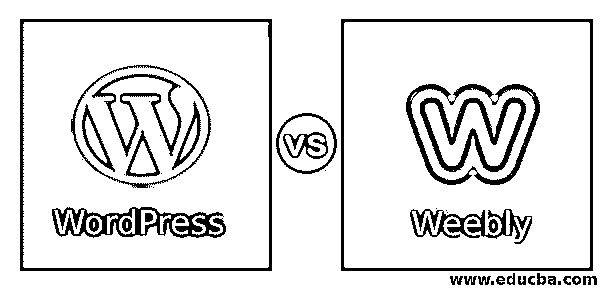
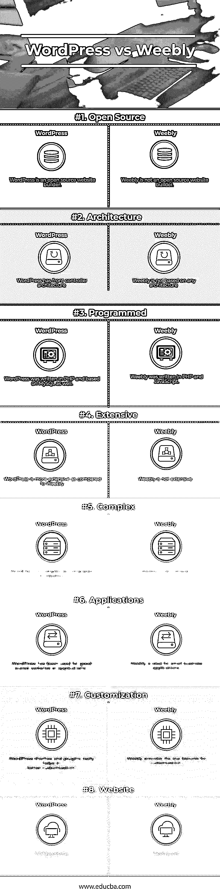

# WordPress vs Weebly

> 原文：<https://www.educba.com/wordpress-vs-weebly/>

## WordPress 和 Weebly 的区别

*   [WordPress 是一款](https://www.educba.com/what-is-wordpress/)开源的内容框架软件。它也被称为博客软件和内容管理系统。它用于通过门户网站交换信息和撰写博客。它是由 WordPress 基金会开发或创建的，其创始人是马特·莫楞威格和迈克·利特尔。第一个版本发布于 2003 年，最新发布的版本是 WordPress 的 4.9。它是用 PHP 和 MySQL 编写的，也用于开发 WordPress。
*   WordPress 是免费的，可以很容易地用来写博客或开发紧凑的网站。WordPress 正在使用模板系统来开发或创建网站和博客。这个模板系统是一个软件，它用一个数据模型来容纳不同的模板，以给出预期的输出文档，称为模板处理器。WordPress 在它的网络模板系统中使用这种处理器，这有助于为用户非常容易地开发定制网页。
*   WordPress 架构是基于一种叫做前端控制器的软件设计模式。当用户或网站上发生的事件请求时，这有助于将网页从一个请求导航到另一个请求。WordPress 已经支持类似 Unix 和 windows 的操作系统。
*   WordPress 有一些功能，比如主题、插件；手机[支持的应用](https://www.educba.com/mobile-applications/)。主题可以根据客户或个人的要求在 WordPress 中定制。它为内容和文件夹提供了不同的外观。WordPress 有很多免费的主题。插件帮助 WordPress 在功能和特性方面被广泛使用。WordPress 是用来开发本地应用程序的，比如用于 android 和 IOS 的任何平台。

Weebly 是一个在线网站，提供了一个平台来创建应用程序或网站。它用于开发电子商务应用程序，小企业程序的网站。它是由三个开发者大卫·鲁森科，丹·维尔特里，克里斯·范宁开发的。第一个版本发布于 2006 年。它主要是用 PHP 和 JavaScript 编写的。

学生们还使用 Weebly 创建网站、项目和其他文件夹。Weebly 有许多开发功能，如简单的拖放、多媒体功能、博客功能、免费和包含的托管以及有影响力的设计。

<small>网页开发、编程语言、软件测试&其他</small>

Weebly 免费且易于使用。它的拖放功能只需将视频、图片和文本拖到你的网站上就可以了。许多明确的设计或主题提供了很好的选择和发展；甚至可以根据需要定制主题。Weebly 还提供托管服务，这使得只由 Weebly 托管网站变得更加容易，并且是免费的。你可以选择你的领域，并设置它的工作。

### WordPress 和 Weebly 的正面比较(信息图)

以下是 WordPress 和 Weebly 的 8 大区别:

### WordPress 和 Weebly 的主要区别

让我们讨论一下 WordPress 和 Weebly 之间的一些主要区别:

1.  WordPress 对 SEO 更友好，因为大规模插件的可用性。Weebly 被称为网站建设者，与 WordPress 相比，它对搜索引擎优化不太友好。
2.  在 WordPress 中，更新内容意味着添加、删除或编辑比 Weebly 更复杂。在 Weebly 中，简单的拖放就可以添加和更新内容，比 WordPress 简单多了。
3.  在 WordPress，开发和更新网站需要更多的时间。在 Weebly，创建一个网站需要的时间更少。
4.  WordPress 有更多的特性和功能。与 WordPress 相比，Drupal 的特性和功能较少。
5.  WordPress 提供原生移动应用；大多数情况下，他们没有任何问题。Weebly 不用于开发原生应用。
6.  WordPress 不能提供很好的安全性，因为它使用了很多插件，插件会使网站暴露于安全相关的问题。Weebly 没有任何问题，因为它是一个封闭的系统，只有有限的工具可以工作。
7.  WordPress 在为网站购买主题和插件时更贵。Weebly 比 WordPress 便宜。
8.  WordPress 有很好的在线论坛和社区来提供支持，开发者数量更多，而 Weebly 在这方面落后于 WordPress。
9.  WordPress 有更多的学习曲线。与 WordPress 相比，Weebly 学习开发网站所需的时间更少。
10.  与 Weebly 相比，WordPress 的用户界面不够友好。Weebly 的用户界面很友好。

### WordPress 和 Weebly 对照表

以下是要点列表，描述了 WordPress 和 Weebly 之间的比较。

| **比较的基础** | **WordPress** | **Weebly** |
| **开源** | WordPress 是一个开源网站构建器。 | Weebly 不是一个开源网站建设者。 |
| **架构** | WordPress 有前端控制器架构。 | Weebly 不基于任何架构。 |
| **已编程** | WordPress 是用 PHP 编写的，也是基于 MySQL 的。 | Weebly 是用 PHP 和 JavaScript 编写的。 |
| **广泛** | 与 Weebly 相比，WordPress 更加广泛 | Weebly 并不广泛。 |
| **复杂** | 与 Weebly 相比，WordPress 更复杂 | Weebly 非常简单。 |
| **应用程序** | WordPress 已经被用于好的、规模化的网站或应用程序。 | Weebly 是小型企业应用的理想选择。 |
| **定制** | WordPress 主题和插件确实有助于更好的定制 | Weebly 提供的定制功能较少。 |
| **网站** | WordPress.org | Weebly.com |

### 结论

WordPress vs Weebly 都是作为开发网站的建站器使用的。WordPress 也用于写博客。WordPress 在开发者中最受欢迎，因为它易于使用、理解，最重要的是，易于学习。WordPress 主要用于开发处理大量数据的网站。

Weebly 主要用于快速方便地开发网站。与 Weebly 相比，WordPress 需要更长的时间来学习，Weebly 是一个不错的选择。Weebly 成本较低，不需要在托管上花钱，而且 Weebly 提供免费托管。如果我们要求简单而优雅的网站或者不错，我们可以使用 Weebly 来创建网站。最大的优点是学生可以使用它，因为它很容易学习和使用。

以上是 WordPress 和 Weebly 的区别，帮助你了解他们的基本情况。WordPress 和 Weebly 各有优缺点。按照你的要求，你必须选择并开始开发网站。

### 推荐文章

这是 WordPress 和 Weebly 之间区别的指南。我们已经讨论了 WordPress 和 Weebly 的直接比较、关键差异、信息图表和比较表。您也可以阅读以下文章，了解更多信息——

1.  [WordPress vs Tumblr](https://www.educba.com/wordpress-vs-tumblr/)
2.  [WordPress 或 Joomla](https://www.educba.com/wordpress-vs-joomla/)
3.  [Shopify](https://www.educba.com/wordpress-vs-shopify/)[vs WordPress](https://www.educba.com/wordpress-vs-shopify/)
4.  [Squarespace vs WordPress](https://www.educba.com/wordpress-vs-squarespace/)

