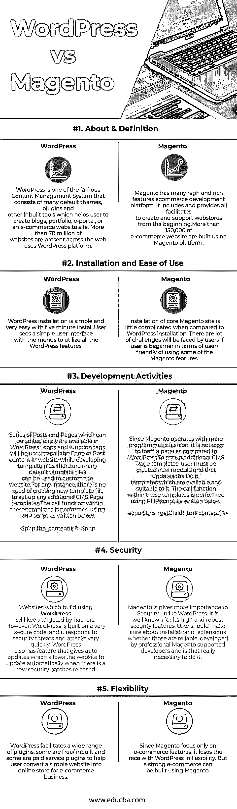

# WordPress vs Magento

> 原文：<https://www.educba.com/wordpress-vs-magento/>

## WordPress 和 Magento 的区别

WordPress 是一个用 PHP 语言编写的在线开源网站创建工具。它是最流行的开源内容管理系统。WordPress 独家支持 MySQL 只存储数据。Magento 是著名的、使用最广泛的开源电子商务软件之一。Magento 拥有许多高功能和丰富的电子商务平台。Magento 使用 PHP 语言开发软件。

### WordPress

马特·莫楞威格和迈克·利特尔最初在 2003 年发布了 WordPress。它在 2009 年被宣布为开源。WordPress 是一个强大的博客和内容管理系统(CMS ),允许用户构建动态网站，并通过其后端组件方便地定制、更新和管理网站。

<small>网页开发、编程语言、软件测试&其他</small>

如前所述，WordPress 还允许人们创建博客，即建立社区、分享想法和他们自己的一些故事，这有助于其他人做出正确的决定。

下面列出了一些 WordPress 的特性:

*   **用户管理:**该功能主要是管理用户的角色、创建、删除、修改用户密码等用户信息。
*   **媒体管理:**这是用于管理媒体文件和文件夹的工具。
*   主题系统:该主题系统功能允许站点查看其功能。
*   多语种:这是一个非常有用的功能，有助于将网站的全部内容翻译成其首选语言。
*   **Importers:** Importers 帮助以张贴到网站的形式导入数据。
*   **搜索引擎优化。**

### Magento

*   Magento 是由一家美国私人公司于 2008 年开发的——****【Varien，Inc】**(总部位于加州卡尔弗城)。**
***   Magento 的架构非常灵活，具有许多用户友好的控制选项，并且允许用户自动更新，这对于电子商务来说非常快速、简单和易于使用。*   Magento 提供从小组织到大组织的服务，通过多种方式实现产品的搜索和分类来建立业务。**

 **### WordPress 和 Magento 的正面比较

下面是 WordPress 和 Magento 之间的前 5 名比较

### WordPress 和 Magento 在电子商务方面的主要区别

两者都是市场上的热门选择；让我们讨论一些主要差异:

1.  WordPress 是用 PHP 语言编写的在线开源网站创建工具，而 Magento 是用 PHP 语言编写的，它使用面向对象编程(OOP)技术来创建电子商务网站。
2.  WordPress 的安装非常容易，用户友好，有很多菜单可以使用，但是 Magento 的安装相对 WordPress 来说有点困难。对初学者来说会更有挑战性。
3.  WordPress 的安全性很低，这使得黑客很容易侵入使用 WordPress 建立的网站，而 Magento 的电子商务网站具有非常高和强大的安全性。
4.  WordPress 的插件目录中有非常好的默认插件。插件目录中有免费的 WordPress 插件(超过 38000 个)和付费服务的高级插件。但就 Magento 而言，由于它只专注于电子商务功能，因此它没有提供太多默认功能。

### WordPress 与 Magento 对比表

WordPress 和 Magento 在电子商务方面的主要比较如下

|  **比较的基础** | **WordPress** | **Magento** |
| **关于&的定义** | WordPress 是一个著名的内容管理系统，由许多默认主题、插件和其他内置工具组成，帮助用户创建博客、作品集、电子门户或电子商务网站。超过 7000 万的网站使用 WordPress 平台。 | Magento 拥有许多高功能和丰富的电子商务开发平台。它包括并提供了从一开始就创建和支持网上商店的所有便利条件。超过 150，000 个电子商务网站是使用 Magento 平台构建的。 |
| **安装和易用性** | WordPress 的安装非常简单，只需要五分钟。用户看到一个简单的用户界面，带有菜单，可以使用所有的 WordPress 功能。 | 与 WordPress 的安装相比，Magento 核心网站的安装有点复杂。如果用户是初学者，在使用 Magento 的一些功能时，用户会面临很多挑战。 |
| **开发活动** | WordPress 提供了一系列可以轻松编辑的帖子和页面。在开发模板文件时，将使用循环和函数标签来调用页面或在网站上发布内容。
有很多默认的模板文件可以用来定制网站。
对于任何实例，没有必要创建一个新的模板文件来设置任何额外的 CMS 页面模板。
这些模板中的调用函数是使用 PHP 脚本执行的，如下所示:
***<？PHP the _ content()；?> <？php*** | 由于 Magento 以一种更程序化的方式运行，与 WordPress 相比，它不容易形成一个页面。
要设置额外的 CMS 页面模板，用户必须创建一个新模块，并更新可用且适用的模板列表。
这些模板中的调用函数是使用 PHP 脚本执行的，如下所示:
***echo $ this->get child html(' content ')？>*** |
| **安全** | 使用 **WordPress** 建立的网站将继续成为黑客的目标。然而，WordPress 是建立在非常安全的代码之上的，它对安全威胁和攻击的反应非常迅速。WordPress 还有一个自动更新的功能，当有新的安全补丁发布时，允许网站自动更新。 | 与 WordPress 不同，Magento 更加重视安全性。众所周知，它具有高度和强大的安全功能。用户应该确保安装了扩展，这些扩展是否可靠，是否由 Magento 支持的专业开发人员开发，是否真的有必要这样做。 |
| **灵活性** | WordPress 提供了各种各样的插件，有些是免费的/内置的，有些是付费服务插件，帮助用户将一个简单的网站转换成电子商务的在线商店。 | 由于 Magento 只专注于电子商务功能，它在与 WordPress 不灵活的竞争中失败了。但是使用 Magento 可以建立强大的电子商务。 |

### 结论

这两个都是开源的和出色的内容管理系统，也适用于电子商务。但是 Magento 是构建电子商务的更合适和稳定的平台，因为它对业务的安全性很高。

尽管 WordPress 在 Magento 上有很多好的特性/插件，但我们建议 Magento 是建立电子商务网站的理想选择，WordPress 也适合建立允许人们创建博客的网站，即建立社区，分享想法，以及帮助其他人做出正确决定的一些自己的故事。

### 推荐文章

这是 WordPress 和 Magento 之间最大差异的指南。在这里，我们还将讨论信息图和比较表的主要区别。您也可以看看以下文章，了解更多信息–

1.  [WordPress 或 Tumblr](https://www.educba.com/wordpress-vs-tumblr/)
2.  [WordPress vs Weebly](https://www.educba.com/wordpress-vs-weebly/)
3.  [Squarespace](https://www.educba.com/wordpress-vs-squarespace/)[vs WordPress](https://www.educba.com/wordpress-vs-squarespace/)
4.  [Shopify](https://www.educba.com/wordpress-vs-shopify/)[vs WordPress](https://www.educba.com/wordpress-vs-shopify/)

**