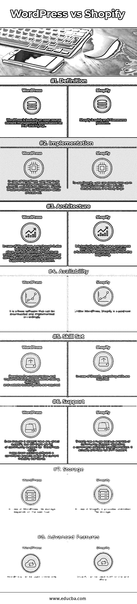

# WordPress vs Shopify

> 原文：<https://www.educba.com/wordpress-vs-shopify/>

## WordPress 和 Shopify 的区别

WordPress vs Shopify 是目前电商行业比较流行的两种解决方案。WordPress 和 Shopify 的解决方案在本质上确实有一些相似之处，但在同一时间点上，WordPress 和 Shopify 也有许多不同之处。在这里，我们将对 WordPress 和 Shopify 进行详细的讨论。

WordPress 基本上是一个免费开源的内容管理系统。WordPress 的神器主要基于 PHP 和 MySQL。WordPress 是最受欢迎的博客平台之一，可以使用插件和扩展。它最初于 2003 年 5 月 27 日发布。

<small>网络开发、编程语言、软件测试&其他</small>

Shopify 基本上是一个电子商务平台，与 WordPress 不同，它是一个付费工具。要使用 Shopify，用户只需在 Shopify.com 注册，经过快速设置后，它就可以运行了。它是一个一体化的电子商务工具，开发者可以从一开始就建立一个功能性的电子商务商店。它提供了广泛的模板，可以根据业务逻辑和需求进行定制。

就像硬币的两面一样，WordPress 和 Shopify 各有利弊。

### WordPress(赞成和反对)

以下是利弊

#### 赞成的意见

1.  WordPress 是开源的，不需要许可费
2.  作为一个开源解决方案，WordPress 对于中小型企业需求来说是一个划算的选择
3.  WordPress 为很多 [SEO 插件](https://www.educba.com/seo-plugins/)提供了很好的支持。这些插件为电子商务业务需求提供了优化和有效的解决方案。
4.  作为开源软件，WordPress 开发者可以在线共享代码，这导致产生更具成本效益的优化商业解决方案。
5.  WordPress 操作简单，可以很容易地安装在主机服务器上。
6.  它主要是为较大的市场，它有方便和友好的管理界面。

#### 骗局

1.  作为一个开源平台，WordPress 并不安全，对潜在的黑客也没有吸引力。
2.  在 WordPress 的情况下，开发者必须通过不同的平台和内部配置来构建电子商务支持功能平台。因此速度相对比 Shopify 慢。
3.  与其他内容管理系统不同，WordPress 拥有有限的权限。
4.  WordPress 没有在一个模板中提供任何本地定义的多个内容区域，因此内容有时变得更加难以实现。
5.  有许多 WordPress 插件不提供高功能。

### Shopify(利弊)

以下是利弊

#### 赞成的意见

1.  Shopify 有一个干净易用的界面。
2.  作为一个电子商务平台，它已经是一个托管网站，因此它的安全性比 WordPress 更强。
3.  它提供了各种各样免费的、响应迅速的、有吸引力的模板。
4.  它实际上提供了一个简单的 PayPal 集成，在当前的电子商务行业中提供了一个附加值。
5.  它提供了出色的销售点选项。
6.  由于大量第三方应用的存在，它的功能可以很容易地扩展。

#### 骗局

1.  Shopify 是一个付费工具，对于小型企业来说，它可能不是一个理想的选择。
2.  它没有电子邮件托管功能。
3.  使用非 Shopify 所有的支付网关时，需要支付交易费。
4.  就博客平台而言，WordPress 提供了比 Shopify 更好的解决方案。Shopify 只是为博客提供了一个基本的布局。
5.  有时 Shopify 主题变得有点难以定制
6.  在平台迁移过程中，Shopify 可能不是一个好的选择

### WordPress 和 Shopify 的正面比较(信息图表)

以下是 WordPress 和 Shopify 的 8 大对比

### WordPress 和 Shopify 的主要区别

WordPress 和 Shopify 的区别可以从以下几点来解释:

1.  WordPress 基本上是一个基于 PHP 和 MySQL 的开源内容管理系统，而 Shopify 仅仅是一个电子商务平台。
2.  与 WordPress 不同，Shopify 可以在线和离线使用
3.  Shopify 提供了大量的免费模板，而 WordPress 的模板种类有限，而且大部分都不能免费使用
4.  作为一个开源解决方案，WordPress 可能是小企业需求的合适选择，然而对于 Shopify 来说可能不是这样
5.  作为一个电子商务平台，Shopify 已经是一个托管网站，因此它提供了比 WordPress 更好的安全性
6.  就博客平台而言，WordPress 将是比 Shopify 更好的选择。

### WordPress 和 Shopify 的对比表

以下是 WordPress 和 Shopify 的对比表:

| **比较的基础** | **WordPress** | **Shopify** |
| **定义** | WordPress 基本上是一个基于 PHP 和 MySQL 的开源内容管理系统。 | Shopify 仅仅是一个电子商务平台 |
| **实施** | 在 WordPress 的例子中，用户必须经历多重设置，如购买域名、虚拟主机账户、设计实现、配置设置过程等。 | 要使用 Shopify，用户只需在 Shopify.com 注册，经过快速设置后，就可以使用了。 |
| **架构** | 就 WordPress 而言，即使它也属于一个一体化的地方，但开发者仍然必须通过不同的平台和内部配置来构建电子商务支持功能平台。 | 它基本上是一个一体化的电子商务工具，开发者可以从一开始就建立一个功能性的电子商务商店。 |
| **可用性** | 这是一个自由软件，可以下载并执行。 | 与 WordPress 不同，Shopify 是一个付费工具 |
| **技能组合** | 根据定制和实施过程，需要一些编码，设计和网站建设的技能。 | 对于 Shopify，不需要任何编码技能 |
| **支持** | 尽管它没有任何直接的支持，但仍然有很多社区支持 WordPress，这有助于他们根据当前的行业标准利用不同的电子商务方面。 | 关于电子商务平台的实现，Shopify 有一个巨大的后备和大量的社区支持。它实际上提供了全天候的全面支持。 |
| **存储** | 在 WordPress 的例子中，文件存储依赖于网络主机 | 就 Shopify 而言，它提供了无限的文件存储空间 |
| **高级功能** | WordPress 只能在线使用 | Shopify 可以在线和离线使用 |

### 结论

在对 WordPress 和 Shopify 进行了一系列因素的比较后，可以得出结论，任何解决方案的选择完全取决于最适合项目需求的功能，因为每一个都有自己的优点和缺点。因此，基于项目需求、工作时间和其他讨论的方面，应该选择这些解决方案中的任何一个来达到期望的目标。

### 推荐文章

这是 WordPress 和 Shopify 区别的有用指南；我们讨论了它们的含义、直接比较、主要差异和结论。您也可以阅读以下文章，了解更多信息——

1.  [WordPress vs Tumblr](https://www.educba.com/wordpress-vs-tumblr/)
2.  [WordPress 和 Joomla](https://www.educba.com/wordpress-vs-joomla/)
3.  [WordPress vs Weebly](https://www.educba.com/wordpress-vs-weebly/)
4.  [Magento vs Shopify](https://www.educba.com/magento-vs-shopify/)

