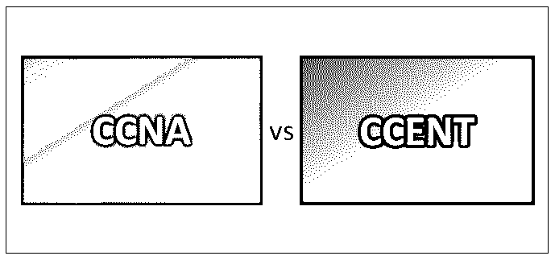
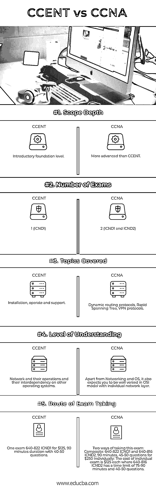

# CCNA 对 CCENT

> 原文：<https://www.educba.com/ccna-vs-ccent/>

## CCNA 和 CCENT 的区别

CCENT(思科认证入门级网络技术员)和 CCNA(思科认证网络助理)。CCNA 和 CCENT 认证都属于思科生态系统，一个网络和基础设施组件的大规模供应商。在过去的几十年里，它还引领了交换、路由和网络技术的创新。CCNA 希望学生能够准备和管理中型交换和路由网络。获得高级认证的 CCENT 认证。

IT 认证是向雇主展示你的技能组合的最好方式，让他们更有可能雇用你，从而提供高薪。在这一类的不同领域中有许多认证，例如对于测试人员来说，ISTQB 是最受认可的认证之一；对于具有 JAVA 背景的人来说，OCJP 和 OCWP 是值得一去的地方，对于云体验来说，AWS 解决方案 cloud architect professional 是值得一去的认证，如果你具有大数据/Hadoop/Spark 背景，CDH、HDP 或 MapR 支持的认证将会给你带来预期的好处。以类似的方式，我们将讨论两个这样的认证，标志着他们在计算机网络领域的存在。

<small>网页开发、编程语言、软件测试&其他</small>

这些认证教授不同层次的不同技能，针对不同的 IT 职位和工作类型。学生在参加这些考试之前需要进行严格的学习，在他们要求更新之前，他们的有效期是三年。

CCNA 希望学生能够准备和管理中型交换和路由网络。它们也迎合广域网的需要，广域网主要用于在不同地理位置的计算机和设备之间建立连接。已经完成 CCNA 的学生也知道所有的预防措施和基本安全故障排除，以及他们的相关威胁，以保持网络安全，免受所有病毒和黑客攻击，这可能会伤害他们或显示私人用户数据。这需要相当于 CCENT 认证的技能才能获得高级认证。必须注意的是，这不是参加 CCNA 考试的先决条件。CCNA 认证专家从事的工作包括网络工程师和广域网/局域网工程师。

这两种考试，CCNA 和 CCENT，对雇主来说都是有价值的，展示了思科网络在几乎所有商业环境中的实际技能。这些认证有助于你作为垫脚石和获得聘用，这将肯定有助于你建立自己的技能，作为一个 IT 网络专业人士。

### CCNA 和 CCENT 的正面对比(信息图)

以下是 CCNA 与 CCENT 之间的五大差异

### CCNA 和 CCENT 的主要区别

两者都是市场上的热门选择；让我们讨论一些主要差异:

CCNA 和 CCENT 的主要区别在于范围的深度。CCENT 认证主要基于入门级设计，对于所有希望在网络领域开始职业生涯的专业人士来说，这是一个很好的起点。本考试涵盖的主题是基本的，不需要太多的努力。本认证课程包括安装、操作和支持小型分支网络等主题。这是最适合清除你在网络领域的基础知识的考试之一，而 CCNA 被认为是准水平考试，其课程和课程表与 CCENT 相比稍微复杂一些。它是对 CCENT 考试已经涵盖的基础知识的有益补充。与 CCENT 相比，通过该考试所需的范围、深度和技能更高、更深。高级动态协议，尤其是负责路由的协议、RST(快速生成树)和 VPN 协议等主题将在本次考试中涵盖。

CCENT 旨在让您了解网络以及网络与其他操作系统和应用程序的关系。例如，数据库管理员、计算机软件程序员和系统管理员可能对学习和通过 CCENT 考试感兴趣，以便更好地理解网络及其对运行的应用系统的影响。网络团队和编程团队或系统管理团队之间经常会就 IT 问题所在发生冲突。对网络的高度理解将有助于最大限度地减少这种情况。因此，CCENT 考试可以说是参加 CCNA 认证的第一步。

CCNA 认证包括一个考试，640-822 ICND1，代表互联思科网络设备 1，考试费用为 125 美元，考试时间为 90 分钟，约有 40-50 个问题，而 CCNA 考试包括 ICND1 和 ICND2 考试以及基本的故障排除。由于故障排除是任何网络管理员的先决条件，因此在两次考试中都介绍了与故障排除相关的主题和问题。理解 OSI 层模型的工作原理也很重要；每层会出现什么网络问题，各种 show 和 debug 命令。

### CCNA 与 CCENT 对比表

下面是 CCNA 和 CCENT 之间最上面的比较

| **比较的基础** | **事件** | **CCNA** |
| **范围深度** | 入门基础水平 | 比 CCENT 更先进 |
| **考试次数** | 1 (ICND1) | 2 (ICND1 和 ICND2) |
| **涵盖的主题** | 安装、操作和支持 | 动态路由协议、快速生成树、VPN 协议 |
| **理解水平** | 网络及其操作，以及它们与其他操作系统的相互依赖性 | 除了网络和操作系统之外，它还要求你精通 OSI 模型和单独的网络层。 |
| **应试路线** | 一次考试 640-822 ICND1，125 美元，时长 90 分钟，包含 40-50 个问题 | 两种考试方式:
综合:640-822 ICND1 和 640-816 ICND2，90 分钟，45-50 题 250 美元
单独:单独考试费用为每门 125 美元，其中 640-816 ICND2 限时 75-90 分钟，40-50 题。 |

### 结论

CCNA vs CCENT 认证肯定会为你的职业生涯增加价值，尤其是如果你想在网络领域往上爬的话。根据你的背景和目标选择证书，在市场上大放异彩，因为这是一个永无止境的行业。请继续关注我们的博客，获取更多类似的帖子。

### 推荐文章

这是 CCNA 和 CCENT 之间最大差异的指南。在这里，我们还将讨论信息图和比较表的主要区别。你也可以看看下面的文章来了解更多。

1.  [CPA vs CFA](https://www.wallstreetmojo.com/cpa-vs-cfa/)
2.  [CCNA vs CCNP](https://www.educba.com/ccna-vs-ccnp/)
3.  [CCBA vs CBAP](https://www.educba.com/ccba-vs-cbap/)
4.  [CCNA vs CCNP](https://www.educba.com/ccna-vs-ccnp/)

