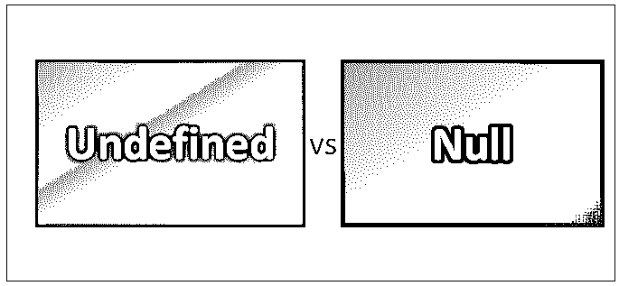
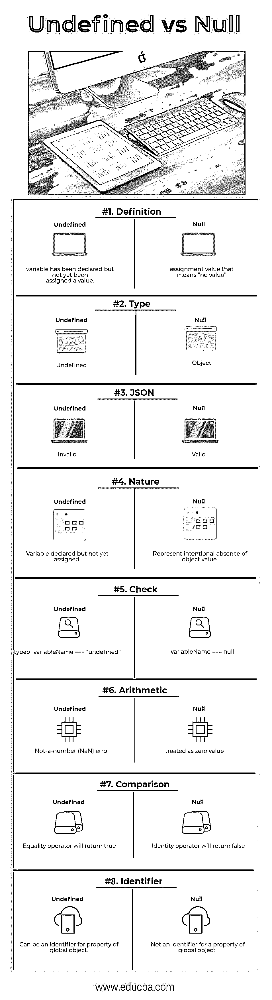

# Undefined vs Null

> 原文：<https://www.educba.com/undefined-vs-null/>

## 未定义和空之间的区别

在 JavaScript 中，变量就像是实际控制对象的遥控器。如果遥控器没有被编程来控制任何对象，它可以被标记为未定义。另一方面，如果遥控器被编程但不做任何事情，它可以被指定为空。Null 是赋值值；它可以作为无值的表示赋给变量。Undefined 是类型本身，而 null 是对象。So Undefined 是一种特殊的类型，而 Null 是 JavaScript 中的一个对象。

下面的 JavaScript 代码片段将给出未定义的输出。

<small>网页开发、编程语言、软件测试&其他</small>

| var x;

console . log(x)；

ð  undefined

 |

如果有人检查 null 的类型，它将输出为“object ”,如下面的 JavaScript 代码片段所示:

| console.log (typeof null);-对象 |

我们可以说 Undefined 的意思是一个变量已经声明了，但是变量的值还没有定义。Undefined 属于“undefined”类型，可以从下面的 JavaScript 代码片段中查看:

| var test;Console.log(测试类型)；ð  undefined |

也可以声明一个变量，然后给它赋值“未定义”,如下所示:

| var test = undefined;Console.log(测试)；ð  undefined |

未赋值的变量由 JavaScript 初始化，默认值为 undefined，而 JavaScript 从不自动将值设置为 null 它必须以编程方式完成。

### 未定义和空值之间的直接比较(信息图表)

下面是 Javascript Undefined 和 Null 之间的 8 大比较:

### Javascript 未定义和空之间的主要区别

让我们讨论一下 Undefined 和 Null 之间的一些主要区别:

1.  Undefined 表示变量已经声明，但尚未赋值。
2.  “null”是一个赋值值，表示“没有值”。
3.  “未定义”和“空”都是原语。
4.  “未定义”属于未定义类型。
5.  “null”属于 object 类型。
6.  JavaScript 从不将值设置为“null”；程序员用它[来表示](https://www.educba.com/concepts-of-programming-languages/)一个“var”没有值。
7.  JavaScript 设置了一个未赋值的变量，默认值为“undefined”。
8.  “undefined”在 JSON (JavaScript 对象表示法)中不是有效值，而“null”在 JSON 中是有效值。
9.  人们可以使用以下方法检查变量是否未定义:变量类型=== "未定义。"
10.  检查变量是否为空的方法，使用:variable === null
11.  相等运算符会将它们视为相等，而相同运算符不会将它们视为相等。null ===未定义//false null ==未定义//true
12.  值“null”表示故意缺少任何对象值。这是 JavaScript 的原始值之一。
13.  Null 用一个字面值写:“null”。它不是像“undefined”那样的全局对象属性的标识符。“null”给出了缺少的标识，意味着变量没有指向对象。
14.  “undefined”是 JavaScript 在运行时创建的一个全局变量。
15.  当对“null”进行算术转换时，确定值为 0，可以验证该转换:var v1 = 3+null；console . log(v1)；//3
16.  “undefined”不像“null”那样执行算术转换；如果我们试图把它加到一个数字上，你会得到一个 NaN(非数字)错误。

### 比较表未定义且为空

以下是积分列表；描述 Javascript 未定义和 Null 的比较。

| **未定义与空值的比较基础** | **未定义** | **Null** |
| **定义** | 变量已声明，但尚未赋值 | 赋值值意味着“没有值” |
| **类型** | 不明确的 | 目标 |
| **JSON** | 无效的 | 有效的 |
| **性质** | 已声明但尚未赋值的变量 | 表示故意缺少对象值 |
| **检查** | typeof variableName === “undefined” | variableName === null |
| **算术** | 非数字(NaN)错误 | 被视为零值 |
| **比较** | 相等运算符将返回 true | 标识运算符将返回 false |
| **标识符** | 可以是全局对象属性的标识符 | 不是全局对象属性的标识符 |

### 结论

大多数时候，人们误解了未定义和空之间的区别。如果 Undefined 和 Null 之间的区别仍然不清楚，它会导致某些测试用例问题。

如果一个变量被声明了，但是没有给它赋值，那么可以说它是“未定义的”。另一方面，“null”是赋给变量的值，代表“没有值”。因此“undefined”是变量类型，其中“null”是对象值。

“null”被认为是空的占位符。这意味着我们有意给一个变量赋值，因此假设变量没有值。当检查 null 或 undefined 时，需要注意等式(==)和等式(===)操作符，因为前者执行类型转换。

| typeof null   //object未定义//未定义的类型null === undefined    //falsenull == undefined   //truenull == null   //true

null === null   //true

!null   //true

isNaN ( 1 + null )   //false

isNaN ( 1 + undefined )   //true

 |

因此，当谈到类型的差异时，“null”是一个具有没有属性的有效值的对象，是不可变的，并且在系统中始终存在单个实例。可以通过使用“类型”运算符来验证“null”的性质。这个操作符的使用将给出作为“对象”的输出。如果我们在一个属于未定义列表的所有标准的对象上使用“type of”操作符，我们将得到“undefined”类型的对象。

未定义与空之间的另一个主要区别可以通过转换到基元类型来得出。两者转换成原始类型的方式是区分的关键领域。对“null”执行算术转换时，确定的值为零。然而，“未定义”不进行这种转换。如果我们试图给一个数字加上“未定义”，你会得到一个非数字的错误。

在现实世界中，使用“null”非常方便。例如，有些人没有中间名。因此，在这种情况下，最好在 person 对象中给中间名变量赋值 null。如果有人正在访问 person 对象中的中间名变量，并且该变量的值为“未定义”。没有办法确定开发人员忘记初始化这个变量或者没有任何值。如果它被赋值为 null，这意味着用户可以很容易地推断中间名变量没有任何值。

所以，总结一下，“空”和“未定义”有不同的含义。“null”是一个特殊的关键字，表示没有值，“undefined”表示“它不存在”。有些情况下，区分“空值”和“无值”会有所帮助。发送列表更新时，“null”可能意味着用“null”替换此字段，undefined 可能意味着“请勿触摸”。在处理默认函数参数时:undefined 表示“使用默认值”，null 表示“使用 null”。在 JavaScript 中，将未定义和空作为两种截然不同的事物确实令人痛苦；然而，如果一个人是 JavaScript 开发人员，他/她可能会喜欢它。

### 推荐文章

这是 Undefined 和 Null 之间最大区别的指南。在这里，我们讨论了未定义与空的直接比较、关键差异，以及信息图和比较表。您也可以看看以下文章——

1.  [围棋 vs Java](https://www.educba.com/go-vs-java/)
2.  Django vs WordPress
3.  [JavaScript vs C#](https://www.educba.com/c-sharp-vs-javascript/)
4.  [XML vs HTML](https://www.educba.com/html-vs-xml/)

