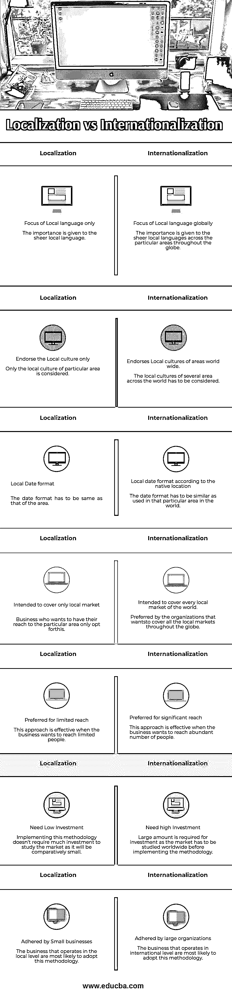

# 本地化与国际化

> 原文：<https://www.educba.com/localization-vs-internationalization/>

## 本地化和国际化的区别

**本地化**

它可以被定义为将网站或软件转变为支持当地偏好的特征的方法。应该符合本地特征的组件是语言、设计、日期格式、文化等等。这主要是为了让本地用户在使用 web 应用程序或软件时感到舒适。

<small>网页开发、编程语言、软件测试&其他</small>

当任何组织或企业打算接触当地人民以在当地扩大业务时，它起着至关重要的作用。举例来说，让我们考虑非常流行的电子商务网站，亚马逊。为了服务印度人，他们为用户提供了切换到本地语言的选项。在节日期间，他们相应地使用节日横幅来介绍销售和优惠。这就是企业如何进行本地化，以扩大他们对当地人民的影响。

**国际化**

它可以被定义为将事物全球本地化的过程。可以认为是为当地人做的本地化的聚合。类似于本地化的组件，它也包括不同的语言、日期格式、文化等等。当一个组织想要接触到全球传播的人时，它应该被实现。为了真正实现国际化，人们必须做大量的研究，因为在文化、语言等方面，一切都在发生变化。

例如，脸书是使用最多的社交媒体网站之一，全球有数百万人作为其活跃用户。该网站将国际化进程提升到了一个不同的高度。甚至在印度，它不仅仅提供给用户用印地语操作他们的网站，还让他们选择任何纯粹的当地语言，如泰米尔语、孟加拉语等。由于他们以同样的方式进行了本地化，这可以被认为是国际化的最佳范例。

### 本地化和国际化的直接比较(信息图表)

以下是本地化与国际化之间的 7 大区别:

### 本地化和国际化的主要区别

让我们讨论一下本地化和国际化之间的一些主要区别:

1.  希望只为本地服务的本地供应商或企业更喜欢其网站或软件的本地化方法，而希望覆盖全球的企业则更喜欢
2.  与后面的网站相比，只针对相对较小的单个区域的网站
3.  在本地化中，语言应该只与本地人的语言相同，而在国际化中，网站应该有几个地方的本地语言。
4.  本地化过程旨在吸引的人数远远少于网站遵循国际化方法的人数。
5.  在国际化中，软件应该包含世界各地的当地文化，而在本地化中，如果应用程序只关注特定的文化，则被认为是好的。
6.  遵循本地化的应用程序支持的时区可以是单一的，但是对于遵循国际化的应用程序，必须支持多个国家或地区的日期格式和时区。
7.  大型组织最有可能进行国际化，因为在实施这种方法之前需要进行大量的研究投资，而投资很少的小型企业最有可能坚持本地化。

### 表的本地化和国际化比较

让我们讨论一下本地化和国际化之间的最大区别:

| **本地化** | **国际化** |
| 只关注本地语言。纯粹的当地语言受到了重视。 | 全球对本地语言的关注
全球特定地区对纯粹本地语言的重视。 |
| 只认可当地文化
只考虑特定地区的当地文化。 | 认可世界各地的当地文化。必须考虑世界上几个地区的当地文化。 |
| 当地日期格式
日期格式必须与该地区的日期格式相同。 | 根据本地位置的本地日期格式
日期格式必须与世界上特定地区使用的格式相似。 |
| 打算只覆盖本地市场的企业，如果想在特定区域有所作为，只能选择这个。 | 它打算覆盖世界上每一个地方市场。希望覆盖全球所有本地市场的组织首选。 |
| 有限接触的首选
当企业希望接触有限的人时，这种方法是有效的。 | 当企业希望接触大量的人时，这种方法是有效的。 |
| 需要低投资
实施这种方法不需要太多投资来研究市场，因为市场相对较小。 | 需要大量投资
在实施该方法之前，必须在全球范围内研究市场，因此需要大量投资。 |
| 小型企业遵循的方法
在当地运营的企业最有可能采用这种方法。 | 大型组织采用的方法
在国际层面运营的企业最有可能采用这种方法。 |

### 结论

*   现代应用程序，尤其是 web 应用程序，应该比传统应用程序更有吸引力。任何吸引人们使用它的应用程序的最主要的特征就是本地口味。任何特定地区的人都更喜欢使用支持他们日常书面或口头交流语言的应用程序。
*   最后，我们在第一部分讨论了节日的案例，这一部分假设当地人的文化在本土化或国际化中起着至关重要的作用。
*   总的来说，采用哪种方法都与业务需求有关。如果企业或组织想要接触到世界各地的人们，他们更有可能选择国际化。
*   对于那些产品只是为当地人服务的本地企业来说，只有本地化是绝对可以选择的。实际上，他们的方法正在被引入以满足业务需求，并且必须被仔细选择以服务于客户。

### 推荐文章

这是本地化与国际化的指南。在这里，我们还将讨论信息图和比较表的主要区别。您也可以浏览我们推荐的其他文章，了解更多信息——

1.  [功能测试与非功能测试](https://www.educba.com/functional-testing-vs-non-functional-testing/)
2.  [全球化与国际化](https://www.educba.com/globalization-vs-internationalization/)
3.  [全球化范例](https://www.educba.com/globalization-example/)
4.  [Laravel vs Codeigniter](https://www.educba.com/laravel-vs-codeigniter/)

