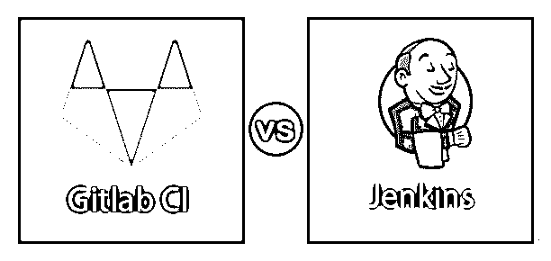
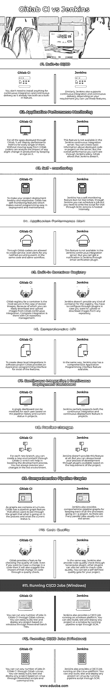

# Gitlab CI vs Jenkins

> 原文：<https://www.educba.com/gitlab-ci-vs-jenkins/>

## Gitlab CI 与 Jenkins 的区别

Gitlab 只不过是帮助 git 管理的开源软件。Gitlab 是一个自托管软件，提供许多功能，如代码审查、活动提要、存储库管理和问题跟踪。CI 意味着持续集成。Gitlab 与 Gitlab [软件配置管理](https://www.educba.com/software-configuration-management/) (SCM)集成，因为可以使用 Gitlab 创建管道。而 Jenkins 被认为是软件行业中最好的构建工具。Jenkins 是一个可扩展的开源持续集成服务器。Jenkins 使用 Java 构建，是领先的持续集成服务器。您可以使用 Jenkins 服务器构建和测试任何软件项目。Jenkins 还支持 300 多个插件支持。在本主题中，我们将了解 Gitlab CI vs Jenkins。

### Gitlab CI 与 Jenkins 的面对面比较(信息图)

以下是 Gitlab CI 和 Jenkins 的 12 大区别。

<small>网页开发、编程语言、软件测试&其他</small>

### Gitlab CI 与 Jenkins 的主要区别

正如我们在 Gitlab CI 和 Jenkins 的对比表中看到的，现在我们将讨论它们之间的主要差异:

*   在 Gitlab 的帮助下，您可以完全控制分支和其他方面来管理 Git 存储库，以保护您的代码免受威胁。然而在 Jenkins 的情况下，您可以管理存储库，但是在某种程度上，您可能无法完全控制分支和其他方面。
*   由于 Gitlab 是“免费的”和“自托管的”，这就是开发者选择它的原因；另一方面，Jenkins 是“免费开源”和“内部托管”的，这就是为什么编码人员使用它。
*   在 Gitlab CI 中，每个项目都有一个跟踪者来跟踪问题并执行代码审查以提高效率，而在 Jenkins 中，它有变更集支持和简单的安装和配置过程。

### Gitlab CI 与 Jenkins 对比表

为了便于理解，让我们通过一个比较表来看看 Gitlab CI 与 Jenkins 之间的更多差异:

| **特性** | **GITLAB CI** | 詹金斯 |
| **内置 CI&#124;CD** | 您不需要为持续集成和持续交付安装任何东西，因为它已经将这两者作为内置特性。 | 同样，Jenkins 也支持持续集成和持续交付；根据您的需求，您可以使用这些功能。 |
| **应用性能监控** | 对于通过 Gitlab 部署的所有应用程序，它将显示每个应用程序的性能指标。在不离开 Gitlab 的情况下，编码人员可以通过密切关注来分析生产中任何细微变化的影响。 | 该功能在 Jenkins 持续集成服务器中不可用。您可以检查服务器上已部署代码或项目的基本信息。但是整体表现你是无法单独看透詹金斯的。Gitlab 允许詹金斯不允许。 |
| **自我监控** | 使您的项目部署健康且响应迅速。Gitlab 具有自我监控功能，使得整体编程易于部署和维护。 | 詹金斯有自我监控功能，但不像 Gitlab 通过 Jenkins，你可以安排一个任务，但是你需要通过 SCM 编写脚本。詹金斯是内部托管。 |
| **应用性能警报** | 通过 Gitlab，编码人员可以为任何通知发生的事件创建服务级别警报。在相同的代码和相同的工作流程中。 | 该功能在 Jenkins 持续集成服务器中不可用。但你可以通过电子邮件验证插件在 Jenkins 中获得通知。 |
| **内置容器注册表** | 容器的 Gitlab 注册表在 docker 图像的情况下是最安全的。因此您可以轻松地从 Gitlab 持续集成下载和上传图像。与 Git 存储库管理完全集成。 | Jenkins 没有为注册表提供任何类型的容器。如果你想从任何存储库上传或下载图像，你必须通过插件进行配置。 |
| **综合 API** | 为了在软件项目中创建深层次的集成，Gitlab 为大多数功能提供了应用程序编程接口。 | 同样，Jenkins 也提供了全面的应用程序编程接口功能。 |
| **持续集成&#124;持续部署仪表板** | 可以根据项目中的 pipeline 历史记录和当前状态为每个用户修改单个仪表板。 | Jenkins 部分支持项目中的持续集成和持续部署特性。 |
| **预览修改** | 对于每个新的分支，您可以通过 Gitlab CI 创建一个新的环境，这将有助于促进开发过程。您可以随时在实时环境中预览您的更改。 | Jenkins 根本不提供这个功能。但是你总是可以通过基于项目需求的插件来推进你的开发过程。 |
| **综合管线图** | 因为图是复杂的结构。Gitlab 有一个管道图功能，允许用户通过图形看到流程中正在发生的事情以及当前的状态。 | Jenkins 还提供了全面的管道图，用于跟踪项目中的所有过程。由于有许多并行作业，它们通常在服务器上运行。 |
| **代码质量** | Gitlab 提供了检查代码质量的特性。即使你想对代码进行修改，它也会通过质量检查来提示修改对代码的影响。 | 同理，Jenkins 也通过 Sonarqube 插件提供代码质量检查；其他插件也可以用来检查代码质量。您可以为您的项目设置一个自定义的质量关卡。 |
| **运行 CI&#124;CD 作业(Windows)** | 您可以通过 Gitlab runner 在 Gitlab CI 中运行任意数量的作业。您可以通过 Powershell 批处理文件轻松构建、测试和部署任何基于 windows 的项目。 | Jenkins 还提供了在 Windows 平台上运行的 CI&#124;CD 作业。您还可以通过 SCM 运行管道脚本，在窗口上构建、测试和部署任何项目。 |
| **运行 CI&#124;CD 作业(Windows** | 您可以通过 Gitlab runner 在 Gitlab CI 中运行任意数量的作业。您可以通过 Powershell 脚本和命令行轻松构建、测试和部署任何基于 Linux 的项目。 | Jenkins 还提供了一个在 Linux 平台上运行的 CI&#124;CD 作业。您还可以通过 SCM 运行管道脚本，在 Linux 上构建、测试和部署任何项目。 |

### 结论

Gitlab 和 Jenkins 都有自己的优缺点，因为它完全取决于项目规范和要求。两者都是在软件开发和部署过程中使用的开源工具。Gitlab 用于版本控制和代码协作，而 Jenkins 用于持续集成。

### 推荐文章

这是 Gitlab CI vs Jenkins 的指南。在这里，我们分别用信息图和比较表来讨论 Gitlab CI 与 Jenkins 的主要区别。您也可以看看以下文章，了解更多信息–

1.  [詹金斯 vs 切尔莱西](https://www.educba.com/jenkins-vs-circleci/)
2.  [Rundeck vs Jenkins](https://www.educba.com/rundeck-vs-jenkins/)
3.  [大三角帆 vs 詹金斯](https://www.educba.com/spinnaker-vs-jenkins/)
4.  [GitLab vs GitHub](https://www.educba.com/gitlab-vs-github/)

