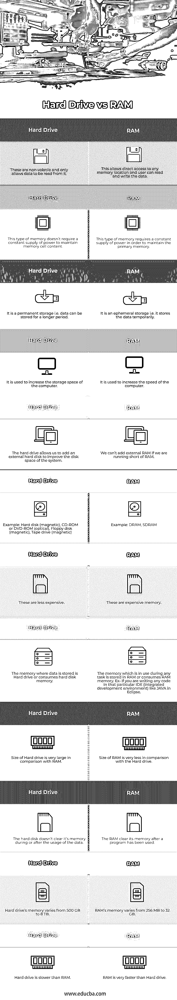

# 硬盘与内存

> 原文：<https://www.educba.com/hard-drive-vs-ram/>

## 硬盘与内存的区别

硬盘和 RAM 用于存储数据。它可以是持久的，也可以是短暂的(暂时的)。RAM 使用半导体芯片，而存储设备使用磁性或光学介质。RAM 能够以比存储介质更高的速度访问数据。在本帖中，我们将深入探讨硬盘与内存的区别。

**硬盘:**如果我们说的是空间或者容量(内存空间)，硬盘的容量比 RAM 大得多，也就是说硬盘容量永远大于 RAM。内存大小从 256MB 到 32GB 不等。可访问的硬盘容量从 500GB 到 8TB 不等。

<small>网页开发、编程语言、软件测试&其他</small>

**RAM:** 它的首字母缩写是随机存取存储器。从名字上看，只有我们可以说它可以访问任何内存位置。由于它是易失性存储器，即如果没有恒定的电源，所有的数据都可能丢失，所以它需要连续的电源，以便保持其存储单元内容中的数据。我们不能永久存储个人数据。它读取和写入数据，并将继续保存内存，直到有稳定的电源供应。

通常，主机上有两种类型的内存:

*   **随机存取存储器(RAM):** 使用 RAM，用户可以直接访问任何内存位置，并可以读写数据。由于 RAM 是短暂的，这种类型的存储器需要持续供电来维持主存储器数据。当电源中断或不稳定时，数据从主存储器中删除。
*   **只读存储器(ROM):** 它们是非易失性的，允许从中读取数据。硬盘比内存便宜。

### 硬盘与内存的直接比较(信息图表)

以下是硬盘与内存的 12 大区别:

### 硬盘与内存的主要区别

让我们讨论一下硬盘与 RAM 之间的一些主要区别:

*   在 RAM 中，我们读写数据，但另一方面，在硬盘中，我们只能读取数据，不能重写。
*   RAM 是易失性的，即临时存储数据不能存储更长时间，但另一方面，硬盘是非易失性数据，可以存储更长时间。
*   RAM 用来提高速度，硬盘用来增加存储空间。
*   RAM 非常贵，因为里面用的是半导体，而硬盘因为用的是磁带，所以不太贵。
*   可以在不更新 windows 的情况下添加 RAM，但如果要添加硬盘，则需要更新 windows，即如果要从 windows 7 迁移到 windows 10。

#### 存储设备的例子

*   硬盘(磁性)
*   CD-ROM 或 DVD-ROM(光学)
*   软盘(磁性)
*   磁带驱动器(磁性)

用更简单的语言或通俗的术语，让普通人能够理解 RAM v/s 硬盘的主题或概念:

在我们的日常生活中，我们每天都要与硬盘和内存进行交互，但问题是，我们并没有意识到这一点。像我们的电脑一样的硬盘可以存储更多的东西，如音乐、照片、视频、应用程序和 RAM，另一方面，基本上使电脑更快。

每当你区分计算机的存储空间和内存时，这似乎是非常令人困惑的。随机存取存储器(RAM)是短暂的存储，即临时的，而硬盘是永久的计算机存储，允许您存储大约 500 GB 至 8 TB 的数据。

如何增加硬盘的内存或容量？

通过更换容量更大的硬盘，或者我们可以添加外部硬盘来增加您的磁盘空间。此外，您可以选择完全更换它，并添加一个更高容量的。

如何提高计算机的处理能力？

RAM 对于提高计算机的性能或增加处理速度非常重要；这意味着内存越少，系统的运行速度越慢。但是，容量较小的硬盘也会影响系统速度。CPU 也使用 RAM 来执行任何任务。

### 硬盘与内存对照表

让我们讨论一下硬盘与 RAM 之间的主要比较:

| **硬盘** | **RAM** |
| 它们是非易失性的，只允许从中读取数据。 | 这允许直接访问任何存储器位置，并且用户可以读取和写入数据。 |
| 这种类型的存储器不需要持续供电来维持存储单元的内容。 | 这种类型的存储器需要持续供电，以维持主存储器。 |
| 它是永久性存储，即数据可以存储更长时间。 | 它是暂时存储，即它临时存储数据。 |
| 它用来增加电脑的存储空间。 | 它被用来提高计算机的速度。 |
| 硬盘允许我们添加外部硬盘来改善系统的磁盘空间。 | 如果内存不足，我们无法添加外部内存。 |
| 例如:硬盘(磁性)、CD-ROM 或 DVD-ROM(光学)、软盘(磁性)、磁带机(磁性)。 | 例如:DRAM、SDRAM。 |
| 这些不太贵。 | 这些是昂贵的内存。 |
| 存储数据的内存是硬盘驱动器或消耗硬盘内存。 | 任何任务中使用的内存都存储在 RAM 中，或者消耗 RAM 内存。例如，如果你在特定的 IDE(集成开发环境)中编写代码，比如 Eclipse 中的 JAVA。 |
| 与 RAM 相比，硬盘的容量非常大。 | 与硬盘相比，RAM 的大小非常小。 |
| 在使用数据期间或之后，硬盘不会清除其内存。 | 程序使用后，RAM 会清空其内存。 |
| 硬盘的内存从 500 GB 到 8 TB 不等。 | RAM 的内存从 256 MB 到 32 GB 不等。 |
| 硬盘比内存慢。 | RAM 比硬盘快得多。 |

### 结论

内存和硬盘都有各自的重要性和用途。RAM 是易失性的，但硬盘驱动器是非易失性的，即永久的或短暂的(临时的)。在 RAM 中，我们可以读取和写入数据，即可以编辑数据，但数据不能存储更长的时间。因此，它是短暂的，而另一方面，硬盘驱动器可以保存数据更长的时间，它是永久的。如果一个负责存储或内存容量，那么另一个对计算机的处理速度很重要。因此，这两者对于在计算机上执行任何任务都很重要。

### 推荐文章

这是一本关于硬盘和内存的指南。在这里，我们还将讨论硬盘与 RAM 的主要区别，以及信息图和比较表。您也可以阅读以下文章，了解更多信息——

1.  [硬件 vs 软件](https://www.educba.com/hardware-vs-software/)
2.  [RAM vs ROM](https://www.educba.com/ram-vs-rom/)
3.  [计算机硬件 vs 网络](https://www.educba.com/computer-hardware-vs-networking/)
4.  [软件开发 vs 网页开发](https://www.educba.com/software-development-vs-web-development/)

