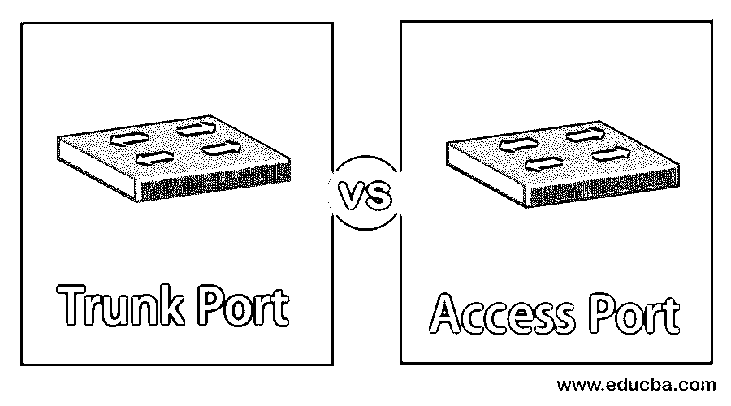
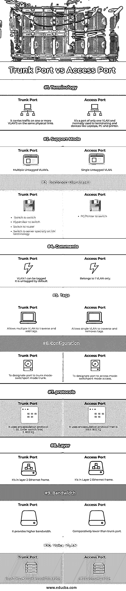

# 中继端口与接入端口

> 原文：<https://www.educba.com/trunk-port-vs-access-port/>

## 中继端口与接入端口的区别

在上一篇文章中，我们讨论了本土 VLAN。让我们来讨论一下在 VLAN 的世界里【Trunk Port vs Access Port 到底是什么意思。本文将向您介绍思科世界中这两个最容易混淆的术语的基本知识。

简单来说，树干将水分和必需的营养物质输送到树木的所有枝叶中。同样，VLAN 的中继特别能将信号流传送到正确的目的地或位置。基本上，我们可以说它是一条同时传送许多信号的链路，从而在两个节点之间创建更高效的网络访问。

<small>网页开发、编程语言、软件测试&其他</small>

现在让我们来看看接入端口。访问端口用于连接一台 VLAN 虚拟机。基本上，它是交换机上的一种连接。它通过交换机、VLAN 为虚拟机提供连接，也无需 VLAN 标记。

### 中继端口与接入端口的直接比较(信息图)

以下是中继端口与接入端口之间的 10 大比较:

### 中继端口与接入端口的主要区别

中继端口和接入端口有许多不同之处。但是让我们来看看它们之间的关键和主要区别:

*   中继[端口仅支持](https://www.educba.com/what-is-a-trunk-port/)带标签的帧，而接入端口发送和接收不带标签的帧。
*   中继端口允许我们交换多个 VLAN，但所有帧都在接入端口的同一 VLAN 中。
*   中继端口主要用于交换机之间的连接；但是，接入端口用于连接笔记本电脑、打印机等。
*   我们不能将数据从一台交换机扩展到另一台交换机，通过中继端口访问端口。它只能通过交换机的接入端口进行扩展。
*   中继端口在接口上设置了多个 VLAN，而接入端口只能在接口上设置一个 VLAN。
*   中继端口通常比接入端口提供更高的带宽和更低的延迟。
*   只有接入端口支持语音 VLAN 功能，中继端口不支持。
*   中继会将 dot1q 或 ISL(交换机间链路)标签直接添加到帧中，而接入端口只传递来自设定的 VLAN 的流量，但不会修改带有 VLAN 标签的帧。

这些都是这些端口之间的主要区别。

*   接入端口发送和接收没有标记的帧，并且只能访问 VLAN 值。由于帧保持在相同的 VLAN 内，这不会导致信号问题。此外，如果它接收到带标签的数据包，它会简单地避开它。如果网络更复杂，那么它就不是一个有效的选择。
*   让我们举一个例子来更好地理解中继端口，它从多个 VLANs 传输数据。假设我们在一个特定的交换机上有 n 个 VLANs 对于每个局域网，我们不需要任何额外的交换机或电缆。只有这一个环节会成功。为了到达正确的端点，中继端口必须使用标签来允许信号通过。
*   电话应该检测到中继线以及被标记的接入和语音 VLAN 分组。如果没有适当的安全功能，将端口配置为中继端口是非常危险的。
*   接入端口配置在终端主机插入台式机或个人电脑的交换机接口上。
*   现在让我们以接入端口为例。假设一台工程 PC 接入交换机，其连接的端口需要配置为工程 VLAN 的接入端口。配置都在交换机上。终端主机不需要知道任何有关 VLANs 的信息。
*   通过只允许同一 VLAN 内的流量，VLAN 将校园 LAN 分割成更小的广播网段。VLANs 之间的流量必须通过路由器。

现在，让我们看一下接入端口和中继端口的对照表，以便更好地理解。

### 中继端口与接入端口对照表

以下是中继端口与接入端口的主要比较:

| **比较的基础** | **中继端口** | **接入端口** |
| **术语** | 它在同一物理链路上的一个或多个 VLANs 上传输流量。 | 它是唯一一个 VLAN 的一部分，通常用于端接笔记本电脑、PC 和打印机等终端设备。 |
| **支持模式** | 多个未标记的 VLAN。 | 单一无标签的 VLAN。 |
| **常见用例** | 

*   switchboard

*   Virtual machine supervisor

*   router
*   Switch, especially the term about virtual machine.

 | PC/打印机切换。 |
| **评论** | VLAN 1 号可以被标记。默认情况下，它是未标记的。 | 只属于 VLAN 1 号。 |
| **标签** | 允许多个 VLANs 遍历和添加标签。 | 允许单个 VLAN 遍历并移除标签。 |
| **配置** | 将端口指定为中继模式-交换机端口模式中继。 | 指定端口访问模式-交换机端口模式访问。 |
| **协议** | 它使用封装协议

2.  802.1 问

 | 它使用 IEEE 802.1Q 封装协议。 |
| **层** | 它位于第 2 层以太网帧中。 | 它在第 2 层以太网帧中。 |
| **带宽** | 它提供更高的带宽。 | 相对低于干线港。 |
| **声音 VLAN** | 此端口不支持此功能。 | 接入端口上的支架。 |

使用“交换机端口模式访问”命令强制端口成为其配置部分的访问端口。类似地，如果任何设备插入此端口，那么它将只能与同一个 VLAN 中的其它设备通信。同样,“交换机端口模式中继”命令强制端口成为中继端口。

中继端口使用一些独特的识别标签来标记帧，这些标签可以是 802.1 Q 或交换机间链路(ISL)标签，因为它们允许在交换机之间移动。当帧在交换机和其他设备之间传输时，它们[用于向帧添加 VLAN](https://www.educba.com/types-of-vlan/) 信息。

### 结论

我们只能说，这些是虚拟局域网中承载流量的非常重要的因素，无论它是有标记的还是无标记的。因此，中继和接入端口的主要用途是在 VLANs 之间传输流量，我们需要一个第 3 层设备来路由数据包。

### 推荐文章

这是关于中继端口与接入端口的指南。在这里，我们讨论中继端口与接入端口之间的区别，以及主要区别、信息图和比较表。您也可以浏览我们的其他相关文章，了解更多信息——

1.  github vs SVN
2.  [Java 中的访问修饰符](https://www.educba.com/access-modifiers-in-java/)
3.  [VLAN 标记 vs 未标记](https://www.educba.com/vlan-tagged-vs-untagged/)
4.  [集线器 vs 交换机](https://www.educba.com/hub-vs-switch/)

