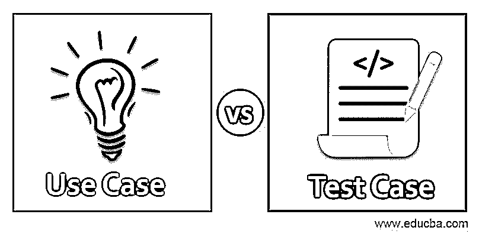
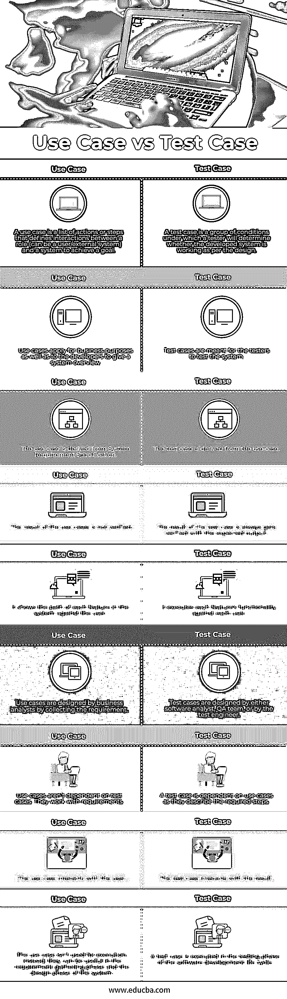

# 用例与测试用例

> 原文：<https://www.educba.com/use-case-vs-test-case/>

## 用例与测试用例之间的区别

用例有助于描述使用它完成特定任务的方法。测试用例的特征是一组测试输入、成功的条件和导致特定测试目标的预期结果。用例不仅仅是一个文档的图形表示，它指示了一个特定的任务是如何执行的。如果谈论一个测试用例，程序被测试以确保软件按照规范工作。测试人员创建软件。

### 用例与测试用例之间的直接比较(信息图表)

下面是用例与测试用例之间的 9 大区别:

<small>网页开发、编程语言、软件测试&其他</small>

### 用例与测试用例的主要区别

让我们讨论一下用例与测试用例之间的一些主要区别:

*   用例给出功能的视图，测试用例确保功能的正确执行。
*   用例是一组说明用户交互的动作，测试用例是一组验证软件的条件、输入和预期输出。
*   用例是基于需求创建的，测试用例是基于用例设计的。
*   一个用例可能会让你对软件或者软件特性有一个完整的理解，但是测试可能会涉及到设计多个测试用例。
*   创建用例的主要目的是提供一个文档，通过它可以实现一个目标，而测试用例的目的是检查软件是否按照需求工作。

还有一个用例的图形表示，有助于轻松理解应用程序。创建一个用例并设计测试用例有时需要一点头脑风暴。

### 用例与测试用例对照表

让我们讨论用例与测试用例之间的主要比较:

| **用例** | **测试用例** |
| 用例是定义角色(可以是用户/外部系统)和系统之间的交互以实现目标的动作或步骤的列表。 | 测试用例是一组条件，在这些条件下，测试人员将确定所开发的系统是否按照设计运行。 |
| 用例适用于业务目的，也适用于开发人员给出系统概述。 | 测试用例是测试人员用来测试系统的。 |
| 用例来源于系统需求规范。 | 测试用例来源于用例。 |
| 用例的结果没有被验证。 | 测试用例的结果总是得到预期输出的验证。 |
| 它向用户显示系统中每个功能的路径。 | 它针对每个用户执行每个特性的功能。 |
| 业务分析师通过收集需求来设计用例。 | 测试用例由软件分析师、QA 团队或测试工程师设计。 |
| 用例不依赖于测试用例。他们根据需求工作。 | 测试用例依赖于用例，因为它们描述了所需的步骤。 |
| 用例与用户交互。 | 测试用例与结果相互作用。 |
| 用例不用于执行。相反，它们在系统的需求收集阶段和设计阶段是有用的。 | 测试用例在软件开发生命周期的测试阶段执行。 |

### 结论

用例在 [SDLC 方法](https://www.educba.com/sdlc-methodologies/)的需求和设计阶段进行设计。用例可以帮助开发人员理解系统。测试用例源自用例，用于 SDLC 方法的测试阶段。

### 推荐文章

这是用例与测试用例的指南。这里我们讨论简介、主要差异和对照表。您也可以看看以下文章，了解更多信息–

1.  [树莓派 vs ODROID](https://www.educba.com/raspberry-pi-vs-odroid/)
2.  [测试用例的类型](https://www.educba.com/types-of-test-case/)
3.  [测试用例与测试场景](https://www.educba.com/test-cases-vs-test-scenario/)
4.  什么是自动化测试？

