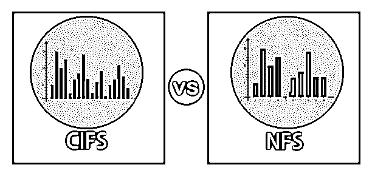
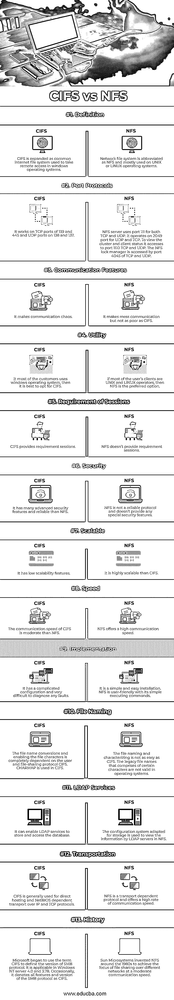

# CIFS 对 NFS

> 原文：<https://www.educba.com/cifs-vs-nfs/>

## CIFS 和 NFS 的区别

CIFS 代表通用互联网文件系统，NFS 代表网络文件系统，它们是用于实现远程通信系统的协议。这两种通信系统的主要区别是 CIFS 只能在 Windows 操作系统中使用，而 NFS 可以在基于 UNIX 和 LINUX 的系统中使用。在安全性方面，CIFS 提供了比 NFS 更好的网络安全性。另一方面，NFS 提供了比 CIFS 更高的可伸缩性。

### CIFS 与 NFS 的对决(信息图)

以下是 CIFS 和 NFS 之间的 13 大对比

<small>网页开发、编程语言、软件测试&其他</small>

### CIFS 与 NFS 的主要区别

让我们从以下几点来讨论 CIFS 与 NFS 之间的一些关键差异:

*   **CIFS 和 NFS 的申请**

NFS 大多数实时应用程序的基本变化是部署在 Oracle 数据库和 VMware 软件等关键业务应用程序中。因为它使客户端能够在服务器维护或任何故障重启后不受干扰地加载。开发 CIFS 是为了共享文件和打印小型局域网中应用的任何服务和应用程序。在 SMB 协议的第三个版本开发之前，微软不会帮助半透明重新连接。微软也提供了 NFSv3 版，NFSv3 到客户端的协议可以支持不同的 Windows 版本，NFSv4.1 服务器在 windows server 2012 年初部署。类似地，Linux 也支持 SMB 客户端，Samba 作为开源软件在 Linux 和 Unix 中支持 CIFS。苹果 MAC OS 一般在中小企业上运行，也使用 NFS。但是许多商业企业使用存储系统来支持 NFS 和中小型企业的文件传输和文件共享。

*   **CIFS 和 NFS 的历史**

Sun Microsystems 在 1989 年开发了 NFS 协议作为免费的资源请求，可从 IETF(因特网工程任务组)获得。该公司在 1985 年初将 NFS 源代码的参考执行授权给大量客户。特殊的供应商执行了他们独特版本的网络文件系统作为 1094 政策征求意见。NFS 作为一个开源版本最早出现在 FreeBSD 中，后来部署在 Linux 中，这是目前 NFS 应用程序的主流。Barry Feigenbaum 首先在 DOS 和早期版本的 Windows 系统中部署了该协议。致力于改进协议的供应商包括微软、英特尔和 3Com。值得注意的是，微软是第一个将 CIFS 定义为 SMB 协议的一种形式的人，该协议应用于 Windows NT server 3.51 和 4、Windows NT workstation 4 以及 Windows 98 和 Windows NT server 4 的操作系统中，还用于表示 SMB 协议的所有属性。开发 CIFS 不仅是为了向托管客户端提供服务，还为了在服务器系统上部署连续文件访问和目录，服务器系统控制打印队列访问和网络范围内的相互通信服务。但 NFS 未能在文件共享服务中提供如此广泛的访问权限。

*   **协议版本**

CIFS 在通信中往往更加混乱和健谈，并且经常需要文件协议优化。SMB 2 和 SMB 3 克服了这个问题，为用户提供了更多的安全功能，在大范围的现代数据中心运行。随着时间的推移，NFS 展示了一个高级版本的文件锁，访问控制和增强的改进的主要演变。

### CIFS 与 NFS 对比表

下表总结了 CIFS 对 NFS 的比较 **:**

| **行为属性** | **CIFS** | **NFS** |
| **定义** | CIFS 被扩展为一个通用的互联网文件系统，用于在 windows 操作系统中进行远程访问。 | 网络文件系统缩写为 NFS，主要用于 UNIX 或 LINUX 操作系统。 |
| **端口协议** | 它适用于 139 和 445 的 TCP 端口以及 138 和 137 的 UDP 端口。 | NFS 服务器对 TCP 和 UDP 都使用端口 111。它在 UDP 和 TCP 的 2049 端口上运行。为了查看集群和客户端状态，它访问端口 1110 TCP 和 UDP。TCP 和 UDP 的端口 4045 访问 NFS 锁管理器。 |
| **通信特性** | 它使交流变得混乱。 | 它使混乱的交流，但没有 CIFS 差。 |
| **效用** | 大多数客户使用 Windows 操作系统；那么，最好选择 CIFS。 | 如果大多数用户的客户端是 UNIX 和 LINUX 操作系统，那么 NFS 是首选。 |
| **会议要求** | CIFS 提供需求会议。 | NFS 不提供需求会议。 |
| **安全** | 它有许多先进的安全功能，比 NFS 可靠。 | NFS 不是一个可靠的协议，不提供任何特殊的安全功能。 |
| **可扩展** | 它具有低可扩展性的特性。 | 它比 CIFS 具有更高的可扩展性。 |
| **速度** | CIFS 的通讯速度比 NFS 适中。 | NFS 的通讯速度很快。 |
| **实施** | 它具有复杂的配置，并且很难诊断任何故障。 | 这是一个简单而容易的安装。NFS 是用户友好的简单执行命令。 |
| **文件命名** | 文件名转换和启用文件字符完全取决于用户和文件共享协议 CIFS。CHARMAP 在 CIFS 使用。 | 文件命名和特征化不像 CIFS 那么简单。包含某些字符的旧文件名在操作系统中无效。 |
| **LDAP 服务** | 它可以使 LDAP 服务存储和访问数据库。 | 适用于存储的配置系统用于通过 NFS 的 LDAP 服务器查看信息。 |
| **运输** | CIFS 通常用于 IP 和 TCP 协议上的直接托管和 NetBIOS 相关传输。 | NFS 是一种依赖于传输的协议，提供高速的通信速度。 |
| **历史** | 微软开始使用术语 CIFS 来定义 SMB 协议的版本。它适用于 Windows NT server 4.0 和 3.78。有时，它将 SMB 协议的所有功能和版本都表示为 CIFS。 | Sun Microsystems 在 1980 年代左右发明了 NFS，以在不同的网络上以中等的通信速度实现文件共享。 |

### 推荐文章

这是 CIFS 和 NFS 之间最大差异的指南。在这里，我们通过信息图和比较表来讨论 CIFS 和 NFS 的主要区别。您也可以看看以下文章，了解更多信息–

1.  [Linux 中的 NFS](https://www.educba.com/nfs-in-linux/)
2.  [Linux 中的 Samba 服务器](https://www.educba.com/samba-server-in-linux/)
3.  [TCP vs UDP](https://www.educba.com/tcp-vs-udp/)
4.  [CIFS vs 中小企业](https://www.educba.com/cifs-vs-smb/)

