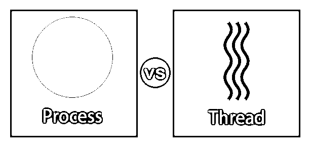
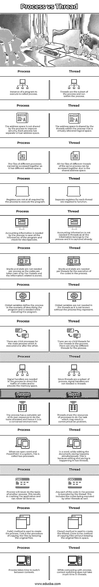

# 进程与线程

> 原文：<https://www.educba.com/process-vs-thread/>

## 进程与线程的区别

在本文中，我们将看到一个关于进程与线程的概要。进程和线程属于执行序列。一个或多个线程执行的计算机程序的实例被称为进程。代码和活动存储在流程中。进程依赖单线程还是多线程取决于操作系统。这些指令被一个接一个地执行。程序被分成两个或更多不同的任务，这是通过线程来完成的。线程属于进程，并且是进程的单个序列。线程也被称为轻量级进程，因为它是进程的一个细分。

### 进程与线程的直接比较(信息图)

以下是进程与线程之间的 14 大对比:

<small>网页开发、编程语言、软件测试&其他</small>

### 进程与线程的主要区别

让我们从以下几点来讨论进程与线程之间的一些关键差异:

*   进程运行在独立的内存空间，而线程运行在共享的内存空间。这些线程属于同一个进程。共享内存帮助不同的计算机系统访问逻辑上共享的内存空间中共享的文件。地址空间是共享的，而不是服务器。没有集中的内存空间。
*   进程同时运行，而线程也同时运行，给人一种它们与进程并行运行的错觉。线程指导进程执行工作。
*   线程是执行中的步骤，是它的序列。而流程被称为容器，可以有一个或多个执行。因此，操作系统将为线程和进程分别创建内存。
*   进程提供执行程序的资源。每个进程都有一个虚拟的地址空间，有写好的代码和安全性。线程属于进程。单个进程中的所有线程共享虚拟地址空间和提供的资源。线程安全性用于管理客户端执行进程。线程拥有自己的机器寄存器和存储在提供给它们的虚拟空间中的用户堆栈。
*   线程位于进程内部，没有线程进程就无法运行。线程访问进程的代码，检查代码中写的指令，并执行它们。没有线程，进程不过是加载到系统内存中的一组代码。线程属于进程。
*   许多进程可以链接到操作系统中的同一个程序。但是通常，一次只能有一个线程作为运行进程的主要控制。一些操作系统将进程称为任务，而线程被称为轻量级进程或 LWP，因为它执行进程中的所有指令。
*   在多处理器系统中，许多进程可以并行运行。线程不能并行运行，只能一个接一个地运行。
*   进程总是存储在主存储器中，主存储器是随机存取存储器。线程存储在进程中，没有单独的内存空间分配给线程。

### 进程与线程对照表

下表总结了进程与线程的比较 **:**

| **流程** | **线程** |
| 要执行的程序的实例称为进程。 | 线程是进程的子集，在进程中运行。 |
| 为了提高安全性，进程不共享地址空间。每个进程都有一个独立的虚拟地址空间。 | 地址空间由进程内的线程共享，这是虚拟分配的逻辑空间。 |
| 不同进程的文件不能一起访问，因为它有不同的地址空间。 | 由于共享的地址空间，同一进程的不同线程的所有文件可以被一起访问。 |
| 执行程序的进程根本不需要寄存器。 | 每个线程都需要独立的寄存器来运行。 |
| 进程需要会计信息来保存程序的所有信息并检查差异。 | 线程中不需要会计信息，因为所有信息都属于进程，并且已经被捕获。 |
| 每个进程不需要堆栈和状态，因为代码由线程处理，相关的信息被存储。 | 每个线程都需要堆栈和状态来执行进程中的代码。 |
| 全局变量在描述程序的场景中定义流程，在执行程序时需要。 | 线程中不需要全局变量，因为没有它们所代表的进程就不知道全局变量。 |
| 主流程有子流程，子流程一个接一个地执行。 | 进程中的线程没有子线程。该进程只能有不同的线程。 |
| 在这个过程中需要信号处理器来引导代码的流量和分配内存空间。 | 由于线程是进程的子集，线程中不需要信号处理程序。 |
| 该进程拥有一整套自己的资源来完成所分配的任务，因此它处于一个封闭的环境中。 | 线程共享进程的资源来完成任务，这可能会导致通信问题。 |
| 当我们在一个系统中打开 word 和 PowerPoint 时，这叫做两个进程。 | 总之，在编辑文档的同时，保存同时发生。这是因为编辑和保存发生在两个线程中。 |
| 该进程永远不会执行另一个进程的任务。这会导致应用程序崩溃，而且永远不会发生。 | 进程中的任何代码部分都由线程执行。这也包括由其他线程执行的代码。 |
| fork()方法用于创建流程。Fork 是通过保留原始文件来复制文件的过程。 | Clone()方法用于创建线程。克隆是一种复制文件而不将原始文件保留在空间中的方法。 |
| 这个过程需要时间在上下文之间切换。 | 与进程相比，上下文切换在线程中花费的时间并不多。 |

### 结论

进程和线程是相互依赖的。为了顺利运行程序，进程和线程携手工作。每个进程都可以作为一个线程来调用，但是每个线程都不能称为一个进程。系统需要线程和进程来分配资源。

### 推荐文章

这是一个进程与线程的指南。这里我们用信息图和比较表来讨论进程和线程的关键区别。您也可以看看以下文章，了解更多信息–

1.  [线程面试问题](https://www.educba.com/threading-interview-questions/)
2.  [操作系统中的线程](https://www.educba.com/threads-in-operating-system/)
3.  [Java 中的线程组](https://www.educba.com/threadgroup-in-java/)
4.  [C#线程](https://www.educba.com/c-sharp-thread/)

