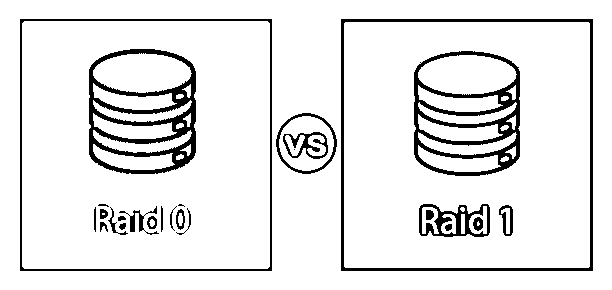
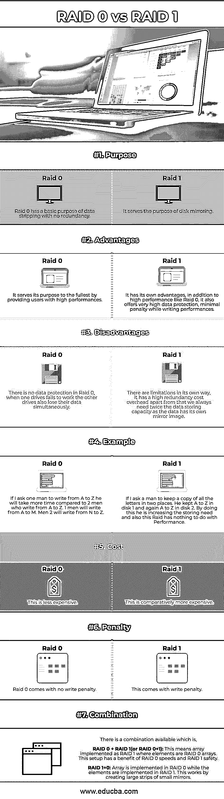

# RAID 0 与 RAID 1

> 原文：<https://www.educba.com/raid-0-vs-raid-1/>

## RAID 0 与 RAID 1 的区别

RAID 技术只不过是独立磁盘存储单元的冗余阵列，它允许具有更高性能速率的平衡输入/输出流。RAID 0 和 RAID 1 之间的主要区别之一是，RAID 0 在一个目标单元中提供基本存储功能，而 RAID 1 允许多个存储位置。虽然 RAID 0 只能实现很少或没有数据冗余，但 RAID 1 可以用作数据镜像技术。

.在这里，我们将讨论 RAID 0 与 RAID 1 的主要区别:

<small>网页开发、编程语言、软件测试&其他</small>

### RAID 0 与 RAID 1 的直接比较(信息图表)

以下是 RAID 0 与 RAID 1 之间的 7 大区别:

### RAID 0 与 RAID 1 的主要区别

让我们看一下 RAID 0 与 RAID 1 之间的主要区别，如下所示:

*   RAID 0 仅仅意味着剥离数据，而 RAID 1 是数据镜像；在 RAID 0 中，数据存储在一个位置，而在 RAID 1 中，数据可以存储在多个位置的条带中。
*   RAID 0 提供更快的读写速度，而 RAID 1 的写入速度较慢，但读取能力更强。
*   对于 RAID 0，至少需要 2 个磁盘(对于 RAID 1 也是如此)2，但决定其速度的因素是 RAID 控制器、RAID 控制器处理器*、* RAID 控制器带宽，而对于 RAID 1，决定速度的因素是 RAID 控制器、RAID 控制器处理器和 RAID 控制器带宽。
*   通过上面提到的图示，可以很容易地理解 Raid 0 的直观表示。在这里，两个数据集都有不同的数据段与之关联，这意味着数据被划分为条带并放置在多个位置，而 Raid 1 的直观表示可以从上述图示中非常清晰地看到和理解。我们可以看到相似的数据放在两个地方，其中一个是真实数据，而另一个是它的镜像。
*   Raid 0 没有冗余能力，因为没有奇偶校验和镜像功能，而 Raid 1 具有最高的冗余可能性；这种行为的原因是它的镜像行为。
*   重建标准值得一提—重建是指在 RAID 系统出现故障时操作整个系统。Raid 0 中的重建时间和费用在时间和成本上都相对较少；RAID 0 中影响可靠性的因素有系统崩溃、位错误和磁盘故障，而对于 RAID 1，由于镜像，重建时间越来越长。影响 RAID 1 可靠性的因素包括不可纠正的位错误、硬件大小以及与 RAID 0 相比的最新版本。
*   RAID 0 非常适合在图形设计和视频编辑工作站等地方使用，而 RAID 1 非常适合 web 服务器或机箱较小、只能使用 2 个驱动程序的服务器。

### RAID 0 与 RAID 1 对比表

让我们讨论一下 RAID 0 与 RAID 1 之间最重要的比较:

| **比较的基础** | **RAID 0** | **RAID 1** |
| **目的** | Raid 0 的基本用途是无冗余的数据分条。 | Raid 1 用于磁盘镜像。 |
| **优势** | Raid 0 为用户提供了高性能，充分发挥了它的作用。 | Raid 1 有自己的优势；除了像 Raid 0 一样的高性能，它还提供非常高的数据保护，在写入性能时损失最小。 |
| **缺点** | Raid 0 中没有数据保护；当一个驱动器出现故障时，其他驱动器也会同时丢失数据。 | Raid 1 有其自身的局限性；它具有高冗余成本开销；除此之外，我们总是需要两倍的数据存储容量，因为数据有自己的镜像。 |
| **例子** | 如果我让一个人从 A 写到 Z，他会比两个从 A 写到 Z 的人花更多的时间。 | 假设我让一个人在两个地方保存所有信件的副本。他在磁盘 1 中保存了 A 到 Z，又在磁盘 2 中保存了 A 到 Z。通过这样做，他增加了存储需求，而且这种 Raid 与性能无关。 |
| **成本** | 这个比较便宜。 | 这相对来说更贵。 |
| **罚款** | Raid 0 没有写入损失。 | Raid 1 会带来写损失。 |

### 结论

您知道在任何 RAID 级别中进行选择都有特定的原因，这取决于您的需求和操作规模，最好考虑以下几点。

*   表演
*   数据保护
*   重建和
*   划算的

RAID 技术除了个人用户之外，大多被虚拟主机公司使用。

### 推荐文章

这是 RAID 0 与 RAID 1 的对比指南。在这里，我们讨论 RAID 0 与 RAID 1 的介绍，信息图和比较表的主要区别。您也可以浏览我们推荐的其他文章，了解更多信息——

1.  [TDM vs FDM](https://www.educba.com/tdm-vs-fdm/)
2.  [PowerShell vs 命令提示符](https://www.educba.com/powershell-vs-command-prompt/)
3.  [卡夫卡 vs 克瑞斯](https://www.educba.com/kafka-vs-kinesis/)
4.  [正向链接与反向链接](https://www.educba.com/forward-chaining-vs-backward-chaining/)

