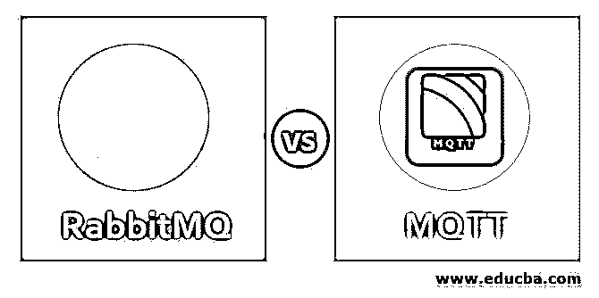
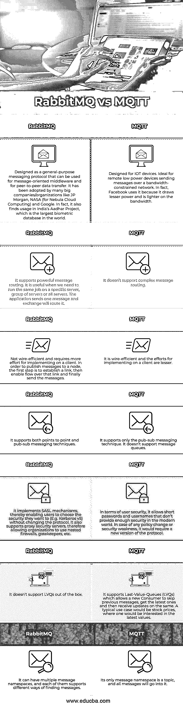

# RabbitMQ vs MQTT

> 原文：<https://www.educba.com/rabbitmq-vs-mqtt/>

## RabbitMQ 和 MQTT 的区别

RabbitMQ 是使用最广泛的开源消息代理之一。它最初是基于高级消息队列协议(AMQP)的。后来，对它进行了修改，以支持消息队列遥测传输(MQTT)、面向流文本的消息协议(STOMP)和其他几种常见协议。在这里，我们将讨论 RabbitMQ 和 MQTT 之间的 7 大区别。

MQTT 是为 IOT 设备开发的基于发布-订阅的轻量级消息传递技术。它用于与网络带宽昂贵的远程设备(有一定的限制)进行通信。脸书在他们的移动应用程序中使用 MQTT。

<small>网页开发、编程语言、软件测试&其他</small>

### RabbitMQ 与 MQTT 的面对面比较(信息图表)

以下是 RabbitMQ 和 MQTT 的 7 大区别:

### RabbitMQ 和 MQTT 的主要区别

让我们看看 RabbitMQ 和 MQTT 之间的主要区别如下:

*   MQTT 设计用于通过低带宽网络发送消息的较小设备。它以简单(只有 5 个 API)和最小的线路占用空间而闻名。另一方面，RabbitMQ 被设计用于过去 25 年中开发的各种消息传递场景。它以可靠性和互操作性而闻名。它已经用多种语言实现了；因此，它是构建可靠、大规模、集群化、弹性消息传递基础设施的最佳选择之一。
*   MQTT 只支持发布-订阅消息技术。在消息寿命很短的情况下，以及存在连接的订阅者和发布者的活动路由的情况下，这是很有用的。因此，将 MQTT 用于传统的长期消息队列是很麻烦的。另一方面，RabbitMQ 支持几乎所有的消息传递形式，如发布-订阅、循环、消息队列等。它还支持消息分组和幂等消息。在访问队列方面，它支持很多细粒度的控制。人们可以限制对某些队列的访问，管理深度等等。
*   MQTT 不支持事务，并且允许一些基本的确认。RabbitMQ 支持不同用例的各种确认，并支持跨消息队列的事务。它还允许分离各种事务语义(如果需要的话)。它还允许分布式事务，如 X/Open XA 事务。
*   MQTT 没有配备任何现成的安全协议。因此，我们需要花费额外的时间/资源来集成任何安全协议。在连接安全性方面，RabbitMQ 比 MQTT 有一些显著的优势。它开箱即用，支持 SASL、TLS 和 IETF set 集。它还自我更新以支持现代 SASL 机制，如 GS2 和 SCRAM-SHA。
*   在现实生活中，我们需要 AMQP 的可靠性和高级功能，以及在较小带宽网络上使用低功耗设备的能力。RabbitMQ 非常适合这种情况，因为它能够同时使用 AMQP 和 MQTT。

### RabbitMQ 与 MQTT 对照表

我们来讨论一下 RabbitMQ 和 MQTT 的顶级对比:

| **RabbitMQ** | **MQTT** |
| 设计为通用消息协议，可用于面向消息的中间件和对等数据传输。它已被许多大公司/组织采用，如 JP 摩根、NASA(用于星云云计算)和 Google。事实上，它在印度的 Aadhar 项目中也有应用，该项目是世界上最大的生物特征数据库。 | 专为 [IOT 设备](https://www.educba.com/iot-devices/)设计。非常适合通过带宽受限的网络发送消息的远程低功耗设备。事实上，脸书使用它是因为它消耗的能量更少，占用的带宽更少。 |
| 它支持强大的消息路由。当我们需要在特定的服务器、服务器组或所有服务器上运行相同的作业时，这很有用。应用程序发送一封邮件，exchange 将对其进行路由。 | 它不支持复杂的消息路由。 |
| 有线效率不高，并且在客户端上实现需要更多的工作。为了向节点发布消息，第一步是建立一个链接，然后在该链接上启用流，最后发送消息。 | 它是有线高效的，并且在客户机上实现的工作量较小。 |
| 它支持点对点和发布-订阅消息技术。 | 它只支持发布-订阅消息技术。它不支持消息队列。 |
| 它实现了 SASL 机制，从而使用户能够在不改变协议的情况下选择他们想要的安全性(例如 Kerberos v5)。它还支持代理安全服务器，因此允许组织使用嵌套防火墙、网守等。 | 在用户安全性方面，它允许在现代世界中不能提供足够安全性的短密码和用户名。在任何政策变化或安全弱点的情况下，将需要新版本的协议。 |
| 它不支持 LVQs 开箱即用。 | 它支持最后值队列(LVQs)，允许新用户跳过以前的消息，获取最新的消息，然后在同一消息上接收更新。一个典型的用例是股票价格，人们会对最新的价值感兴趣。 |
| 它可以有多个消息名称空间，每个名称空间都支持不同的消息查找方式。 | 它唯一的消息名称空间是一个主题，所有的消息都将进入其中。 |

### 结论

RabbitMQ 和 MQTT 都很受欢迎，在业界应用广泛。当需要复杂的路由时，您会更喜欢 RabbitMQ，但是如果您正在构建一个 IOT 应用程序，您会更喜欢 MQTT。对于较大的系统，您可能会使用两者的组合，以便可以利用两者的优点。

### 推荐文章

这是 RabbitMQ vs MQTT 的指南。这里我们分别用信息图和比较表来讨论 RabbitMQ 和 MQTT 的主要区别。您也可以浏览我们推荐的其他文章，了解更多信息——

1.  [SAAS vs 云](https://www.educba.com/saas-vs-cloud/)
2.  [卡珊德拉 vs MySQL](https://www.educba.com/cassandra-vs-mysql/)
3.  [rabbitq vs redis](https://www.educba.com/rabbitmq-vs-redis/)
4.  [兔子队对 SQS 队](https://www.educba.com/rabbitmq-vs-sqs/)

