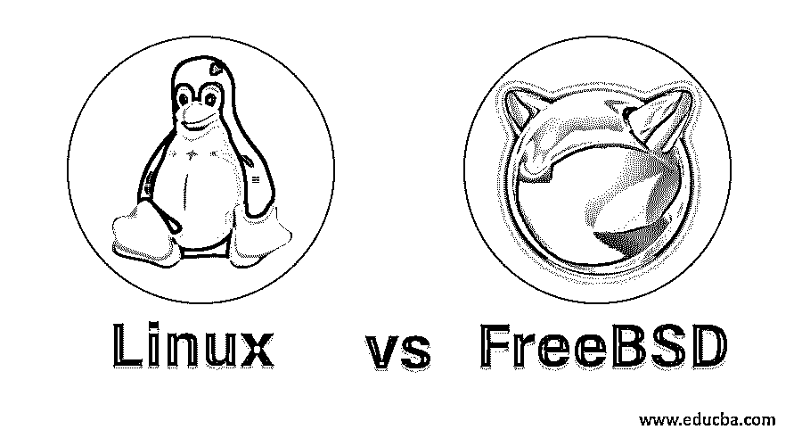
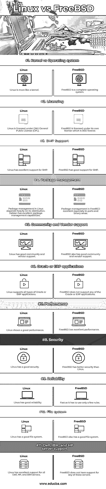

# Linux vs FreeBSD

> 原文：<https://www.educba.com/linux-vs-freebsd/>

## Linux 和 FreeBSD 的区别

FreeBSD，像 [Linux 一样，是一个自由、开源](https://www.educba.com/what-is-linux/)和安全的 Berkeley 软件发行版或 BSD 操作系统，构建在 [Unix 操作系统之上。](https://www.educba.com/what-is-unix/) FreeBSD 是 BSD 最流行的操作系统发行版之一。尽管 FreeBSD 与 Linux 发行版有许多相似之处，但它们在许多重要方面还是有很大的不同。[与 FreeBSD](https://www.educba.com/what-is-freebsd/) 相比，Linux 在市场上广受欢迎。加州大学伯克利分校开发了 Bell Unix，后来进行了多方面的更新和修改，后来演变为当前的 BSD。FreeBSD 是完整的开源 BSD 操作系统之一。在这个主题中，我们将学习 Linux 和 FreeBSD。

### Linux 与 FreeBSD 的直接比较(信息图表)

以下是 Linux 和 FreeBSD 之间的 11 大区别。

<small>网页开发、编程语言、软件测试&其他</small>

### Linux 和 FreeBSD 的主要区别

以下是 Linux 和 FreeBSD 之间的主要区别。

FreeBSD 和 Linux 都是开源的，不同之处在于它们的许可不同，具有类似 Unix 的性质。FreeBSD 是由 Unix 操作系统经过多年的多次更新和修改演变而来的。另一方面，Linux 是作为 Unix 的另一种选择从零开始开发的。Linux 和 FreeBSD 都划分了文件系统层次。此外，它们都类似于作为主要交互方式的外壳环境。除此之外，它们还共享相似的编程 API 特性。由于各种相似性，Linux 和 FreeBSD 可以互相共享许多应用程序和工具。

Linux 和 FreeBSD 之间的一些差异如下:

#### 1.许可差异

*   Linux 和 FreeBSD 在许可方面的差异是它们之间的主要差异之一。
*   所有的 Linux 发行版、Linux 内核、Linux 应用程序、基于 GNU 的应用程序都是根据 GNU 通用公共许可证或 GNU GPL 授权的。
*   GNU GPL 也被称为 copyleft
*   GNU GPL 许可证给予了访问、共享和修改 Linux 源代码的自由。
*   由于它的 GNU GPL 许可，任何人都可以访问、共享和编辑 Linux 而没有任何法律问题。
*   另一方面，FreeBSD 有自己的许可证，称为 BSD 许可证。所有的 FreeBSD 内核和所有的工具都在这个许可下。
*   就许可性而言，BSD 许可证几乎与 GNU GPL 相似，但是 BSD 许可证的衍生作品并不是维护许可证条款所必需的。
*   任何人都可以轻松地访问、共享或修改其源代码，而无需反馈修改或发布更新的源代码。
*   应该包括原始的 BSD 许可证和版权证书，更新的源代码是唯一的要求。
*   每个许可证的调用完全取决于用户的需求和他们的理念。
*   GNU GPL 许可证鼓励开放和自由的生态系统以及共享。
*   专有软件应该小心依赖基于 GNU 的软件。
*   另一方面，BSD 许可的软件可以轻松自由地集成到专有的闭源应用程序中。
*   这使得 BSD 软件对大多数希望将其软件商业化的企业和开发者来说更有吸引力，因为他们可以直接销售保留其源代码的软件。

#### 2.血统差异

*   系统的历史和血统是 Linux 和 FreeBSD 的另一个主要区别。
*   Linus Torvalds 开发了一个 Linux 内核来取代 MINIX，这对于赫尔辛基大学的教育来说是非常严格的。
*   然后，他将开发的 Linux 内核与多个 GNU 组件结合起来，构建了一个完整的类 Unix 操作系统。
*   Linux 完全是从零开始开发的，没有使用现有 Unix 操作系统的任何东西。
*   Linux 在许多方面不同于 Unix。
*   另一方面，FreeBSD 与 Unix 操作系统有着密切的联系。
*   伯克利软件发行版或 BSD 是在加州大学伯克利分校开发的。
*   BSD 是 Unix 操作系统的扩展版本，他们的许可条款非常令人满意。
*   后来，BSD 用一个完整的 BSD 许可证重写了所有原始许可证，操作系统后来被所有可能的开源替代品完全取代。

#### 3.系统范围的差异

*   就系统设计和开发工作而言，系统范围的差异是 Linux 和 FreeBSD 之间的关键差异之一。
*   Linux 只是一个单独的内核，使用来自不同来源的各种额外组件。但是 FreeBSD 有一个内核和它自己的操作系统，作为一个单一的软件包单元。
*   尽管这种差异看起来很小，但它会影响您与系统的交互和管理方式。
*   所有的 Linux 俱乐部发行版一起作为一个单一的软件包工作，它们一起很好地互操作。
*   这些组件使用分发的包管理工具进行跟踪和管理。
*   另一方面，FreeBSD 作为一个完整的操作系统工作。
*   所有的 FreeBSD 软件和内核都是由 FreeBSD 的开发者开发和维护的。
*   改变这个软件包的组件是不可能的，因为它就像一个整体软件一样工作。

### Linux 与 FreeBSD 比较表

让我们讨论一下 Linux 和 FreeBSD 之间的 11 大区别。

| **比较** | **Linux** | **FreeBSD** |
| 内核与操作系统 | Linux 更像一个内核。 | FreeBSD 是一个完整的操作系统。 |
| 批准 | Linux 是根据 GNU 通用公共许可证(GPL)授权的 | FreeBSD 是根据它自己的许可证授权的，也就是 BSD 许可证。 |
| SMP 支持 | Linux 对 SMP 有极好的支持。 | FreeBSD 对 SMP 有很好的支持。 |
| 包装管理 | Linux 中的包管理很大程度上依赖于它的发行版。Debian 有优秀的包管理能力。 | FreeBSD 中的包管理非常出色，尤其是在端口和二进制区域。 |
| 社区和供应商支持 | Linux 有很好的社区和供应商支持。 | FreeBSD 也有很好的社区和供应商支持。 |
| Oracle 或 ERP 应用程序 | Linux 支持所有类型的 Oracle 或 ERP 应用程序。 | FreeBSD 不支持任何 Oracle 或 ERP 应用程序。 |
| 表演 | Linux 表现不错。 | FreeBSD 的性能非常出色。 |
| 安全性 | Linux 有很好的安全性。 | FreeBSD 比 Linux 有更好的安全性。 |
| 可靠性 | Linus 具有良好的可靠性。 | FreeBSD 具有出色的可靠性。 |
| 文件系统 | Linux 有一个很好的文件系统。 | FreeBSD 也有一个很好的文件系统。 |
| 戴尔、IBM 和惠普服务器支持 | Linux 对所有戴尔、惠普和 IBM 服务器都有很好的支持。 | FreeBSD 不支持这些服务器。 |

### 结论

FreeBSD 和 Linux 都是基于 Unix 的免费开源操作系统。Linux 和 FreeBSD 有着非常好的相似之处，但是它们之间仍然有很多相似之处。任何人想要一个成熟的操作系统，他们可以选择 FreeBSD。但是如果他们只需要一个内核，Linux 是最好的选择。

### 推荐文章

这是一个 Linux vs FreeBSD 的指南。这里我们分别用信息图和比较表来讨论 Linux 和 FreeBSD 的主要区别。您也可以看看以下文章，了解更多信息–

1.  [Linux vs Mac](https://www.educba.com/linux-vs-mac/)
2.  [卡莉 Linux vs Ubuntu](https://www.educba.com/kali-linux-vs-ubuntu/)
3.  [Ubuntu vs FreeBSD](https://www.educba.com/ubuntu-vs-freebsd/)
4.  [Linux vs Windows Server](https://www.educba.com/linux-vs-windows-server/)

