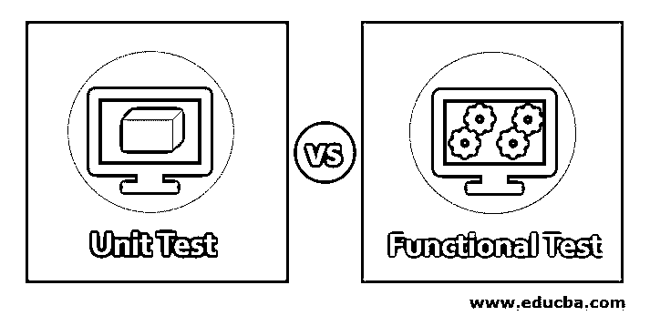
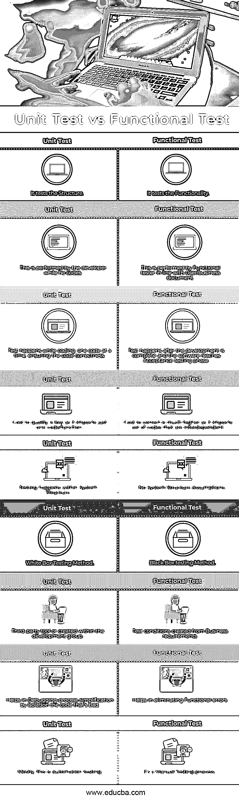

# 单元测试与功能测试

> 原文：<https://www.educba.com/unit-test-vs-functional-test/>

## 单元测试和功能测试的区别

在本文中，我们将看到单元测试和功能测试的概要。测试是产品开发中确保质量的关键功能。在每个阶段都要这样做，以识别错误并纠正它们。单元测试是软件开发的基石，由 Kent Beck 提出。从那以后，它被许多组织作为一种良好的实践采用。在最初阶段，当编码发生时，开发人员使用单元测试框架开发自动化测试用例。当测试用例被执行时，这个框架记录测试用例，并用严重性标记它们。然后，开发人员可以对其进行处理，并且每个单元测试都遵循一致的命名约定。这有助于在进入集成阶段之前测试每个模块中的一组单独的代码、函数或过程。软件的功能在功能测试中进行[测试，测试应用程序的结果。功能测试人员会这样做。他分析测试用例的预期和实际结果，并相应地标记它们。](https://www.educba.com/what-is-functional-testing/)

### 什么是单元和功能测试？ **T2】**

单元和功能测试的详细说明如下:

<small>网页开发、编程语言、软件测试&其他</small>

**单元测试**:

单元测试是许多组织采用的流行实践，因为它主要有助于消除代码中出现 bug 的风险。为了测试应用程序每个部分的功能，这组代码要通过自动化测试。开发人员可以选择进行手动单元测试或自动化单元测试，而自动化测试是首选。或者，可以开发一个逐步测试文档来隔离功能，以便更严格地测试它。由于它有一个系统结构的模拟，它遵循白盒测试技术。开发人员可以使用许多自动化工具来使用开箱即用的解决方案进行自动化测试；其中一些是:

*   这是一个流行的单元测试框架，适用于所有人。网络语言。它是一个开源工具。此工具允许手动脚本。
*   **JUnit:** 对于 Java 编程语言来说，这是一个常用的测试工具。它可以免费使用。它提供断言来识别测试方法。
*   Jmockit: 这也是一个开源工具，广泛用于单元测试。记录和验证语法在这个工具上是可能的。
*   **PHPUnit:**PHP[程序员进行单元测试的理想工具](https://www.educba.com/unit-testing/)。它具有预定义的模拟，有助于创建用于测试的系统结构。

**功能测试:**

根据功能规范或要求对系统进行的测试被称为功能测试。这里，不测试处理步骤，而是测试输入-输出过程中的处理结果。在不做任何环境假设的情况下，它模拟实际的系统功能。在这个阶段，测试由测试人员完成。由于测试人员不知道系统的内部逻辑，所以采用了黑盒测试技术。这个过程非常简单，从业务需求中识别应用程序的功能，根据预期的功能创建输入和输出数据，并执行测试用例。对实际和预期输出的分析有助于测试结果，并在必要时计划纠正。有不同类型的功能测试和几种执行它们的方法。这包括集成测试、冒烟测试、回归测试、健全性测试和用户验收测试。一些被广泛接受的方法是 BDD 测试和 UI 测试。他们都有一个共同的目标来确保软件的功能性；有些测试更加严格，需要手动编写脚本，有些测试只检查关键功能。

### 单元测试和功能测试之间的直接比较(信息图)

下面是单元测试和功能测试之间的 9 大对比:

### 单元测试和功能测试的主要区别

让我们从以下几点来讨论单元测试和功能测试之间的一些关键区别:

*   在早期发现问题比在实施阶段纠正问题的成本更低。因此，单元测试在开发阶段至关重要，而功能测试在验收阶段至关重要。
*   单元测试严格遵循设计文件。当开发人员仍在编码时，他通过自动化测试传递一组代码/功能，以确保与设计文档同步。另一方面，如果测试文档是根据设计文档创建的，功能测试就不能检测到缺陷。对于有效的功能测试，测试条件应该从业务需求中创建。与设计文档不同，该文档清楚地指定了软件的预期功能和期望结果。
*   由于单元测试是一次一个代码地完成的，因此可以确保代码在模拟的系统结构中是正确的。由于代码的相互依赖性较小，因此更容易解决，并且其他代码受影响的机会也较少。然而，不可能测试所有的执行路径。因为它是对代码质量的逐步检查，所以它不能检测集成错误。功能测试在验收测试和实现之前非常有用。

### 单元测试与功能测试对照表

下表总结了单元测试与功能测试的比较 **:**

| **单元测试** | **功能测试** |
| 它测试结构。 | 它测试功能。 |
| 这是由开发人员在编码时执行的。 | 这是由功能测试人员根据用户/业务文档执行的。 |
| 测试在编码时进行，一次一个代码，确保代码的正确性。 | 测试发生在开发完成之后，软件到达验收测试阶段。 |
| 质量成本很低，因为它只影响一个代码/功能。 | 纠正的成本要高得多，因为它会影响一组相互依赖的代码。 |
| 测试发生在系统结构中。 | 没有系统结构假设。 |
| 白盒测试法。 | 黑盒测试方法。 |
| 第三方工具或在开发组内部创建。 | 根据业务需求创建的测试条件。 |
| 通过隔离不好的代码来帮助简化调试过程。 | 它有助于消除功能错误。 |
| 大多数情况下，这是自动化测试。 | 这是一个手工测试过程。 |

### 结论

今天，客户期望开发者和 SI 公司开发最高质量的软件。这迫使公司将不同的测试阶段作为开发过程的一部分。对于一个不断发展和竞争激烈的市场，单元测试是实现无缺陷代码的关键。是的，开发人员必须花费额外的时间来测试和纠正错误。但它的回报更高——它确保了代码质量，并有助于编码与设计文档保持一致。功能测试根据业务文档识别功能缺陷，从而引导出符合客户期望的完美软件产品。

### 推荐文章

这是单元测试和功能测试的指南。这里我们用信息图和比较表来讨论单元测试和功能测试的主要区别。您也可以看看以下文章，了解更多信息–

1.  [自动化测试？](https://www.educba.com/automation-testing/)
2.  [自动化测试面试问题](https://www.educba.com/automation-testing-interview-questions/)
3.  [单元测试 vs 集成测试](https://www.educba.com/unit-test-vs-integration-test/)
4.  [手工测试 vs 自动化测试](https://www.educba.com/manual-testing-vs-automation-testing/)

