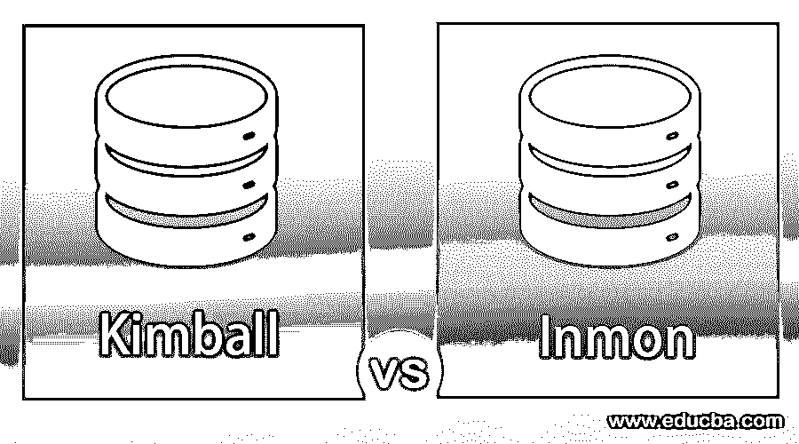
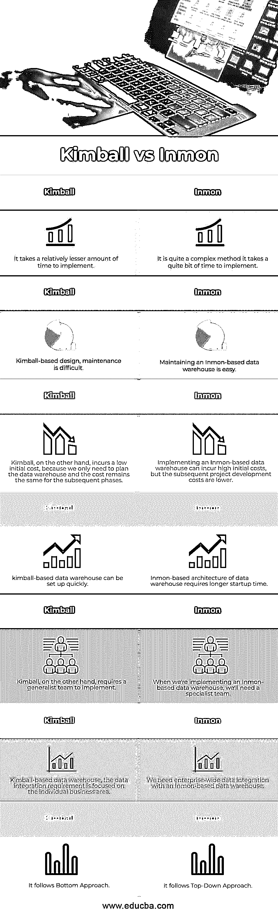

# 金博尔 vs 英蒙

> 原文：<https://www.educba.com/kimball-vs-inmon/>

## 金博尔和英蒙的区别

以下文章提供了金博尔 vs 英蒙的概要。我们可以用不同的方式来对齐数据仓库的不同组件，这些组件是数据仓库的基本[部分。例如，数据源帮助我们识别数据来自哪里。](https://www.educba.com/what-is-data-warehouse/)

有了数据暂存区，我们可以在数据被接收到数据存储之前决定我们想要添加到数据中的某些功能。接下来，我们可以提供信息传递机制。我们将从探索一个非常简单、基本的数据仓库架构开始。使用这种基本的体系结构方法，数据仓库是中心。数据源直接与仓库交互，中间没有任何数据暂存过程。

<small>网页开发、编程语言、软件测试&其他</small>

### 金博尔与英蒙的对决(信息图)

以下是金博尔和英蒙之间的 7 大区别:

### 金博尔与英蒙的主要区别

让我们来看看 Kimball 和 Inmon 之间的主要区别:

*   Kimball 利用维度模型处理数据，而 Inmon 只利用维度模型处理数据集市。现在从架构的角度来看，Kimball 认为没有必要将数据集市从现有的多维数据仓库中分离出来。在这种情况下，Inmon 使用来自数据仓库的数据集市将它们从数据仓库中分离出来，作为物理上独立的单元。
*   现在，让我们快速比较一下 Kimball 和 Inmon 方法提出的架构。因此，我们可以了解这些方法中哪一种更适合我们的数据仓库需求，并相应地采用适当的体系结构。
*   使用 Kimball 方法，重点是识别关键业务流程和我们需要为数据仓库提供的后续业务解决方案。而 Inmon 方法相信用公司数据模型构建数据仓库。
*   Kimball 方法利用维度模型(如 [star 和雪花模式](https://www.educba.com/star-schema-vs-snowflake-schema/))将数据组织成各种业务分类数据，以快速实现业务流程。另一方面，Inmon 考虑整体公司数据要求，因此，它利用 er 建模技术。
*   Kimball 专注于提供可以从数据仓库直接访问的分析系统。换句话说，Kimball 提出了一种体系结构，其中分析系统可以直接使用数据仓库中的数据。而在 Inmon 的情况下，设计的体系结构使得分析系统只能通过数据集市访问数据仓库中的数据。
*   从业务考虑的角度看 Kimball 和 Inmon 的数据仓库架构。Inmon 架构需要时间来构建或实现，因为我们必须规划各种数据集市。而实现 Kimball 数据仓库架构花费的时间相对较少。由于抽象是更高的抽象层次，我们只考虑使用星型或雪花模式的数据仓库设计。
*   维护基于 Inmon 的数据仓库很容易，因为我们可以将维护任务分解成不同的数据维护活动。在基于 Kimball 的设计中，维护很困难，因为可能存在冗余数据，并且修改需要额外的任务。
*   实现一个基于 Inmon 的数据仓库可能会产生很高的初始成本，但随后的项目开发成本较低，因为它需要较少的维护和负载变化适应性。另一方面，Kimball 的初始成本很低，因为我们只需要规划数据仓库，并且后续阶段的成本保持不变。基于 Inmon 架构的数据仓库需要较长的启动时间，而基于 Kimball 架构的数据仓库可以快速建立。
*   当我们实现基于 Inmon 的数据仓库时，我们需要一个专家团队，因为我们也需要设计数据集市。要设计数据集市，团队必须熟悉每个功能单元。另一方面，Kimball 需要一个通用团队来实现。
*   所涉及的资源需要知道如何使用 ER 建模，而不需要将它们解耦到各种数据集市中。我们需要[企业范围的数据集成](https://www.educba.com/what-is-data-integration/)与基于 Inmon 的数据仓库。而对于基于 Kimball 的数据仓库，数据集成需求集中在单个业务领域。
*   我们将探讨的最后一个比较是关于基于 Inmon 和 Kimball 的数据仓库的使用。Inmon 和 Kimball 架构都需要数据源、数据暂存、ETL 功能和数据集市。
*   需要捕获业务需求，并且它们都需要数据的时间属性以方便历史数据。虽然 Inmon 促进了企业数据仓库，但 Kimball 没有。Inmon 不涉及维度，因为有多个数据集市要建模。虽然有针对 Inmon 的关系工具，但没有针对 Kimball 的工具。虽然 Inmon 不是面向过程的，但 Kimball 恰好是面向过程的，因为它关注的是业务过程。
*   Inmon 使用规范化数据模型，而 Kimball 更喜欢非规范化数据模型，因此，我们发现 Kimball 架构中存在冗余数据模型。Inmon 的设计和架构可能很复杂，但是基于 Kimball 的数据仓库更容易设计和实现。
*   在离散时间框架内继续，是的。在 Inmon 的情况下，因为我们需要连续监控数据标记。慢慢改变时间框架，是的。在 Kimball 的例子中，因为我们必须适应变化和数据仓库级别。通过 Kimball，我们获得了一个需要根据业务流程进行逻辑利用的数据仓库存储。

### 金博尔 vs 英蒙对比表

让我们讨论一下金博尔和英蒙之间最重要的比较:

| **金博尔** | **因蒙** |
| 它需要相对较少的时间来实现。 | 这是一个相当复杂的方法；这需要相当多的时间来实现。 |
| 基于 Kimball 的设计维护很困难。 | 维护基于 Inmon 的数据仓库很容易。 |
| 另一方面，Kimball 的初始成本很低，因为我们只需要规划数据仓库，并且后续阶段的成本保持不变。 | 实现一个基于 Inmon 的数据仓库可能会产生很高的初始成本，但是随后的项目开发成本较低。 |
| 基于 Kimball 的数据仓库可以快速建立。 | 基于 inmon 的数据仓库架构需要较长的启动时间。 |
| 另一方面，Kimball 需要一个多面手团队来实施。 | 当我们实现一个基于 Inmon 的数据仓库时，我们需要一个专家团队。 |
| 基于 Kimball 的数据仓库，数据集成需求集中在单个业务领域。 | 我们需要企业范围的数据与基于 Inmon 的数据仓库集成。 |
| 它遵循底层方法。 | 它遵循自上而下的方法。 |

### 结论

实现 Kimball 数据仓库架构花费的时间相对较少。维护基于 Inmon 的数据仓库很容易，因为我们可以将维护任务分解成各种数据集市维护活动。在基于 Kimball 的设计中，维护很困难，因为可能存在冗余数据。实现基于 Inmon 的数据仓库可能会产生很高的初始成本。另一方面，Kimball 的初始成本较低，后续阶段的成本保持不变。实现基于 Inmon 的数据仓库需要一个专家团队。另一方面，Kimball 需要一个多面手团队来实施。

### 推荐文章

这是金博尔 vs 英蒙的指南。在这里，我们还讨论了 Kimball 与 Inmon 的关键差异，并提供了信息图表和比较表。您也可以看看以下文章，了解更多信息–

1.  [Scala vs Java](https://www.educba.com/scala-vs-java/)
2.  [DDL vs DML](https://www.educba.com/ddl-vs-dml/)
3.  [Java vs PHP](https://www.educba.com/java-vs-php/)
4.  [金博尔方法学](https://www.educba.com/kimball-methodology/)

